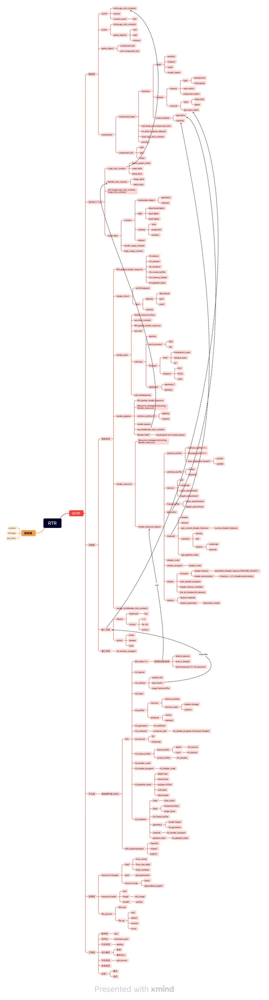

# RTR 实时渲染引擎

## 简介
RTR 是一个实时3D图形渲染引擎。

## Engine Runtime系统架构


### 分层架构

RTR的系统架构采用分层设计，由底层到上层依次为：
- 工具层
- 资源层
- 平台层
- 功能层
- 上下文层
- 框架层

## 为什么分层
分层架构的设计使得RTR的系统更加模块化和可扩展。 
每一层的设计相对独立，层与层之间具有单向的调用关系，上层的实现仅调用下层提供的接口。
这样的设计使得RTR的系统更加灵活和可维护,易于测试和调试。

# 工具层

## 概述
工具层主要用于提供一些通用的底层工具类和辅助函数。
第三方库也将会于工具层接入RTR Runtime，工具层将会对其进行封装和抽象，提供统一的接口。
以下是工具层的主要模块

## 设计模式库
RTR Runtime时常会使用某些设计模式，如单例模式、事件中心模式等。工具层提供了这些设计模式的实现，使得其他模块可以方便地使用这些设计模式。

**单例模式实现：**


在RTR Runtime中，单例模式通常用于管理全局资源，如窗口、输入设备、渲染设备等。
单例模式的实现通常包含一个私有的构造函数和一个静态的公有方法，用于获取单例对象。
单例模式的实现可以保证全局只有一个实例，并且提供了一个全局访问点。
RTR Runtime中的单例模式实现是一个模板类，可以通过`Singleton<T>::get_instance() `方法获取任意类的单例对象。

**事件中心模式：**


在RTR Runtime中，事件中心模式通常用于管理事件的分发和处理。
事件中心模式的实现通常包含一个参数可变的事件中心类模板`Event_center<Args...>`，用于管理事件的注册、注销和分发。
以及一个事件类`Event<Args...>`，用于封装事件的类型和数据。
每个事件可以绑定多个lamda函数，当事件触发时，会依次调用这些lamda函数。

## 数学库


RTR Runtime使用GLM作为数学库，GLM提供了丰富的数学函数和数据结构，用于处理3D图形渲染中的各种数学运算。
另外，RTR Runtime 的数学库还提供了一些常用的计算几何算法，如射线与三角形的交点计算、AABB包围盒的计算，以及求凸包的算法等。

## 日志库


RTR Runtime使用spdlog作为日志库，spdlog提供了灵活的日志输出方式，可以根据需要选择不同的日志级别和输出方式。
RTR Runtime中的日志输出可以通过spdlog提供的接口进行配置和控制。

## 序列化库


RTR Runtime使用nlohmann_json作为序列化库，nlohmann_json提供了简单易用的序列化和反序列化接口，可以方便地将数据结构序列化为JSON格式，或者将JSON格式反序列化为数据结构。用户只需要在对应数据类的命名空间中定义`to_json`和`from_json`即可使得数据持久化成为可能。

## 计时器库


RTR Runtime使用std::chrono作为计时器库，std::chrono提供了高精度的计时器功能，可以用于测量程序的执行时间。计时器库使得性能分析和优化成为可能。

## 枚举和宏

RTR Runtime使用枚举和宏来定义一些常用的常量和类型，如错误码、日志级别、渲染API等。枚举和宏使得代码更加清晰和易于维护。由于篇幅限制，这里不再详细列举具体的枚举和宏定义。

# 资源层

## 概述
资源层主要用于提供一些通用的资源管理类和接口。
资源层的设计主要是为了实现跨平台的资源管理，使得RTR Runtime可以在不同的平台上运行。
以下是资源层的主要模块

## 文件服务


`File_service`类作为跨平台资源管理的核心组件，封装了底层文件系统操作，提供统一的资源存取接口。主要功能包括路径管理（设置/获取根目录）、文本文件读写支持、目录创建与递归遍历、跨平台文件操作（复制/移动/删除），以及通过构建树形文件结构实现可视化资源管理。该抽象层有效隔离了不同操作系统的文件系统差异，为上层资源加载器提供标准化的访问接口。
另外，在GUI层中，File面板将使用File_service提供的接口，实现资源的可视化管理。

## 资源管理器


`Resource_manager_dep` 类是一个模板化的资源管理工具，用于存储和管理由 `Key_type` 标识的、类型为 `T` 的共享资源（通过 `std::shared_ptr`）。它的核心特点是引入了资源依赖图功能：它不仅能添加、获取、移除和清空资源，还能记录和管理资源之间的依赖关系。您可以显式声明一个资源依赖于另一个（例如，材质依赖于纹理），或者在添加资源时就指定其依赖项。该类具备循环依赖检测机制，能防止创建导致问题的依赖闭环。在移除资源时，它会检查是否有其他资源依赖于待移除项，默认情况下会阻止此类移除以保证依赖完整性，从而提供更健壮的资源生命周期管理。同时，它也支持查询特定资源的直接依赖项和被依赖项。

## 加载器系统
加载器系统主要用于加载资源。包括文本加载器和图像加载器。

### 文本加载器


首先，`Text` 类被设计为文本内容的基础表示与封装单元。此类支持通过两种主要途径进行实例化：其一，通过指定文件系统路径，此时类内部将执行文件读取操作以加载文本；其二，通过直接传递C风格字符串常量进行初始化。在内部实现上，`Text` 类采用 `std::string` 对象来存储文本数据，并提供了一组公共接口方法，允许外部代码访问文本内容（例如，获取 `std::string` 引用、C风格字符串指针）以及查询文本属性（如长度、是否为空）。其文件加载逻辑集成了一套基础的异常处理机制，在发生I/O错误时，会将相关的诊断信息输出至标准错误流。

其次，`Text_loader` 类作为一个辅助性的加载器（Loader）组件，其特定职责是创建并管理 `Text` 类的共享指针（`std::shared_ptr`）实例。该加载器提供了一个静态成员函数 `load_from_path`，此函数接受一个文件路径作为参数，负责根据该路径实例化 `Text` 对象，并将生成的对象包装在 `std::shared_ptr` 中返回。此种设计模式有效地将文本对象的具体创建逻辑，尤其是涉及文件系统交互的部分，从客户端代码中分离出来，并统一封装在 `Text_loader` 内部，从而提高了代码的模块化程度和可维护性。

### 图像加载器


图像加载器首先定义了 `Image_format` 枚举类型，用以抽象不同的像素表示格式（例如RGB、灰度图），并通过 `stbi_image_format` 辅助函数将这些抽象格式映射为 `stb_image` 库所特有的常量，从而确保库接口的正确调用。核心的 `Image` 类作为图像数据的抽象表示，封装了图像的维度（宽度、高度）、通道数量以及一个指向由 `stb_image` 获取的原始像素缓冲区的指针。该类支持从内存字节流或文件系统路径进行实例化，并允许在加载过程中对期望的像素格式及垂直方向进行精细控制。值得注意的是，`Image` 类的析构函数负责调用 `stbi_image_free `函数，从而确保了由 `stb_image `库所管理内存的确定性释放。为简化资源获取过程，Image_loader 类实现了工厂设计模式，提供了静态方法（`load_from_path` 和 `load_from_data`）用于创建并返回包裹在 `std::shared_ptr`智能指针中的 `Image` 实例。此设计不仅简化了客户端与加载机制的交互，亦通过共享所有权语义整合了稳健的内存管理策略。

## 哈希


`Hash` 结构体被设计为一个统一的哈希值表示和处理单元，它封装了一个 `unsigned long long` 类型的核心哈希值，并提供了标准的构造、赋值及比较操作。该结构体的关键功能在于其哈希生成能力：通过静态方法 `from_string`，它能够利用FNV-1a算法从字符串高效地计算出哈希值；而另一个静态方法 `from_raw_data` 则采用一种自定义的分块处理和位混合算法，从原始字节序列生成哈希。此外，`Hash` 结构体重载了 `+=` 和 `+` 运算符，允许通过特定的位操作（结合了异或、加法、位移及素数乘法）安全地将多个哈希对象合并为一个新的哈希值，这对于组合对象或序列的哈希非常有用。用户可以通过 `value()` 方法获取其内部的原始 `unsigned long long` 哈希值，使得该结构体不仅是哈希值的容器，也是一套功能完备的哈希生成与组合工具。


## GUID


GUID 系统的设计目的是为了提供一种简单且高效的方式来生成和管理全局唯一的标识符，适用于需要唯一标识对象或资源的场景。
它包含两个主要组件：`GUID_generator` 和 `GUID`。这两个类协同工作以提供一种简单的顺序唯一标识符（GUID）生成与封装机制。`GUID_generator` 类扮演着ID生产者的角色，它内部维护一个静态自增的无符号整型计数器，并通过其静态方法 `generate_GUID()` 来分配并返回一个在此程序运行期间内唯一的递增ID。而 `GUID` 类则作为这些ID的容器和表示；当其实例通过默认构造函数创建时，会自动调用 `GUID_generator` 来获取一个新的唯一ID进行初始化，同时也支持使用一个已有的 `unsigned int` 值来构造。

# 平台层

## 平台层概述

RTR Runtime的平台层设计旨在提供跨平台的支持，使得开发者可以基于不同的图形API(OpenGL/DirectX12/Vulkan)使用RTR Runtime。

平台层的设计主要包括以下两个方面：

- 平台抽象：通过平台接口层提供统一的平台抽象，使得上层模块可以在不同的平台上运行。也就是下文提到的RHI（Render Hardware Interface）。

- 平台适配：通过平台适配层提供不同平台的适配实现，使得平台层可以在不同的平台上运行。也就是对RHI的具体实现。

平台接口层和平台适配层的设计主要是为了实现跨平台的支持，使得上层模块可以在不同的平台上运行。
在本项目中，RHI接口仅实现了OpenGL的版本，对于其他的平台，需要自行实现RHI接口。

## RHI核心模块

### 设备管理（Device）

#### 跨平台GPU设备抽象
`RHI_device`是一个跨平台的GPU设备抽象，提供了统一的接口，使得上层模块可以在不同的平台上运行。
`RHI_device`的设计主要包括以下几个方面：
- 设备管理：提供设备创建、销毁、配置等接口。
- 资源管理：提供资源创建、销毁、配置等接口。
- 上下文管理：提供上下文创建、销毁、配置等接口。

#### 典型使用流程
  ```cpp
  // 1. 创建设备实例
  auto device = RHI_device_OpenGL::create();
  
  // 2. 创建渲染窗口
  auto window = device->create_window(1280, 720, "RTR Engine");
  
  // 3. 创建顶点/索引缓冲区
  auto vbo = device->create_vertex_buffer(...);
  auto ebo = device->create_element_buffer(...);
  
  // 4. 组装几何体
  auto geometry = device->create_geometry({ {0, vbo} }, ebo);
  
  // 5. 创建着色器程序
  auto shader_program = device->create_shader_program(...);
  ```

### 窗口系统
#### 跨平台窗口抽象
`RHI_window`类作为渲染硬件接口的窗口抽象基类，提供统一的跨平台窗口操作接口。主要功能包括：

- 窗口属性管理
  ```cpp
  const int& width();      // 获取窗口宽度
  const int& height();     // 获取窗口高度
  const std::string& title(); // 获取窗口标题
  ```

- 生命周期控制
  ```cpp
  virtual bool is_active() = 0;  // 窗口激活状态
  virtual void deactivate() = 0; // 关闭窗口
  ```

- 视口设置
  ```cpp
  virtual void set_viewport(int x, int y, int width, int height) = 0;
  ```

#### OpenGL上下文管理
通过继承实现具体平台的上下文管理，核心方法：
```cpp
void on_frame_begin() {
    poll_events();     // 处理系统事件
    swap_buffers();    // 交换前后缓冲
    m_frame_begin_event.execute(this); // 触发帧开始事件
}

void on_frame_end() {
    m_frame_end_event.execute(this); // 触发帧结束事件
}
```
#### 输入事件处理流程
采用事件委托机制实现输入处理：

```cpp
// 事件类型定义
using Window_resize_event = Event<int, int>;
using Key_event = Event<Key_code, Key_action, unsigned int>;

// 事件注册接口
Window_resize_event& window_resize_event(); 
Key_event& key_event();

// 典型事件处理示例
Key_event m_key_event{[&](Key_code key_code, Key_action action, unsigned int repeat) {
    if (key_code == Key_code::ESCAPE && action == Key_action::PRESS) {
        this->deactivate(); // ESC键关闭窗口
    }
}};
```

#### 实现特性
1. **ImGui集成支持**
   ```cpp
   std::shared_ptr<RHI_imgui>& imgui(); // 获取ImGui上下文
   ```

2. **帧事件系统**
   ```cpp
   Event<RHI_window*>& frame_begin_event(); // 帧开始事件
   Event<RHI_window*>& frame_end_event();   // 帧结束事件
   ```

3. **多平台扩展**
   通过继承实现不同图形API的窗口：
   ```cpp
   class RHI_window_OpenGL : public RHI_window {
       // OpenGL具体实现
   };
   
   class RHI_window_Vulkan : public RHI_window {
       // Vulkan具体实现
   };
   ```

#### 使用示例
```cpp
// 创建窗口
auto window = device->create_window(1280, 720, "RTR Engine");

// 注册窗口调整事件
window->window_resize_event().add_listener([](int w, int h) {
    std::cout << "New size: " << w << "x" << h << std::endl;
});

// 主循环
while(window->is_active()) {
    window->on_frame_begin();
    // 渲染逻辑...
    window->on_frame_end();
}
```

### 2.3 资源管理

#### 2.3.1 缓冲区（Buffer）
- 顶点/索引/存储缓冲区
- 内存映射机制

#### 2.3.2 着色器（Shader）
- 着色器代码编译流程
- Uniform管理策略
- 跨平台着色器程序

#### 2.3.3 纹理系统
- 2D/立方体贴图/数组纹理
- Mipmap生成策略
- 帧缓冲附件管理

## 3. 渲染管线

### 3.1 几何体抽象
- 顶点格式描述
- VAO管理策略
- 实例化渲染支持

### 3.2 状态管理
- 混合/深度测试/模板测试
- 多边形偏移配置
- 裁剪状态管理

## 4. 工具模块

### 4.1 ImGui集成
- 平台抽象接口
- 事件处理集成
- 渲染后端对接

### 4.2 计算管线
- 计算着色器分派
- 内存屏障控制
- 异步计算支持

## 5. 全局资源管理
- 设备单例管理
- 渲染器生命周期
- 纹理构建器模式
