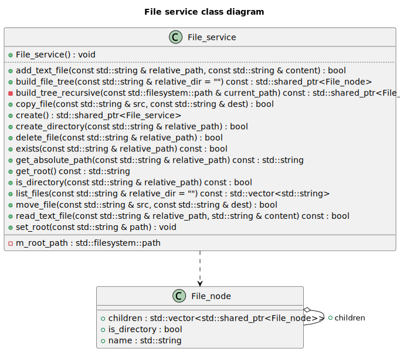

# RTR Rendering Engine

## RTR 系统总体架构

RTR 是一个基于C++的渲染引擎，它提供了一个简单易用的API，使得开发者可以轻松地创建和管理3D场景。
总的来说，RTR分为两个部分：Runtime和Editor。

- Runtime 
Engine Runtime 是渲染引擎的执行核心，它负责在最终用户的设备上实际运行和显示应用程序或游戏。它包含了所有必要的模块来加载、处理、渲染场景和处理用户输入。
- Editor
Engine Editor 是一个用于编辑和调试 Engine Runtime 的工具。它允许用户在不运行应用程序的情况下对场景进行编辑和调试，从而提高开发效率和调试能力。

## Editor系统架构

Editor系统架构是基于runtime提供的RHI_ImGUI驱动的，总的来说，Editor系统的中心协调者是Editor类。它维护了一个Panel实例的集合（通过一个映射表进行管理），允许按名称动态添加和移除面板。Editor类与引擎运行时（Engine_runtime）交互，以获取必要的上下文信息。 因此Editor系统的具体实现将会在Runtime介绍后进行。

## Runtime系统架构

## 分层架构

RTR的系统架构采用分层设计，由底层到上层依次为：
- 工具层
- 资源层
- 平台层
- 功能层
- 上下文层
- 框架层

其中，工具层，资源层和平台层是渲染器Runtime的后端；
功能层，上下文层，框架层是渲染器的前端。

## 为什么分层
分层架构的设计使得RTR的系统更加模块化和可扩展。 
每一层的设计相对独立，层与层之间具有单向的调用关系，上层的实现仅调用下层提供的接口。
这样的设计使得RTR的系统更加灵活和可维护,易于测试和调试。

## 后续的章节安排
因为RTR Runtime的系统架构比较复杂，因此我们将在后续的章节中对每一层的具体实现进行详细的介绍。

# 渲染器后端概述

渲染器的后端由三层构成，分别为：

- 工具层
  用于提供一些通用的底层工具类和辅助函数
- 资源层 
  用于提供一些通用的资源管理类和资源加载的能力
- 平台层 
  提供跨平台的支持，使得开发者可以基于不同的图形API(OpenGL/DirectX12/Vulkan)使用RTR Runtime。并且向上提供统一的接口，使得上层模块可以在不同的平台上运行

这三层是整个渲染器的基石，它们共同构成了渲染器的底层架构。
其设计思想和具体的实现将在后续的章节中进行详细介绍。

# 工具层

## 概述
工具层主要用于提供一些通用的底层工具类和辅助函数。
第三方库也将会于工具层接入RTR Runtime，工具层将会对其进行封装和抽象，提供统一的接口。
以下是工具层的主要模块

## 设计模式库
RTR Runtime时常会使用某些设计模式，如单例模式、事件中心模式等。工具层提供了这些设计模式的实现，使得其他模块可以方便地使用这些设计模式。

**单例模式实现：**

在RTR Runtime中，单例模式通常用于管理全局资源，如窗口、输入设备、渲染设备等。
单例模式的实现通常包含一个私有的构造函数和一个静态的公有方法，用于获取单例对象。
单例模式的实现可以保证全局只有一个实例，并且提供了一个全局访问点。
RTR Runtime中的单例模式实现是一个模板类，可以通过`Singleton<T>::get_instance() `方法获取任意类的单例对象。

**事件中心模式：**

在RTR Runtime中，事件中心模式通常用于管理事件的分发和处理。
事件中心模式的实现通常包含一个参数可变的事件中心类模板`Event_center<Args...>`，用于管理事件的注册、注销和分发。
以及一个事件类`Event<Args...>`，用于封装事件的类型和数据。
每个事件可以绑定多个lamda函数，当事件触发时，会依次调用这些lamda函数。

## 数学库

RTR Runtime使用GLM作为数学库，GLM提供了丰富的数学函数和数据结构，用于处理3D图形渲染中的各种数学运算。
另外，RTR Runtime 的数学库还提供了一些常用的计算几何算法，如射线与三角形的交点计算、AABB包围盒的计算，以及求凸包的算法等。

## 日志库

RTR Runtime使用spdlog作为日志库，spdlog提供了灵活的日志输出方式，可以根据需要选择不同的日志级别和输出方式。
RTR Runtime中的日志输出可以通过spdlog提供的接口进行配置和控制。

## 序列化库

RTR Runtime使用nlohmann_json作为序列化库，nlohmann_json提供了简单易用的序列化和反序列化接口，可以方便地将数据结构序列化为JSON格式，或者将JSON格式反序列化为数据结构。用户只需要在对应数据类的命名空间中定义`to_json`和`from_json`即可使得数据持久化成为可能。

## 计时器库

RTR Runtime使用std::chrono作为计时器库，std::chrono提供了高精度的计时器功能，可以用于测量程序的执行时间。计时器库使得性能分析和优化成为可能。

## 枚举和宏

RTR Runtime使用枚举和宏来定义一些常用的常量和类型，如错误码、日志级别、渲染API等。枚举和宏使得代码更加清晰和易于维护。由于篇幅限制，这里不再详细列举具体的枚举和宏定义。

# 资源层

## 概述
资源层主要用于提供一些通用的资源管理类和接口。
资源层的设计主要是为了实现跨平台的资源管理，使得RTR Runtime可以在不同的平台上运行。
以下是资源层的主要模块

## 文件服务

`File_service`类作为跨平台资源管理的核心组件，封装了底层文件系统操作，提供统一的资源存取接口。主要功能包括路径管理（设置/获取根目录）、文本文件读写支持、目录创建与递归遍历、跨平台文件操作（复制/移动/删除），以及通过构建树形文件结构实现可视化资源管理。该抽象层有效隔离了不同操作系统的文件系统差异，为上层资源加载器提供标准化的访问接口。
另外，在GUI层中，File面板将使用File_service提供的接口，实现资源的可视化管理。

## 资源管理器

`Resource_manager_dep` 类是一个模板化的资源管理工具，用于存储和管理由 `Key_type` 标识的、类型为 `T` 的共享资源（通过 `std::shared_ptr`）。它的核心特点是引入了资源依赖图功能：它不仅能添加、获取、移除和清空资源，还能记录和管理资源之间的依赖关系。您可以显式声明一个资源依赖于另一个（例如，材质依赖于纹理），或者在添加资源时就指定其依赖项。该类具备循环依赖检测机制，能防止创建导致问题的依赖闭环。在移除资源时，它会检查是否有其他资源依赖于待移除项，默认情况下会阻止此类移除以保证依赖完整性，从而提供更健壮的资源生命周期管理。同时，它也支持查询特定资源的直接依赖项和被依赖项。

## 加载器系统
加载器系统主要用于加载资源。包括文本加载器和图像加载器。

### 文本加载器

首先，`Text` 类被设计为文本内容的基础表示与封装单元。此类支持通过两种主要途径进行实例化：其一，通过指定文件系统路径，此时类内部将执行文件读取操作以加载文本；其二，通过直接传递C风格字符串常量进行初始化。在内部实现上，`Text` 类采用 `std::string` 对象来存储文本数据，并提供了一组公共接口方法，允许外部代码访问文本内容（例如，获取 `std::string` 引用、C风格字符串指针）以及查询文本属性（如长度、是否为空）。其文件加载逻辑集成了一套基础的异常处理机制，在发生I/O错误时，会将相关的诊断信息输出至标准错误流。

其次，`Text_loader` 类作为一个辅助性的加载器（Loader）组件，其特定职责是创建并管理 `Text` 类的共享指针（`std::shared_ptr`）实例。该加载器提供了一个静态成员函数 `load_from_path`，此函数接受一个文件路径作为参数，负责根据该路径实例化 `Text` 对象，并将生成的对象包装在 `std::shared_ptr` 中返回。此种设计模式有效地将文本对象的具体创建逻辑，尤其是涉及文件系统交互的部分，从客户端代码中分离出来，并统一封装在 `Text_loader` 内部，从而提高了代码的模块化程度和可维护性。

### 图像加载器

图像加载器首先定义了 `Image_format` 枚举类型，用以抽象不同的像素表示格式（例如RGB、灰度图），并通过 `stbi_image_format` 辅助函数将这些抽象格式映射为 `stb_image` 库所特有的常量，从而确保库接口的正确调用。核心的 `Image` 类作为图像数据的抽象表示，封装了图像的维度（宽度、高度）、通道数量以及一个指向由 `stb_image` 获取的原始像素缓冲区的指针。该类支持从内存字节流或文件系统路径进行实例化，并允许在加载过程中对期望的像素格式及垂直方向进行精细控制。值得注意的是，`Image` 类的析构函数负责调用 `stbi_image_free `函数，从而确保了由 `stb_image `库所管理内存的确定性释放。为简化资源获取过程，Image_loader 类实现了工厂设计模式，提供了静态方法（`load_from_path` 和 `load_from_data`）用于创建并返回包裹在 `std::shared_ptr`智能指针中的 `Image` 实例。此设计不仅简化了客户端与加载机制的交互，亦通过共享所有权语义整合了稳健的内存管理策略。

## 哈希

`Hash` 结构体被设计为一个统一的哈希值表示和处理单元，它封装了一个 `unsigned long long` 类型的核心哈希值，并提供了标准的构造、赋值及比较操作。该结构体的关键功能在于其哈希生成能力：通过静态方法 `from_string`，它能够利用FNV-1a算法从字符串高效地计算出哈希值；而另一个静态方法 `from_raw_data` 则采用一种自定义的分块处理和位混合算法，从原始字节序列生成哈希。此外，`Hash` 结构体重载了 `+=` 和 `+` 运算符，允许通过特定的位操作（结合了异或、加法、位移及素数乘法）安全地将多个哈希对象合并为一个新的哈希值，这对于组合对象或序列的哈希非常有用。用户可以通过 `value()` 方法获取其内部的原始 `unsigned long long` 哈希值，使得该结构体不仅是哈希值的容器，也是一套功能完备的哈希生成与组合工具。

## GUID

GUID 系统的设计目的是为了提供一种简单且高效的方式来生成和管理全局唯一的标识符，适用于需要唯一标识对象或资源的场景。
它包含两个主要组件：`GUID_generator` 和 `GUID`。这两个类协同工作以提供一种简单的顺序唯一标识符（GUID）生成与封装机制。`GUID_generator` 类扮演着ID生产者的角色，它内部维护一个静态自增的无符号整型计数器，并通过其静态方法 `generate_GUID()` 来分配并返回一个在此程序运行期间内唯一的递增ID。而 `GUID` 类则作为这些ID的容器和表示；当其实例通过默认构造函数创建时，会自动调用 `GUID_generator` 来获取一个新的唯一ID进行初始化，同时也支持使用一个已有的 `unsigned int` 值来构造。

# 平台层

## 平台层概述

RTR Runtime的平台层设计旨在提供跨平台的支持，使得开发者可以基于不同的图形API(OpenGL/DirectX12/Vulkan)使用RTR Runtime。并且向上提供统一的接口，使得上层模块可以在不同的平台上运行。

平台层的设计主要包括以下两个方面：

- 平台抽象：通过平台接口层提供统一的平台抽象，使得上层模块可以在不同的平台上运行。也就是下文提到的RHI（Render Hardware Interface）。

- 平台适配：通过平台适配层提供不同平台的适配实现，使得平台层可以在不同的平台上运行。也就是对RHI的具体实现。

平台接口层和平台适配层的设计主要是为了实现跨平台的支持，使得上层模块可以在不同的平台上运行。
在本项目中，RHI接口仅实现了OpenGL的版本，对于其他的平台，需要自行实现RHI接口。

## RHI核心模块

本质上来说，RHI接口是对GPU设备的面向对象的抽象，它提供了一组API，使得开发者可以方便地管理GPU设备。在经典的图形开发的流程中，图形API通常会提供两种类型的能力：
- 资源管理能力：用于管理GPU设备上的资源，如纹理、缓冲区、渲染目标等。
- 渲染能力：用于管理GPU设备上的渲染状态，如渲染管道、着色器、渲染目标等。

因此，在RTR Runtime中，RHI接口主要提供了以下两个模块：

- RHI_functions 
  RHI_functions模块提供了一组API，用于管理GPU设备上的渲染能力。也包括渲染上下文的创建与销毁，资源的创建与销毁，渲染状态的设置与获取。
- RHI_resources 
  RHI_resources模块提供了一组API，用于表示GPU设备上的资源。如纹理、缓冲区、渲染目标，shader等。 

相比于传统的图形API（OpenGL），RTR Runtime的RHI接口更加面向对象，更加符合现代的C++编程风格，并且简单易用，功能全面。 这也是RTR Runtime的RHI设计的优点之一。

接下来将会对这两个模块进行详细的介绍。

## RHI_functions 模块

### RHI_device

`RHI_device` 是渲染硬件接口（Render Hardware Interface, RHI）系统的核心组件，负责统一抽象底层图形 API（例如 OpenGL、Vulkan、DirectX 等）的设备操作。该类通过纯虚函数接口规定了一系列图形资源与操作的创建方法，供具体的图形 API 实现类进行重载和实现。类中包含的所有成员函数都以面向对象方式封装了底层图形资源的创建逻辑，确保了平台无关性和模块化设计。

类的构造函数接收一个 `API_type` 参数，用于标识当前使用的图形 API 类型。通过 `api_type()` 方法可以访问该信息，用于在上层逻辑中根据 API 类型进行相应处理。此外，该类定义了一个纯虚函数 `check_error()`，用于在派生类中实现图形 API 特有的错误检查机制。

在资源创建方面，`RHI_device` 提供了多种缓冲区（Buffer）创建接口，包括顶点缓冲（Vertex Buffer）、索引缓冲（Element Buffer）、通用内存缓冲（Memory Buffer）等。所有这些缓冲资源都通过统一的参数接口进行创建，使得调用者无需关心底层的细节即可完成数据上传和管理。此外，该类还支持创建几何体对象 `RHI_geometry`，其本质是将多个顶点缓冲与索引缓冲组合起来，以描述完整的绘制图元结构。

在着色器方面，`RHI_device` 允许创建单个着色器代码对象（`RHI_shader_code`）以及由多个着色器组成的完整程序对象（`RHI_shader_program`）。通过参数传入的 `std::unordered_map`，用户可以灵活绑定不同类型的着色器（如顶点、片元等），并为其附加相应的 Uniform 变量。

纹理资源方面，`RHI_device` 支持创建 2D 纹理、2D 纹理数组和立方体纹理，均可通过设定 mipmap 层级、内部格式、包裹方式与过滤方式等参数来自定义。此外，类中还提供了多个便捷函数，用于快速创建常见的纹理类型，例如颜色附件、深度附件、深度立方体贴图等，从而简化了调用代码的复杂性，提高了开发效率。

除了资源创建外，`RHI_device` 还定义了帧缓冲对象（Frame Buffer）和屏幕缓冲对象（Screen Buffer）的创建接口，分别用于离屏渲染和最终画面显示。同时，为了支持计算着色器的使用，该类还包含 `create_compute_task` 方法，用于生成计算任务对象。此外，还提供了一些更高阶的资源管理与渲染流程对象，如 `RHI_memory_buffer_binder`、`RHI_texture_builder`、`RHI_renderer` 以及 `RHI_pipeline_state`，使得开发者可以灵活控制资源绑定、渲染流程状态以及多阶段渲染策略。

### RHI_window

`RHI_window` 定义了图形渲染窗口在渲染硬件接口（RHI）中的基本行为和事件交互机制。它主要用于管理图形窗口的生命周期、事件响应与帧更新操作。构造函数接收窗口的宽度、高度和标题，用于初始化窗口的基本属性。窗口还可以绑定一个 `RHI_imgui` 对象，以支持图形用户界面功能的集成。在运行过程中，窗口可以检测并处理来自用户的输入事件，如按键、鼠标点击、鼠标移动和滚轮滚动，并通过相应的事件对象（如 `Key_event`、`Mouse_button_event` 等）向注册的回调函数派发事件。

类中预定义了两个重要的默认事件处理逻辑：窗口尺寸变化时会自动调整视口设置，并记录日志；当用户按下 ESC 键时，将触发窗口关闭的操作。为了支持每一帧的渲染流程，`RHI_window` 还定义了 `on_frame_begin` 和 `on_frame_end` 方法，它们在每帧开始和结束时分别执行事件回调，并调用虚函数 `poll_events` 和 `swap_buffers`，以轮询系统事件并交换前后缓冲区，保证窗口的实时响应和画面更新。

此外，该类还提供了多个访问接口，供外部模块读取窗口的宽度、高度、标题等信息，并访问各类事件对象以注册自定义事件处理逻辑。通过虚函数的设计，`RHI_window` 为不同平台的窗口实现提供了统一的抽象接口，使得后续在 OpenGL、Vulkan 等平台下可以灵活继承和实现具体功能，符合跨平台渲染系统的设计理念。

### RHI_imgui

`RHI_imgui` 是一个用于抽象图形用户界面（GUI）渲染功能的纯虚类，旨在为不同后端实现 ImGui 提供统一的接口。该类通过一组虚函数定义了 GUI 渲染过程中常见的操作，包括帧的开始与结束、UI 面板的绘制流程，以及各种常用控件的渲染与交互逻辑。使用该类，开发者可以通过继承方式实现具体平台上的 GUI 渲染，例如 OpenGL、Vulkan 或 DirectX 下的 ImGui 接入，从而在渲染系统中无缝嵌入可视化调试工具或编辑器界面。

在渲染流程中，`begin_frame` 和 `end_frame` 分别用于标志一帧的 GUI 渲染开始和结束，而 `begin_render` 与 `end_render` 则用于具体 UI 面板的构建流程。例如，在一个以“Settings”为标题的面板中，可以添加颜色编辑器、按钮、滑动条、文本输入框等控件，这些功能分别由 `color_edit`、`button`、`slider_float`、`text_edit` 等方法提供。控件操作往往会绑定到外部变量地址上，实现交互式的数据修改。

此外，类中还提供了对 GUI 输入捕获状态的查询（`is_io_captured`），用于判断是否当前帧用户输入已被 GUI 接管，以避免与底层窗口系统产生冲突。`frame_rate` 方法可返回 GUI 当前帧率信息，便于性能监控。总体而言，`RHI_imgui` 为 GUI 模块提供了高度解耦的接口层，支持在跨平台渲染系统中灵活接入和扩展图形用户界面功能，是实时渲染系统中调试与交互不可或缺的组成部分。

### RHI_compute

`RHI_compute_task` 是一个用于封装计算着色器任务的抽象基类，代表一类可在 GPU 上执行的通用计算操作。该类设计的核心目的是将与图形渲染无关的计算流程（如图像处理、粒子模拟、物理计算等）以统一接口的形式封装，方便在底层渲染后端中实现跨平台的计算任务调度。构造函数要求传入一个 `RHI_shader_program` 类型的共享指针，并在构造时检查该程序是否包含计算着色器类型（`Shader_type::COMPUTE`）。如果未包含，将输出错误信息，提示用户当前程序未提供有效的计算着色器代码。

该类内部通过一个受保护的成员变量 `m_shader_program` 来持有计算任务所绑定的着色器程序，使得派生类可以直接访问其资源并进行调度。类中定义了两个纯虚函数，`dispatch` 和 `wait`，分别用于发起计算任务的执行请求与同步等待其执行完成。`dispatch` 接收三个无符号整数作为线程组分布的维度，用于定义计算任务的执行规模，而 `wait` 则用于阻塞主线程，直到 GPU 上的计算任务完成，确保任务顺序一致性和数据的完整性。

### RHI_renderer

`RHI_renderer` 是图形渲染引擎中的一个抽象基类，负责定义统一的渲染接口和状态管理机制，为具体平台的渲染实现（如 OpenGL、Vulkan、DirectX 等）提供可扩展的框架。该类围绕图形渲染的核心组件设计，包括着色器程序（`RHI_shader_program`）、几何数据（`RHI_geometry`）、帧缓冲对象（`RHI_frame_buffer_base`）以及清屏状态（`Clear_state`）。清屏状态用于控制是否清除颜色、深度和模板缓冲区，以及这些缓冲区的默认清除值。默认清屏颜色为柔和的粉色调，既具辨识度，又适合作为调试背景。

该类提供了 `draw` 和 `draw_instanced` 两个纯虚函数，分别用于常规绘制与实例化绘制，从而支持多种绘制方式。绘制时需要绑定着色器、几何体和帧缓冲，它们通过类成员变量持有，并可以在运行时修改。通过 `set_shader_program`、`set_geometry` 和 `set_frame_buffer` 三个 setter 接口，用户可以灵活配置渲染资源，而 `init` 方法提供了一种便捷方式将这些资源初始化为空指针，便于状态重置或重新绑定。

此外，类中还定义了 `clear` 和 `apply_clear_state` 两个虚函数，用于控制帧缓冲的清除操作。其中 `change_clear_state` 方法支持通过传入 lambda 或函数对象的方式动态修改清除状态，并立即应用，从而允许更高层的模块对渲染管线的清除行为进行灵活配置。同时，视口设置函数 `get_viewport` 和 `set_viewport` 也是纯虚接口，确保渲染器可以根据窗口大小或其他需求更新视口，支持多视图或多窗口渲染。

## RHI_resources 模块

### RHI资源的分类
RHI_resources分为两种类型：
- 原子类型 ：用于表示GPU设备上的不可细分的资源。如显存缓冲区，纹理、Shader代码，渲染管线配置文件等。
- 组合类型 ：由原子类型组合而成的资源。如帧缓冲，几何体，Shader程序等。

### RHI资源和渲染器前端的交互方式

RHI虽然是对GPU设备的面向对象的抽象，但是在实际的使用中，我们通常会使用渲染器前端来管理RHI资源。因为RHI还是一个较为底层的概念，我们通常不会直接使用RHI来管理资源。而是使用渲染器前端来管理RHI资源，封装RHI层的细节，提供更易用的API。

在此，我们提出了RHI_linker概念，用于将RHI资源和渲染器前端进行链接。RHI_linker是一个模板类，它的模板参数是RHI资源的类型。RHI_linker的作用是将RHI资源和渲染器前端进行链接，使得渲染器前端可以使用RHI资源。并且RHI_linker向前端提供了一组API，用于灵活地管理RHI资源。可以实现渲染资源的惰性创建或者预生成等功能。

### RHI资源对象

在这里我们开始介绍RHI具体的资源有哪些，包括其实现方式和设计理念

#### RHI_buffer

`RHI_buffer` 是对 GPU 设备上一种通用缓冲资源的抽象表示，在图形渲染中扮演着基础而重要的角色。它封装了缓冲区的基本属性，如缓冲类型（`Buffer_type`）、使用方式（`Buffer_usage`）以及数据大小等，旨在为渲染器提供统一的内存操作接口。类中定义了几个纯虚函数，如 `reallocate_data`、`subsitute_data` 和 `map_buffer`，它们分别用于重新分配数据、在指定偏移位置替换数据以及映射缓冲区到主存进行读写操作。这些接口的抽象设计允许不同平台或图形 API（如 Vulkan、OpenGL、DirectX）对底层缓冲区管理进行定制化实现。

与 `RHI_buffer` 配套的还有 `RHI_buffer_access_flags` 结构体，用于指示在映射缓冲区时的访问权限。它提供了三个静态函数：`read_only`、`write_only` 和 `read_write`，分别用于快速配置读取、写入或读写权限。这一设计增强了 API 的表达力，使用户可以明确指定访问目的，避免出现不必要的数据同步或资源状态切换。

此外，RHI 还针对不同类型的缓冲需求提供了接口类，如 `IRHI_vertex_buffer`、`IRHI_element_buffer` 和 `IRHI_memory_buffer`。其中，`IRHI_vertex_buffer` 表示一个顶点缓冲区，记录了每个顶点的数据类型、迭代方式和每个单元的数据数量等关键信息。它可用于描述顶点数据的组织方式，为渲染管线中的顶点输入阶段提供支持。而 `IRHI_element_buffer` 则用于存储索引数据，主要作用是在绘制时通过索引引用顶点，从而减少冗余数据，提高内存利用率。其内部假设索引类型为 `UINT`，简化了接口使用。`IRHI_memory_buffer` 提供了与绑定显存位置相关的接口，例如绑定整个缓冲区或部分区域，常见于 Uniform Buffer、Storage Buffer 等资源类型的绑定操作，其对齐方式也可通过成员变量进行指定。

为了支持统一的资源绑定操作，RHI 还引入了 `RHI_memory_buffer_binder` 抽象类。该类为内存缓冲绑定操作提供了统一接口，支持整体绑定与部分绑定，便于在渲染管线不同阶段灵活控制资源访问。这种解耦的设计使得上层渲染器能够更方便地控制底层资源，而无需关心底层 API 的差异和复杂性。

#### RHI_geometry

RHI_geometry 是对图形渲染中“几何体”这一资源的抽象封装。在图形渲染的过程中，几何体是由顶点和索引（元素）数据共同描述的，这正是 RHI_geometry 所管理的内容。该类的设计意图是为前端渲染逻辑提供一个统一的接口，用于管理和绑定 GPU 缓冲资源，并最终驱动绘制命令的执行。

在类内部， `m_vertex_buffers` 是一个映射表，用于保存多个顶点缓冲（RHI_buffer），它们通过整数 location 作为键进行索引。这种设计与现代图形 API（如 OpenGL、Vulkan）对顶点属性绑定的方式保持一致，即每个顶点属性（位置、法线、纹理坐标等）都对应一个独立的缓冲对象。 `m_element_buffer` 则是可选的索引缓冲（element/index buffer），用于在绘制时通过索引来复用顶点数据，从而提高内存效率。

构造函数支持从外部传入顶点缓冲和索引缓冲的智能指针，使得 RHI_geometry 对底层资源保持引用计数式的管理模式，避免了资源的重复拷贝和泄漏风险。

作为一个抽象类，RHI_geometry 定义了若干纯虚函数，用于由派生类提供具体实现。`bind_buffers()` 是一个用于绑定所有相关缓冲区的函数，通常在绘制之前调用。`bind_vertex_buffer()` 提供了动态绑定某个顶点缓冲区的能力，这使得几何体的数据结构可以在运行时灵活变更。`draw()` 和 `draw_instanced()` 分别用于执行标准绘制和实例化绘制操作，后者在图形编程中常用于大量相同对象的重复渲染（例如草地、树木等），大幅提升渲染效率。

#### RHI_shader

RHI_shader 是对图形渲染中“着色器”这一资源的抽象封装。在图形渲染的过程中，着色器是用于处理顶点和像素数据的程序，它定义了顶点和像素的输入输出格式、计算逻辑等。在GPU渲染管线的不同阶段，都会有不同的Shader来对渲染管线中的数据进行灵活地处理。
我们在此介绍两个和Shader密切相关的概念：

- RHI_Shader_code，它是对着色器代码的抽象封装。
- RHI_Shader_program ，它由多个RHI_Shader_code构成，是对着色器程序的抽象封装。

##### RHI_shader_code

RHI_shader_code 类，它是对着色器代码资源的抽象表示，是 RHI（渲染硬件接口）层中的一个关键组件。着色器是运行在 GPU 上的程序，负责控制渲染管线中各个阶段的行为，例如顶点变换、片元着色等。该类设计的主要目的是提供统一的接口来管理不同类型的着色器代码，并在运行时执行编译过程。

类中包含一个受保护成员变量 m_shader_type，用于标识该着色器的类型，比如是顶点着色器（Vertex Shader）、片元着色器（Fragment Shader）、几何着色器（Geometry Shader）等。这种分类对于着色器资源的管理和编译流程是必要的，因为不同的类型有不同的输入输出要求，并在 GPU 渲染流水线中的位置也不同。

虚函数 compile() 是类的核心接口，它表示将着色器源码编译成 GPU 可识别的中间表示或机器码。由于是纯虚函数，这个类是抽象的，不能被直接实例化，而需要由具体图形 API（如 OpenGL、Vulkan、DirectX）的后端类继承并实现具体的编译逻辑。

##### RHI_shader_program

`RHI_shader_program` 是抽象的着色器程序类，内部通过 `m_codes` 管理各个类型（如顶点、片元等）的着色器代码，通过 `m_uniforms` 维护所有 Uniform 变量的映射关系。它定义了一系列虚函数，如 `attach_code` 、 `detach_code` 、 `link` 和 `set_uniform` 等，用于派生类实现平台相关的操作。此外，类还提供了模板函数接口，例如 modify_uniform 和 get_uniform，可以类型安全地修改或读取 Uniform 变量的值。这些模板函数通过 `std::dynamic_pointer_cast` 实现对不同类型的 Uniform 条目的安全访问，并在找不到对应 Uniform 名称时输出提示信息。

对于 Shader的 uniform变量管理，RHI也提供了全面支持：
`Uniform_entry_base` 是所有 Uniform 数据项的抽象基类，定义了统一变量的类型（Uniform_data_type）以及是否需要更新的状态标志。这个类提供了接口函数 `data_ptr` 和 `data_count` ，由派生类具体实现，以获取底层数据指针和元素数量。

对于具体的 `Uniform` 数据，代码分别实现了 `Uniform_entry<T>` 和 `Uniform_entry_array<T>` 两个模板类，分别对应单个值和数组类型的 Uniform。两者都继承自 `Uniform_entry_base` ，分别使用 `std::unique_ptr<T>` 和 `std::unique_ptr<T[]> ``来管理数据的生命周期。Uniform_entry` 提供了对单一数据的访问与修改，而 `Uniform_entry_array` 支持修改整个数组或指定位置的元素。两者均提供了静态 `create` 方法，便于构造共享指针实例以供管理。

#### RHI_texture

`RHI_texture` 是对纹理资源的抽象封装，它是图形渲染中最常见的资源之一。纹理通常用于存储图像数据，例如纹理贴图、法线贴图等，在图形渲染中起到重要的作用。

`RHI_texture` 是一个抽象基类，封装了纹理资源的通用属性和操作接口，例如纹理的类型、内部格式、尺寸、多级渐远纹理（mipmap）级数、环绕方式和过滤方式等。该类还定义了若干纯虚函数，如 `set_filter`,`set_wrap` ,`generate_mipmap` 和 `bind_to_unit` ，用于由具体平台的子类实现。同时，它提供了封装好的方法用于批量设置过滤器和环绕参数，以及设置边框颜色的方法 `set_border_color，并通过` `on_set_border_color` 纯虚函数将具体行为交由子类实现，从而保证接口的一致性与灵活性。

对于纹理元数据的管理，我们提供了 `Image_data` 结构体。该结构体用于表示原始图像数据，包含图像的宽高、指向数据的指针、数据格式和外部格式信息，并通过 `has_ownership` 成员变量指示是否需要在析构时释放数据内存。此外，该结构体还封装了一个 `create_image` 方法，可以根据图像的缓冲类型创建对应格式的 `Image` 对象。

RHI_texture 分为三大类：
- 2D 纹理：用于存储二维图像数据，如纹理贴图。
- 2D 数组纹理：用于存储二维图像数据的数组，如纹理数组。
- Cubmap 纹理：用于存储立方体贴图图像数据。

`对于这三种类型，IRHI_texture_2D` `、IRHI_texture_cubemap` 和 `IRHI_texture_2D_array` 分别定义了针对二维纹理、立方体纹理和二维纹理数组的接口，这些接口统一约定了图像数据上传和获取的操作，并支持通过原始图像数据或已有纹理资源进行纹理的构建。这种设计有助于实现纹理资源的灵活转换与共享，同时也便于引擎内部的功能复用。

`RHI_texture_builder` 是一个面向构建的接口类，定义了一组用于创建不同类型纹理的方法。通过 `build_texture_2D`,`build_texture_cubemap` 和 `build_texture_2D_array` 等方法，用户可以使用原始图像数据或已有纹理资源构建目标纹理对象。这一设计模式遵循了“构建者模式”的思想，使纹理的构建流程更加灵活且易于维护，有利于与外部资源加载系统集成，提升引擎的模块化程度。

#### RHI_frame_buffer

`RHI_frame_buffer` 定义了一套用于渲染帧缓冲区（Frame Buffer）的抽象与实现类，主要包括普通离屏帧缓冲与屏幕缓冲的封装。通过统一的基类接口 `RHI_frame_buffer_base`，系统可以在不关心具体帧缓冲类型的前提下操作渲染目标，从而提升渲染系统的通用性与可扩展性。

`RHI_frame_buffer_base` 是所有帧缓冲类型的抽象基类，定义了判断帧缓冲有效性的纯虚函数 `is_valid`，以及获取缓冲区宽度和高度的接口 `width` 和 `height`。这一接口的存在为不同类型的帧缓冲提供了统一的访问方式，使得在后续的渲染流程中可以透明地切换目标缓冲对象，无需依赖具体的帧缓冲实现细节。

`RHI_frame_buffer` 是具体的离屏帧缓冲实现，它维护了一个宽高尺寸，并使用 `std::vector` 存储了多个颜色附件（Color Attachments），以及一个深度附件（Depth Attachment）。这些附件均为纹理对象，说明该类旨在将渲染输出重定向到纹理中，用于后续的后处理、纹理采样或图像保存等操作。该类提供了获取颜色附件和深度附件的接口，从而方便图形管线在不同阶段读取或替换对应资源。

`RHI_screen_buffer` 代表的是屏幕帧缓冲，即最终渲染结果输出到用户可见窗口的那部分帧缓冲。它内部保存了一个指向窗口对象的智能指针 `m_window`，并通过该对象提供的接口获取当前窗口的宽度和高度。由于屏幕缓冲通常不拥有独立的纹理资源，其行为主要受窗口系统的驱动，因此它没有显式的颜色或深度附件。

#### RHI_pipeline_state

`RHI_pipeline_state` 定义了一个图形渲染管线状态的抽象系统，用于描述和控制图形渲染过程中的关键固定功能阶段。它以结构体的方式封装了深度测试、混合、偏移、模板测试以及背面剔除等常见渲染状态配置，并提供了多个静态工厂方法来快速构造常见渲染情形下的状态组合，如不透明物体、透明物体、天空盒、边缘检测和阴影渲染等。

`Depth_state` 表示深度测试状态，其成员控制是否启用深度测试与深度写入，并指定使用哪种深度比较函数。针对不透明物体、半透明物体以及天空盒，该结构提供了三种静态方法，便于在构建渲染管线时快速设定合适的深度状态。例如，半透明对象通常关闭深度写入以避免遮挡错误，而天空盒允许与最远处深度相等的片元通过测试。

`Polygon_offset_state` 用于控制多边形偏移，用以避免面片重合导致的Z-fighting问题。它支持对点、线和填充的偏移开关控制，并可指定偏移因子与单位值。该状态默认禁用，同时也提供了统一启用的工厂方法供特殊场景（如阴影偏移）使用。

`Stencil_state` 结构体封装了模板测试的配置，包括是否启用模板测试、比较函数、以及当模板测试或深度测试失败或成功时应采取的操作。同时，它还提供模板参考值和掩码控制模板操作的范围。该结构定义了三种典型模板状态：禁用模板、不透明绘制时替换模板值、边缘检测时测试不相等值以突出轮廓。

`Blend_state` 控制颜色混合阶段，主要用于实现半透明物体的正确叠加效果。它提供了源与目标颜色因子、混合操作等配置项。在默认禁用状态下，不进行任何颜色混合，而启用时则通常采用常见的 alpha 混合方式，即源颜色乘以其 alpha 值，加上目标颜色乘以（1 - alpha）。

`Cull_state` 表示背面剔除设置，包括是否启用剔除、剔除哪一面（前面、背面、或全部），以及定义哪一面为正面（顺时针或逆时针）。它的多种静态方法可以帮助快速构造面向不同渲染任务的剔除设置，如完全关闭剔除或启用背面剔除等。

所有这些状态被整合进一个统一的 `Pipeline_state` 结构体，用于代表某一具体渲染流程所需的完整状态集。该结构提供了多个静态方法，返回常见的渲染状态组合，例如用于阴影贴图渲染的 shadow\_pipeline\_state，或用于不透明几何绘制的 opaque\_pipeline\_state。通过这种方式，可以简化渲染流程中对状态的管理，提高可读性与复用性。

`RHI_pipeline_state` 是一个抽象类，封装了一个具体的 `Pipeline_state` 成员，并定义了一个 `apply()` 方法用于将当前状态应用到底层图形 API 管线中。它通过纯虚函数分别调用各个子状态的应用接口，如 `apply_blend_state`、`apply_cull_state` 等，这些函数需在子类中结合具体的图形 API（如 OpenGL、Vulkan 或 DirectX）进行实现。该抽象设计有效地将高层渲染逻辑与底层平台无关地解耦，方便跨平台图形后端的开发与维护。

# 渲染器前端概述

至此，我们已经介绍了RTR Runtime的平台层，资源层以及工具层。这三层为前端提供了一组平台无关的图形API赋予了整个Runtime跨平台的能力，以及一些基础的工具类。接下来我们将介绍渲染器前端的设计。

渲染器的前端分为三个部分：

- 框架层
  定义了用户直接使用渲染器的接口
- 上下文交换层
  定义了框架层和功能层之间如何传输数据
- 功能层
  定义了渲染器的核心功能，这些功能由若干个系统提供。

## 渲染器的帧循环机制

渲染器之所以能够驱动一个动态的虚拟世界，核心在于它将每一帧的执行流程清晰地划分为逻辑更新与图形渲染两个阶段，并通过上下文交换机制在这两者之间传递数据，实现解耦与并行。整个过程由引擎主循环 `Engine_runtime::run` 驱动，该方法持续检测窗口是否处于活跃状态，只要窗口未被关闭，引擎就会不断调用 `tick` 方法推进每一帧的运转。

每一帧的处理首先由窗口系统的 `on_frame_begin` 开启，它负责处理输入、窗口事件等与操作系统交互相关的内容。紧接着，引擎会将输入状态、当前帧的逻辑交换数据、以及时间增量 `delta_time` 一并封装进 `Logic_tick_context`，传入虚拟世界 `World` 中进行逻辑更新。在这个阶段，虚拟世界中所有对象的行为——包括移动、旋转、碰撞、AI、动画等——都在时间和输入的驱动下更新状态，从而推动虚拟世界前进。逻辑更新阶段的`tick`是由框架层具体实现。

逻辑更新结束后，引擎会通过 `swap` 操作交换前后台的 `Swap_data` 缓冲区。这里的`Swap_data` 数据结构是由上下文交换层定义的，它包含了所有与功能层相关的数据。功能层接收到这些数据后，会根据这些信息构建功能层中各个系统的命令。

对于渲染系统而言，渲染系统会读取前一阶段逻辑更新所产生的渲染数据，如相机、光源、物体等，并将其封装进 `Render_tick_context` 中传递到渲染系统。此时，渲染系统根据当前世界状态构建渲染命令并提交给后端的渲染设备，结合渲染系统所定义的渲染管线，最终生成可供显示的图像帧。而渲染系统所调用的底层的 RHI（渲染硬件接口）屏蔽了平台差异，使得这一过程可以在多种图形 API（如 OpenGL、Vulkan）上保持一致的行为。在渲染指令完成后，引擎会通过渲染设备检查图形接口错误，帮助开发者及时发现渲染过程中的问题。

随后，`on_frame_end` 被调用以结束当前帧，并刷新窗口显示内容，准备进入下一帧循环。正是通过这一套持续且高效的帧循环机制，渲染器才能不断更新世界状态并实时生成画面，使得用户看到的虚拟世界仿佛在持续运动。

在了解了渲染器的帧循环机制后，我们接下来将会具体介绍渲染器前端各层的具体实现。

# 框架层

## 框架层概述

框架层定义了用户直接使用渲染器的接口，作为渲染器最顶层，框架层对用户所需要渲染的虚拟世界进行了抽象，包括场景定义，对象的定义以及对象行为的描述。

### 框架层的核心概念
框架层有如下核心概念，由下自上组成了一个层次结构：

- Component
  代表了虚拟世界中实体的一个组件，每个Component对象表示着虚拟世界中实体的一种属性，以及可以与其他Component进行交互的行为。
- Component_list
  一个Component的列表，用于存储虚拟世界中的一个实体的所有Component。每个实体都可以有多个Component，这些Component可以通过Component_list进行管理。
- Game_object
  代表了虚拟世界中的一个实体，如玩家、敌人、道具等。每个Game_object都可以挂载一个或多个Component。
- Scene
  一个场景容器，用于管理虚拟世界中的所有Game_object。每个Scene都可以包含多个Game_object，并且可以通过Scene对象进行统一的管理和控制。除此之外，Scene还提供一些全局的信息，如主相机、主光源，天空盒等。
- World
  一个虚拟世界，用于管理所有的Scene。每个World都可以包含多个Scene，并且可以通过World对象进行统一的管理和控制。

有了如上静态的层次结构，我们是如何驱动一个动态场景呢？其实，上述概念均包含了tick方法，这些方法会在每一帧的逻辑更新阶段被调用。

World对象会执行Scene的tick方法，Scene对象会执行Game_object的tick方法，Game_object对象会执行所挂载的Component的tick方法。此外，用户可以在tick方法中获取当前的逻辑上下文，当前的时间增量，以及当前的输入状态。用户可以根据这些信息在tick方法中更新Game_object的状态，同时也可以更新逻辑上下文

### 框架层的具体实现
在这里我们开始介绍框架层的具体实现

#### Component

![Component_base] (./docs/diagrams/framework/component_base_class.svg)

`Component_base` 是所有组件的基类，封装了组件的基本行为和属性，并提供了与其它组件协作的核心接口。每一个组件通过枚举类型 `Component_type` 进行分类，例如节点（NODE）、网格渲染器（MESH\_RENDERER）、相机（CAMERA）、相机控制器（CAMERA\_CONTROL）、光源（LIGHT）、阴影投射器（SHADOW\_CASTER）以及用户自定义的组件（CUSTOM）等。在运行时，每一个组件实例都可以通过类型标识进行识别，以便框架进行特定的逻辑分发。

`Component_base` 定义了一个纯虚的 `tick` 方法，该方法由派生类实现，代表组件在每帧逻辑更新时执行的行为。此外，它还提供了优先级控制机制，通过 `priority` 字段来调节不同组件在更新过程中的调用顺序，允许更细粒度的执行时调度。组件还可以启用或禁用，这一能力对实现某些状态切换或优化渲染路径非常重要。

每个组件内部保存了一个弱引用指向其所附加的 `Component_list` 对象。这一设计让组件能够通过 `get_component` 方法查找和访问同一个实体上的其他组件，从而支持组件之间的解耦协作。此外，组件还可以通过 `add_component` 方法动态地向实体添加新的组件，或者通过 `remove_component` 方法移除不再需要的组件。

`Component_list` 类是组件系统的容器，负责管理一个实体上的所有组件。它内部使用一个 `std::vector` 来维护所有挂载的组件实例。用户可以通过 `add_component` 将新的组件加入到列表中，也可以使用模板方法 `get_component<T>` 来获取某一类型的组件引用。这些方法支持类型安全的动态查询，内部通过 `dynamic_pointer_cast` 来完成类型识别。`remove_component<T>` 允许按类型移除组件，而 `has_component<T>` 则提供快速检测某个组件是否已存在。

为了增强系统的灵活性和调度能力，`Component_list` 还提供了组件排序功能。用户可以传入自定义的排序函数，通过 `sort_components` 方法对组件列表进行重新排序，从而影响组件在每帧更新中的执行顺序。这一机制在处理需要优先或延后更新的逻辑时非常有用，比如先更新相机控制器，再更新相机本身，以确保状态的正确传递。

#### Game_object

在组件系统之上，`Game_object` 是表示虚拟世界中一个具体实体的核心类。它是场景中可以被操作和驱动的基本单位，代表了一个完整的逻辑或图形对象，比如玩家、敌人、道具或环境中的任意元素。每个 `Game_object` 拥有一个名字，用于标识自身，同时也拥有一个内部的 `Component_list`，用于管理所有挂载在其上的组件。

`Game_object` 提供了多种模板方法来访问或管理组件。开发者可以通过 `get_component<T>` 查询某一类型的组件，通过 `add_component<T>` 添加新的组件，或者通过传入已构造的组件实例调用另一版本的 `add_component` 方法。这些接口不仅简化了用户的使用体验，还允许组件在运行时动态构建和挂载，使得实体在生命周期中可以灵活地改变其行为和属性。为了保证组件的可访问性，每当组件被添加进 `Game_object` 时，系统都会自动设置组件的 `Component_list` 指针，并调用其生命周期方法 `on_add_to_game_object`，确保组件在加入实体时可以执行初始化逻辑。

在每一帧的逻辑更新阶段，`Game_object` 的 `tick` 方法会被调用。该方法首先根据组件的优先级对所有组件进行排序，然后依次调用每个启用状态下组件的 `tick` 方法。这一机制确保了组件的执行顺序具备可预测性，尤其适用于组件间存在依赖关系的场景，例如相机控制器需要在相机更新之前执行。通过这种设计，`Game_object` 在封装组件行为的同时，也为整个逻辑调度提供了清晰的控制入口。

此外，`Game_object` 支持使用静态工厂方法 `create` 来构造实体对象，从而提高了创建接口的一致性。无论是运行时动态创建的游戏对象，还是场景加载过程中的反序列化逻辑，均可以使用该工厂方法进行统一处理。

#### Scene

在游戏世界的层级结构中，`Scene` 扮演着容器与组织者的双重角色。它代表了一个独立的游戏或渲染场景，聚合了多个 `Game_object` 实例，并统一管理其生命周期、逻辑更新与资源状态，是构建关卡、编辑地图或驱动渲染输出的核心单元。

`Scene` 中的每一个 `Game_object` 都代表了虚拟世界中的一个具体元素，而 `Scene` 本身则通过一个 `std::vector<std::shared_ptr<Game_object>>` 管理着它们的集合。开发者可以通过 `add_game_object` 方法添加新的对象，无论是传入已有对象的共享指针，还是通过对象名称构建新的实例，`Scene` 都会将其统一纳入管理范畴。同时，它也提供了基于名称查找游戏对象的能力，以及按引用或名称移除对象的方法，使得场景对象的管理具备较高的灵活性和便利性。此外，`clear` 方法允许开发者快速清空整个场景，适用于场景切换或资源重置等操作。

为了适配渲染需求，`Scene` 也支持对天空盒（`Skybox`）资源的引用管理。通过 `set_skybox` 和 `skybox` 方法，用户可以为场景指定当前所使用的天空盒资源，进而影响渲染时的环境背景。在逻辑更新过程中，`Scene::tick` 方法会在执行场景中所有 `Game_object` 的更新逻辑之前，将当前的天空盒信息写入 `Logic_tick_context` 中，确保逻辑数据与渲染数据之间的一致性。

`Scene` 的生命周期中最核心的操作是逻辑更新，即 `tick` 方法的调用。在每一帧中，它会遍历并驱动所有子 `Game_object` 的更新逻辑，执行顺序按照对象插入顺序进行。这种设计使得 `Scene` 成为游戏引擎逻辑调度的入口，它通过对所有实体的调度，实现了从场景到对象、再到组件的逐层解耦与更新。

#### World

`World` 是对游戏空间的更高层次封装，它管理着一个或多个 `Scene` 实例，并提供场景切换、统一逻辑驱动以及场景索引控制的功能。可以将 `World` 理解为一个“舞台管理者”，在其之下，不同的 `Scene` 像是一幕幕剧目，而 `Game_object` 则是舞台上的具体演员。

每个 `World` 拥有一个独立的名称，并维护着一组 `Scene` 的集合。通过 `add_scene` 方法，开发者可以动态添加新的场景资源，无论是通过已有 `Scene` 实例注入，还是通过名称创建新的场景对象，都能快速集成到当前世界中。`get_scene` 方法允许开发者按名称查找场景，而 `remove_scene` 则提供了清除不再使用场景的手段，确保资源管理的清晰有序。

`World` 的核心功能之一是场景切换管理。其内部维护一个 `m_current_scene_index`，用于标识当前激活的场景索引。开发者可以通过 `set_current_scene`（支持通过名称或指针）指定当前活跃场景，或通过 `set_current_scene_index` 直接设置索引。此外，`next_scene` 和 `previous_scene` 提供了自动循环切换场景的机制，非常适合用于演示场景轮播、剧情过场等功能模块。

逻辑驱动方面，`World::tick` 方法会将逻辑上下文 `Logic_tick_context` 传递给当前场景，由场景进一步递交给各个 `Game_object` 进行更新。通过这种逐层递进的方式，`World` 实现了对整个逻辑更新流程的统一调度。无论是物理运算、组件行为，还是渲染状态更新，都可以在这一过程中自然衔接，形成清晰的执行链条。

### 框架层所提供的预制组件

#### Node_component

`Node` 类和 `Node_component` 是实现场景图系统（Scene Graph System）与游戏对象体系（GameObject System）之间桥梁的关键模块，它们共同支持游戏对象的空间层级变换、节点组织与世界坐标转换等核心功能。

`Node` 类本身是一个支持层级结构的空间变换节点，提供了位置（position）、旋转（rotation）、缩放（scale）等基本变换属性，并支持通过父子关系构建出树状结构的场景图。每个节点可以拥有多个子节点，并可设置其父节点，从而形成具有继承性的空间结构。通过 `model_matrix()` 方法，节点可以在发生变换时按需（基于脏标记机制）计算其完整的变换矩阵，并自动组合父节点的变换，以获得正确的世界变换。`Node` 同时也提供了 `world_position`、`world_rotation`、`world_scale` 等接口，用于获取世界空间中的状态，以及常用的空间方向向量（如前、上、右等）。此外，它支持 `look_at_point` 和 `look_at_direction` 等方法，可将节点朝向某个方向或点，在游戏角色面向控制、摄像机朝向调整等功能中尤为重要。

与之配套的 `Node_component` 是框架层的一个预制组件，继承自 `Component_base`。它的职责是为游戏对象绑定一个 `Node` 实例，从而使得该对象可以在场景图中进行空间定位和组织。该组件在被添加到游戏对象时会自动创建一个 `Node` 对象并与之关联，开发者可以通过 `node()` 方法访问或操作这个节点。虽然 `Node_component` 本身不直接处理更新逻辑，其存在确保了游戏对象具备场景图中的层级变换能力，为后续的渲染、物理、动画等系统提供统一的空间基础。

`Node` 提供了功能完备的变换和层级管理机制，而 `Node_component` 则将这一能力以组件化的形式集成到游戏对象中。两者相辅相成，共同构建起了该游戏引擎中支持复杂空间结构和父子变换继承的基础设施。

#### Camera_component

`Camera` 类作为抽象基类，定义了所有相机通用的接口与核心属性。它依赖于一个 `Node` 实例来提供空间位置信息，使得相机能够通过节点系统进行定位与朝向控制。`Camera` 支持设置近平面和远平面，并提供了获取视图矩阵 `view_matrix()` 的方法，该方法基于绑定的节点计算视图变换，用于将世界空间转换为观察空间。由于 `Camera` 是抽象类，因此具体的投影矩阵生成逻辑交由子类实现，并通过 `projection_matrix()` 虚函数暴露。此外，相机还支持调整缩放（`adjust_zoom`）与设置纵横比（`set_aspect_ratio`），为动态视图控制提供便利。

该体系下提供了两种具体的相机实现：`Perspective_camera` 和 `Orthographic_camera`。前者实现了透视投影，适用于三维场景中的真实视觉模拟，通过设定视野角（FOV）和纵横比生成投影矩阵。它的缩放操作通过在前方向上平移实现，模拟相机前后移动的效果。后者则采用正交投影，常用于2D界面、编辑器或需要无透视畸变的场景。`Orthographic_camera` 支持设置投影边界，并可通过缩放调整其可视区域大小。此外它还能根据窗口纵横比动态调整边界高度，实现自动适配。

`Camera_component` 则是组件系统中的桥接器，将 `Camera` 类与游戏对象体系结合起来，使得游戏对象可以拥有并驱动一个摄像机实例。在逻辑更新的 `tick()` 函数中，组件会从相机中提取视图矩阵、投影矩阵、位置与方向等数据，并存入逻辑交换数据结构中供渲染使用。该组件还提供了 `add_resize_callback()` 方法，可注册窗口尺寸变化时的回调，从而自动更新相机的纵横比，确保视图正确适配窗口大小。

为了方便不同类型相机的使用，系统还提供了 `Perspective_camera_component` 和 `Orthographic_camera_component` 两个具体子类。在添加到游戏对象时，这些组件会查找已有的 `Node_component`，获取其 `Node` 节点作为相机的空间基础，然后构建相应类型的相机实例。这种设计不仅实现了组件化管理，也保证了相机与场景图系统的无缝集成，为场景中多相机切换、UI摄像机与主视角分离等功能提供了基础支持。

#### Camera_control_component

`Camera_control` 是一个抽象基类，负责统一摄像机控制的接口与基本行为封装，支持不同风格的摄像机控制类型，如轨迹球控制（Trackball）和第一人称游戏控制（Game）。该类持有一个摄像机的共享指针，并记录当前控制方式的类型以及控制的敏感度参数（包括移动速度、旋转速度和缩放速度）。它定义了必须实现的核心接口如 `pitch`（俯仰）、`yaw`（偏航）和 `tick`（根据输入状态更新摄像机状态），用于派生类根据用户输入更新摄像机姿态。

在 `Camera_control` 的派生类中，`Trackball_Camera_control` 实现了一种轨迹球式的控制方式，通过鼠标左键旋转摄像机观察角度，中键平移摄像机位置，滚轮实现缩放，适合查看模型或场景。它在 `pitch` 和 `yaw` 方法中通过矩阵旋转计算新的摄像机位置，保持摄像机环绕目标旋转的交互感。而 `Game_Camera_control` 则模拟第一人称或自由视角的游戏摄像机控制逻辑，通过 W/A/S/D/Q/E 键控制方向移动，左键控制旋转视角，滚轮缩放视野。这种方式更适合在 3D 场景中自由漫游。

`Camera_control_component` 则是一个基于组件化设计的摄像机控制容器，用于在游戏对象系统中集成和驱动 `Camera_control` 的行为。它继承自 `Component_base`，并在每帧调用 `tick` 方法来更新摄像机状态，实质上将输入系统与摄像机控制器进行连接。其子类如 `Trackball_camera_control_component` 和 `Game_camera_control_component`，会在被添加到游戏对象时自动获取相应的 `Camera_component`，并根据绑定的摄像机实例化对应的控制器，使得组件系统具备动态装配和切换摄像机控制方式的能力。这种设计模式有效提升了系统的可扩展性和灵活性，便于在不同交互场景下切换控制风格。

#### Light_component

`Light` 类及其派生类代表了 3D 图形系统中的不同类型的光源。`Light` 类作为基类，提供了基础的属性，如颜色、强度和与之相关的节点，这些节点定义了光源在 3D 世界中的位置和朝向。该类还包括了这些属性的 getter 和 setter 方法，便于访问和修改光源的属性。构造函数用于初始化这些属性，并且类确保其析构函数是虚拟的，从而能够正确清理派生类对象。

派生类——`Directional_light`、`Point_light` 和 `Spot_light`——是对 `Light` 类的具体化，表示 3D 场景中的不同类型的光源。`Directional_light` 代表一个特定方向的光源，通常用于模拟阳光；`Point_light` 代表从一个点发出的全向光源，常用于模拟灯泡；`Spot_light` 则代表一个在锥形区域内发光的光源，通常用于模拟聚光灯等。每个子类都有一些特定于光源类型的属性，如 `Point_light` 的衰减因子或 `Spot_light` 的角度。

`Light_component` 类作为 `Light` 类的容器，封装了光源的功能，并将其纳入引擎的组件系统中。每种光源类型的组件，如 `Directional_light_component`、`Spot_light_component` 和 `Point_light_component`，都继承自 `Light_component`，并专门处理不同的光源类型。这些组件负责在游戏对象中添加适当的光源、每帧更新光源的数据以及执行必要的更新操作。

例如，`Directional_light_component` 类包含了处理方向光的逻辑，包括存储光源的颜色、强度和方向。它使用 `tick` 函数将光源数据推送到交换数据中进行处理，如根据节点的世界前向向量更新光源的方向。同样，`Point_light_component` 和 `Spot_light_component` 处理各自的光源类型，将相关的数据如位置、衰减因子和角度推送到交换数据中。

#### Mesh_renderer_component

`Mesh_renderer` 类和 `Mesh_renderer_component` 类用于表示 3D 图形渲染系统中的网格渲染器。`Mesh_renderer` 类负责管理与渲染相关的基本组件，包括节点、几何体和材质。它的构造函数接受一个节点对象指针，用于将网格渲染器与特定的 3D 对象绑定。`Mesh_renderer` 类提供了对这些属性的访问方法，包括节点、几何体和材质的 getter 和 setter 方法，允许开发者动态地修改网格的属性。

`Mesh_renderer_component` 类继承自 `Component_base`，是一个组件系统的一部分，专门用于管理 `Mesh_renderer` 类的生命周期和行为。该组件类包含了一个 `Mesh_renderer` 的共享指针，并且提供了 `on_add_to_game_object` 方法，在将该组件添加到游戏对象时，会自动创建并初始化一个 `Mesh_renderer` 对象。`Mesh_renderer_component` 还包括一个标志位 `m_is_cast_shadow`，用于控制该渲染器是否参与阴影投射。

`Mesh_renderer_component` 还定义了 `tick` 方法，该方法在每帧被调用时，负责将网格渲染器的相关数据（如材质、几何体、模型矩阵和阴影投射标志）推送到渲染数据中，供后续的渲染管线处理。`Mesh_renderer_component` 提供了一个静态方法 `create`，用于创建一个新的组件实例，使得组件系统更加灵活和易于管理。

#### Shadow_caster_component

`Shadow_caster_component` 定义了一个与阴影映射（Shadow Mapping）相关的类结构，主要是为不同类型的光源（如定向光和点光源）提供阴影映射的功能。`Shadow_caster`类作为基类，包含了一个共享指针`m_shadow_map`，用于存储阴影贴图，以及`m_shadow_camera`，用于控制生成阴影的相机视角。该类有一个构造函数，接受一个相机对象，构造时进行初始化，并提供了多个方法来访问和修改阴影贴图和相机。

`Directional_light_shadow_caster`类继承自`Shadow_caster`，它特别为定向光源（如太阳光）设计。在构造函数中，它要求传入一个正交相机（Orthographic Camera），这是因为定向光源的阴影通常使用正交投影。该类提供了一个方法，将`m_shadow_camera`动态转换为`Orthographic_camera`，确保正确访问其特定功能。

`Point_light_shadow_caster`类则是专门为点光源设计的，同样继承自`Shadow_caster`，并使用透视相机（Perspective Camera）生成阴影。这些类通过继承和多态，能够根据不同光源的类型动态选择合适的阴影映射策略。

接下来的`Directional_light_shadow_caster_component`类是一个组件类，主要功能是为游戏对象添加定向光源的阴影投射功能。它内部包含一个`Directional_light`对象和一个`Directional_light_shadow_caster`对象。在`update`方法中，基于光源的位置和方向更新相机的变换矩阵，并调整阴影相机的参数。`tick`方法用于更新阴影贴图数据，并将其传递到后续渲染流程中。

`CSM_shadow_caster_component`类则实现了级联阴影映射（CSM，Cascaded Shadow Mapping）的功能。该类支持多个定向光阴影投射器（`Directional_light_shadow_caster`），并且可以根据相机的远近裁剪层次，动态调整阴影投射器的数量和视锥体。`generate_csm_layers`方法根据主相机的近远裁剪面生成层次化的阴影层，`generate_csm_frustum_vertices`方法则计算出每个阴影层的视锥体顶点。该类在`update`方法中根据光源和视锥体的变化调整每个阴影相机的参数。

# 上下文交换层

## 上下文交换层概述
上下文交换层定义了框架层和功能层之间是如何传输数据的，使得逻辑与数据解耦。

在这里，我们介绍上下文交换层的两个个核心概念：
-  `Swap_data` 
   功能层和框架层之间交换的数据结构
-  `Tick_context`
    框架层和功能层调用tick函数的上下文

### Swap_data

`Swap_data` 结构体是渲染系统中框架层与功能层之间进行数据交换的核心载体，它封装了渲染场景所需的全部信息，旨在实现逻辑与数据的解耦。通过这个结构体，渲染器可以获取到当前帧需要渲染的所有对象、光源以及摄像机视图等关键数据。

该结构体包含一个 `Swap_camera` 对象，用于定义当前场景的观察视角，包括其视图矩阵、投影矩阵、摄像机位置和方向，以及近裁剪面和远裁剪面距离。场景中所有可渲染的几何体都通过 `render_objects` 向量进行管理，每个 `Swap_object` 都包含几何体数据、材质信息、模型变换矩阵以及是否投射阴影的标志。

光源信息则被细分为三种类型：`directional_lights` 存储方向光（如太阳光）的信息，包括强度、颜色和方向；`point_lights` 存储点光源（如灯泡）的信息，包含强度、颜色、位置和衰减参数；而 `spot_lights` 则存储聚光灯的信息，除了强度、颜色、位置和方向外，还定义了内外圆锥角的余弦值来控制光照范围。此外，`Swap_data` 还包含一个 `Skybox` 的共享指针，用于渲染天空盒，为场景提供环境背景。

`Swap_data` 也处理了复杂的阴影数据，特别是针对方向光。`dl_shadow_casters` 存储单一方向光的阴影投射信息，包括阴影贴图和用于生成阴影的平行光正交摄像机数据。为了支持更精细的方向光阴影，特别是针对大范围场景，`enable_csm_shadow` 布尔变量用于控制是否启用级联阴影贴图（CSM）。当启用时，`csm_shadow_casters` 向量将包含多个 `Swap_CSM_shadow_caster` 结构体，每个结构体代表一个CSM级联，记录其对应的阴影投射器以及该级联的近裁剪面和远裁剪面距离。

为了方便数据管理，`Swap_data` 提供了两个成员函数。`clear()` 函数用于重置 `Swap_data` 中的所有向量和共享指针，将其恢复到初始状态，确保每帧数据交换的独立性。而 `get_shadow_casters()` 函数则遍历 `render_objects` 向量，从中筛选出所有标记为 `is_cast_shadow` 的对象，并以 `Swap_shadow_caster_object` 的形式返回，这些对象仅包含几何体和模型矩阵信息，专用于阴影贴图的生成过程，从而优化了阴影计算的数据传输。

### Tick_context

`Tick_context` 是框架层与功能层之间进行通信和数据传递的上下文结构，它为每帧的逻辑更新（Tick）和渲染更新（Tick）提供了必要的输入数据。通过将数据封装到这些上下文结构中，系统能够清晰地分离不同功能层（如逻辑层和渲染层）的职责，并确保它们在各自的更新周期中拥有所需的所有信息，从而实现高度解耦的设计。

其中，`Logic_tick_context` 专为逻辑更新（或称模拟更新）提供上下文。它包含三个关键成员：`input_state`，该成员承载了当前帧的用户输入状态，如键盘按键、鼠标移动等，供逻辑层处理用户交互；`logic_swap_data` 是对 `Swap_data` 结构体的一个引用，它充当逻辑层向渲染层传递渲染指令和场景数据的输出通道，逻辑层会在这里填充本帧需要渲染的所有对象、光源、摄像机视图等信息；`delta_time` 则表示自上一帧逻辑更新以来所经过的时间，这个时间步长对于实现帧率无关的物理模拟、动画更新和计时器等功能至关重要。

`Render_tick_context` 则为渲染系统的每帧更新提供了上下文。它主要包含两个成员：`render_swap_data`，这是对 `Swap_data` 结构体的另一个引用，但在此上下文中，它扮演着渲染层的输入数据源角色，渲染器会从这里读取逻辑层准备好的所有场景数据，并据此进行渲染绘制操作；与 `Logic_tick_context` 类似，`delta_time` 也存在于 `Render_tick_context` 中，它同样表示自上一帧渲染更新以来经过的时间，这对于实现时间相关的渲染效果、动画播放和着色器更新等方面非常有用。通过这种方式，逻辑层和渲染层可以独立地进行更新，并通过 `Swap_data` 在两者之间进行数据交换，共同驱动整个应用的运行。

# 功能层

## 功能层概述

功能层定义了渲染器的核心功能，这些功能由若干个系统提供，如渲染系统，输入系统等。每个系统的具体实现由渲染器后端提供的平台无关的API实现

## 功能层的核心系统

### 输入系统

输入系统是功能层中的一个关键组件，它负责捕获、处理并维护所有用户输入设备（如键盘和鼠标）的当前状态。这个系统旨在提供一个统一且易于查询的接口，供上层逻辑（如游戏逻辑或UI系统）获取最新的输入信息，从而实现对用户交互的响应。

该系统的核心数据结构是 `Input_state`。这个结构体详细记录了当前输入设备的各种状态：`key_mods`、`keys` 和 `mouse_buttons` 分别通过无序映射（`std::unordered_map`）存储了修饰键（如Ctrl、Shift）、普通按键和鼠标按键的按下/释放状态（`Key_action`）。此外，`Input_state` 还追踪鼠标的绝对位置 (`mouse_x`, `mouse_y`)，以及自上一帧以来的鼠标移动量 (`mouse_dx`, `mouse_dy`) 和鼠标滚轮的滚动量 (`mouse_scroll_dx`, `mouse_scroll_dy`)。为了方便外部模块查询，`Input_state` 提供了 `key_mod`、`key` 和 `mouse_button` 等常量成员函数，它们以安全的方式返回指定按键或按钮的状态，如果查询的键不存在，则默认返回 `Key_action::RELEASE`。

`Input_system` 类是输入系统的主要管理者。它在构造时需要一个 `RHI_window` 的共享指针，并利用该窗口对象注册一系列事件回调。这包括鼠标移动事件、鼠标滚轮事件、键盘按键事件和鼠标按钮事件。当这些事件发生时，`Input_system` 内部的相应 `update_` 方法（例如 `update_mouse_position`、`update_key` 等）会被调用，负责处理原始输入数据并更新 `m_state`（即内部维护的 `Input_state` 对象）。值得注意的是，`update_mouse_position` 方法在更新鼠标绝对位置的同时，还会计算并存储鼠标的相对移动量。此外，`Input_system` 还注册了一个 `frame_end_event` 回调，在每一帧结束时调用 `reset_deltas()` 方法，将鼠标的位移和滚轮的增量归零，确保这些瞬时变化量在每帧开始时都是干净的。外部模块可以通过 `state()` 方法获取当前 `Input_state` 的常量引用，从而查询最新的输入数据。`create` 静态成员函数提供了一种便捷的方式来创建 `Input_system` 的共享实例。

### 渲染系统

#### 渲染系统概述

渲染系统是功能层中至关重要的组成部分，它负责将抽象的场景数据转化为最终呈现在屏幕上的图像。整个渲染过程通过一系列精心设计的组件和流程来管理，旨在实现高效、灵活且可扩展的图形渲染。其核心在于对底层渲染硬件接口（RHI）的抽象和封装，使得渲染逻辑与具体的图形API实现解耦，从而提升系统的可移植性和维护性。

#### 渲染系统核心概念

- Render_system
  整个渲染系统的入口，负责初始化全局RHI资源并管理 `Render_pipeline` 的生命周期。
- Render_pipeline
  渲染管线的抽象基类，定义了渲染的高级流程和接口。每个 `Render_pipeline`中包含多个 `Render_pass`，为每个render_pass提供了资源管理能力，并定义了其执行顺序。
- Render_pass
  `Render_pass` 是渲染管线中的基本构建单元，代表着一个独立的渲染阶段。如Shadow_map的绘制，场景着色，天空盒渲染，以及后处理等。 
- Render_object
  渲染系统中所有可渲染资产的抽象基类，例如几何体，材质，纹理和内存缓冲区。每个 `Render_object` 都可以与RHI设备进行链接和管理，确保渲染资源在需要时能够正确地加载和绑定到GPU。

#### 渲染系统抽象类的定义

##### Render_system

##### Render_pipeline

##### Render_pass

##### Render_object

#### 渲染系统的优越之处

- **灵活性和可扩展性**。开发者可以轻松地通过实现新的 `Render_pipeline` 类来尝试不同的渲染技术（例如，从前向渲染切换到延迟渲染），而无需修改核心渲染逻辑。同样，通过添加新的 `Render_pass` 类，可以方便地集成新的渲染效果或阶段（如环境光遮蔽、景深等），这使得系统能够快速适应不断变化的渲染需求。

- **可维护性和可测试性**。清晰的模块边界和职责分离使得每个组件的代码量相对较小，易于理解和维护。由于 `Render_pass` 具有明确的输入（`Resource_flow` 和 `Execution_context`），这使得它们可以更容易地进行单元测试，从而提高代码质量和稳定性。

- **强大的平台无关性**。RHI抽象层是其核心优势之一，它使得渲染器能够轻松地部署到支持不同图形API（如OpenGL、Vulkan、DirectX）的平台上，而无需重写大部分渲染代码，这对于开发跨平台应用至关重要。

- **数据流的清晰性与效率**。`Swap_data` 和 UBOs 的广泛使用不仅使逻辑层和渲染层之间的数据交换变得结构化和易于理解，而且通过批处理数据更新，有效减少了CPU与GPU之间的通信次数，从而潜在地提升了渲染性能。这种设计确保了渲染系统在复杂场景下也能保持高效运行，并为未来的性能优化奠定了坚实基础。

# 渲染系统的具体实现

## Render_object

### Shader

### Texture

### Material

### Frame_buffer

### Attribute_buffer

### Memory_buffer

### Geometry

### Skybox

### texture

## Render_pass

### Shadow_pass

### Main_pass

### Postprocess_pass

## Render_pipeline

### Forward_render_pipeline

# 运行时系统架构总结

# 编辑器架构

# 实时渲染算法的实现

## 阴影算法

### PCF

### PCSS

## 光照模型

## 材质表达

#### 透明蒙板

#### 法线贴图

#### 视差贴图

## 后处理

### Gamma矫正

  

