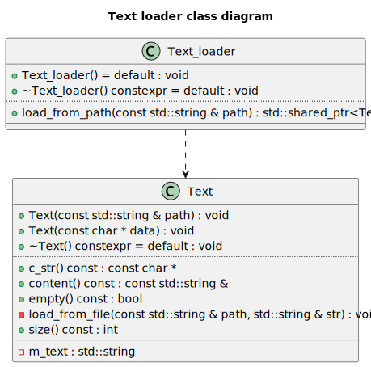

# RTR Rendering Engine

## RTR 系统总体架构

RTR 是一个基于C++的渲染引擎，它提供了一个简单易用的API，使得开发者可以轻松地创建和管理3D场景。
总的来说，RTR分为两个部分：Runtime和Editor。

- Runtime 
Engine Runtime 是渲染引擎的执行核心，它负责在最终用户的设备上实际运行和显示应用程序或游戏。它包含了所有必要的模块来加载、处理、渲染场景和处理用户输入。
- Editor
Engine Editor 是一个用于编辑和调试 Engine Runtime 的工具。它允许用户在不运行应用程序的情况下对场景进行编辑和调试，从而提高开发效率和调试能力。

## Editor系统架构

Editor系统架构是基于runtime提供的RHI_ImGUI驱动的，总的来说，Editor系统的中心协调者是Editor类。它维护了一个Panel实例的集合（通过一个映射表进行管理），允许按名称动态添加和移除面板。Editor类与引擎运行时（Engine_runtime）交互，以获取必要的上下文信息。 因此Editor系统的具体实现将会在Runtime介绍后进行。

## Runtime系统架构

## 分层架构

RTR的系统架构采用分层设计，由底层到上层依次为：
- 工具层
- 资源层
- 平台层
- 功能层
- 上下文层
- 框架层

## 为什么分层
分层架构的设计使得RTR的系统更加模块化和可扩展。 
每一层的设计相对独立，层与层之间具有单向的调用关系，上层的实现仅调用下层提供的接口。
这样的设计使得RTR的系统更加灵活和可维护,易于测试和调试。

## 后续的章节安排
因为RTR Runtime的系统架构比较复杂，因此我们将在后续的章节中对每一层的具体实现进行详细的介绍。

# 运行时工具层

## 概述
工具层主要用于提供一些通用的底层工具类和辅助函数。
第三方库也将会于工具层接入RTR Runtime，工具层将会对其进行封装和抽象，提供统一的接口。
以下是工具层的主要模块

## 设计模式库
RTR Runtime时常会使用某些设计模式，如单例模式、事件中心模式等。工具层提供了这些设计模式的实现，使得其他模块可以方便地使用这些设计模式。

**单例模式实现：**

在RTR Runtime中，单例模式通常用于管理全局资源，如窗口、输入设备、渲染设备等。
单例模式的实现通常包含一个私有的构造函数和一个静态的公有方法，用于获取单例对象。
单例模式的实现可以保证全局只有一个实例，并且提供了一个全局访问点。
RTR Runtime中的单例模式实现是一个模板类，可以通过`Singleton<T>::get_instance() `方法获取任意类的单例对象。

**事件中心模式：**

在RTR Runtime中，事件中心模式通常用于管理事件的分发和处理。
事件中心模式的实现通常包含一个参数可变的事件中心类模板`Event_center<Args...>`，用于管理事件的注册、注销和分发。
以及一个事件类`Event<Args...>`，用于封装事件的类型和数据。
每个事件可以绑定多个lamda函数，当事件触发时，会依次调用这些lamda函数。

## 数学库

RTR Runtime使用GLM作为数学库，GLM提供了丰富的数学函数和数据结构，用于处理3D图形渲染中的各种数学运算。
另外，RTR Runtime 的数学库还提供了一些常用的计算几何算法，如射线与三角形的交点计算、AABB包围盒的计算，以及求凸包的算法等。

## 日志库

RTR Runtime使用spdlog作为日志库，spdlog提供了灵活的日志输出方式，可以根据需要选择不同的日志级别和输出方式。
RTR Runtime中的日志输出可以通过spdlog提供的接口进行配置和控制。

## 序列化库

RTR Runtime使用nlohmann_json作为序列化库，nlohmann_json提供了简单易用的序列化和反序列化接口，可以方便地将数据结构序列化为JSON格式，或者将JSON格式反序列化为数据结构。用户只需要在对应数据类的命名空间中定义`to_json`和`from_json`即可使得数据持久化成为可能。

## 计时器库

RTR Runtime使用std::chrono作为计时器库，std::chrono提供了高精度的计时器功能，可以用于测量程序的执行时间。计时器库使得性能分析和优化成为可能。

## 枚举和宏

RTR Runtime使用枚举和宏来定义一些常用的常量和类型，如错误码、日志级别、渲染API等。枚举和宏使得代码更加清晰和易于维护。由于篇幅限制，这里不再详细列举具体的枚举和宏定义。

# 资源层

## 概述
资源层主要用于提供一些通用的资源管理类和接口。
资源层的设计主要是为了实现跨平台的资源管理，使得RTR Runtime可以在不同的平台上运行。
以下是资源层的主要模块

## 文件服务

`File_service`类作为跨平台资源管理的核心组件，封装了底层文件系统操作，提供统一的资源存取接口。主要功能包括路径管理（设置/获取根目录）、文本文件读写支持、目录创建与递归遍历、跨平台文件操作（复制/移动/删除），以及通过构建树形文件结构实现可视化资源管理。该抽象层有效隔离了不同操作系统的文件系统差异，为上层资源加载器提供标准化的访问接口。
另外，在GUI层中，File面板将使用File_service提供的接口，实现资源的可视化管理。

## 资源管理器

`Resource_manager_dep` 类是一个模板化的资源管理工具，用于存储和管理由 `Key_type` 标识的、类型为 `T` 的共享资源（通过 `std::shared_ptr`）。它的核心特点是引入了资源依赖图功能：它不仅能添加、获取、移除和清空资源，还能记录和管理资源之间的依赖关系。您可以显式声明一个资源依赖于另一个（例如，材质依赖于纹理），或者在添加资源时就指定其依赖项。该类具备循环依赖检测机制，能防止创建导致问题的依赖闭环。在移除资源时，它会检查是否有其他资源依赖于待移除项，默认情况下会阻止此类移除以保证依赖完整性，从而提供更健壮的资源生命周期管理。同时，它也支持查询特定资源的直接依赖项和被依赖项。

## 加载器系统
加载器系统主要用于加载资源。包括文本加载器和图像加载器。

### 文本加载器

首先，`Text` 类被设计为文本内容的基础表示与封装单元。此类支持通过两种主要途径进行实例化：其一，通过指定文件系统路径，此时类内部将执行文件读取操作以加载文本；其二，通过直接传递C风格字符串常量进行初始化。在内部实现上，`Text` 类采用 `std::string` 对象来存储文本数据，并提供了一组公共接口方法，允许外部代码访问文本内容（例如，获取 `std::string` 引用、C风格字符串指针）以及查询文本属性（如长度、是否为空）。其文件加载逻辑集成了一套基础的异常处理机制，在发生I/O错误时，会将相关的诊断信息输出至标准错误流。

其次，`Text_loader` 类作为一个辅助性的加载器（Loader）组件，其特定职责是创建并管理 `Text` 类的共享指针（`std::shared_ptr`）实例。该加载器提供了一个静态成员函数 `load_from_path`，此函数接受一个文件路径作为参数，负责根据该路径实例化 `Text` 对象，并将生成的对象包装在 `std::shared_ptr` 中返回。此种设计模式有效地将文本对象的具体创建逻辑，尤其是涉及文件系统交互的部分，从客户端代码中分离出来，并统一封装在 `Text_loader` 内部，从而提高了代码的模块化程度和可维护性。

### 图像加载器

图像加载器首先定义了 `Image_format` 枚举类型，用以抽象不同的像素表示格式（例如RGB、灰度图），并通过 `stbi_image_format` 辅助函数将这些抽象格式映射为 `stb_image` 库所特有的常量，从而确保库接口的正确调用。核心的 `Image` 类作为图像数据的抽象表示，封装了图像的维度（宽度、高度）、通道数量以及一个指向由 `stb_image` 获取的原始像素缓冲区的指针。该类支持从内存字节流或文件系统路径进行实例化，并允许在加载过程中对期望的像素格式及垂直方向进行精细控制。值得注意的是，`Image` 类的析构函数负责调用 `stbi_image_free `函数，从而确保了由 `stb_image `库所管理内存的确定性释放。为简化资源获取过程，Image_loader 类实现了工厂设计模式，提供了静态方法（`load_from_path` 和 `load_from_data`）用于创建并返回包裹在 `std::shared_ptr`智能指针中的 `Image` 实例。此设计不仅简化了客户端与加载机制的交互，亦通过共享所有权语义整合了稳健的内存管理策略。

## 哈希

`Hash` 结构体被设计为一个统一的哈希值表示和处理单元，它封装了一个 `unsigned long long` 类型的核心哈希值，并提供了标准的构造、赋值及比较操作。该结构体的关键功能在于其哈希生成能力：通过静态方法 `from_string`，它能够利用FNV-1a算法从字符串高效地计算出哈希值；而另一个静态方法 `from_raw_data` 则采用一种自定义的分块处理和位混合算法，从原始字节序列生成哈希。此外，`Hash` 结构体重载了 `+=` 和 `+` 运算符，允许通过特定的位操作（结合了异或、加法、位移及素数乘法）安全地将多个哈希对象合并为一个新的哈希值，这对于组合对象或序列的哈希非常有用。用户可以通过 `value()` 方法获取其内部的原始 `unsigned long long` 哈希值，使得该结构体不仅是哈希值的容器，也是一套功能完备的哈希生成与组合工具。

## GUID

GUID 系统的设计目的是为了提供一种简单且高效的方式来生成和管理全局唯一的标识符，适用于需要唯一标识对象或资源的场景。
它包含两个主要组件：`GUID_generator` 和 `GUID`。这两个类协同工作以提供一种简单的顺序唯一标识符（GUID）生成与封装机制。`GUID_generator` 类扮演着ID生产者的角色，它内部维护一个静态自增的无符号整型计数器，并通过其静态方法 `generate_GUID()` 来分配并返回一个在此程序运行期间内唯一的递增ID。而 `GUID` 类则作为这些ID的容器和表示；当其实例通过默认构造函数创建时，会自动调用 `GUID_generator` 来获取一个新的唯一ID进行初始化，同时也支持使用一个已有的 `unsigned int` 值来构造。

# 平台层

## 平台层概述

RTR Runtime的平台层设计旨在提供跨平台的支持，使得开发者可以基于不同的图形API(OpenGL/DirectX12/Vulkan)使用RTR Runtime。并且向上提供统一的接口，使得上层模块可以在不同的平台上运行。

平台层的设计主要包括以下两个方面：

- 平台抽象：通过平台接口层提供统一的平台抽象，使得上层模块可以在不同的平台上运行。也就是下文提到的RHI（Render Hardware Interface）。

- 平台适配：通过平台适配层提供不同平台的适配实现，使得平台层可以在不同的平台上运行。也就是对RHI的具体实现。

平台接口层和平台适配层的设计主要是为了实现跨平台的支持，使得上层模块可以在不同的平台上运行。
在本项目中，RHI接口仅实现了OpenGL的版本，对于其他的平台，需要自行实现RHI接口。

## RHI核心模块

本质上来说，RHI接口是对GPU设备的面向对象的抽象，它提供了一组API，使得开发者可以方便地管理GPU设备。在经典的图形开发的流程中，图形API通常会提供两种类型的能力：
- 资源管理能力：用于管理GPU设备上的资源，如纹理、缓冲区、渲染目标等。
- 渲染能力：用于管理GPU设备上的渲染状态，如渲染管道、着色器、渲染目标等。

因此，在RTR Runtime中，RHI接口主要提供了以下两个模块：

- RHI_functions 
  RHI_functions模块提供了一组API，用于管理GPU设备上的渲染能力。也包括渲染上下文的创建与销毁，资源的创建与销毁，渲染状态的设置与获取。
- RHI_resources 
  RHI_resources模块提供了一组API，用于表示GPU设备上的资源。如纹理、缓冲区、渲染目标，shader等。 

相比于传统的图形API（OpenGL），RTR Runtime的RHI接口更加面向对象，更加符合现代的C++编程风格，并且简单易用，功能全面。 这也是RTR Runtime的RHI设计的优点之一。

接下来将会对这两个模块进行详细的介绍。

## RHI_functions 模块

### RHI_device

`RHI_device` 是渲染硬件接口（Render Hardware Interface, RHI）系统的核心组件，负责统一抽象底层图形 API（例如 OpenGL、Vulkan、DirectX 等）的设备操作。该类通过纯虚函数接口规定了一系列图形资源与操作的创建方法，供具体的图形 API 实现类进行重载和实现。类中包含的所有成员函数都以面向对象方式封装了底层图形资源的创建逻辑，确保了平台无关性和模块化设计。

类的构造函数接收一个 `API_type` 参数，用于标识当前使用的图形 API 类型。通过 `api_type()` 方法可以访问该信息，用于在上层逻辑中根据 API 类型进行相应处理。此外，该类定义了一个纯虚函数 `check_error()`，用于在派生类中实现图形 API 特有的错误检查机制。

在资源创建方面，`RHI_device` 提供了多种缓冲区（Buffer）创建接口，包括顶点缓冲（Vertex Buffer）、索引缓冲（Element Buffer）、通用内存缓冲（Memory Buffer）等。所有这些缓冲资源都通过统一的参数接口进行创建，使得调用者无需关心底层的细节即可完成数据上传和管理。此外，该类还支持创建几何体对象 `RHI_geometry`，其本质是将多个顶点缓冲与索引缓冲组合起来，以描述完整的绘制图元结构。

在着色器方面，`RHI_device` 允许创建单个着色器代码对象（`RHI_shader_code`）以及由多个着色器组成的完整程序对象（`RHI_shader_program`）。通过参数传入的 `std::unordered_map`，用户可以灵活绑定不同类型的着色器（如顶点、片元等），并为其附加相应的 Uniform 变量。

纹理资源方面，`RHI_device` 支持创建 2D 纹理、2D 纹理数组和立方体纹理，均可通过设定 mipmap 层级、内部格式、包裹方式与过滤方式等参数来自定义。此外，类中还提供了多个便捷函数，用于快速创建常见的纹理类型，例如颜色附件、深度附件、深度立方体贴图等，从而简化了调用代码的复杂性，提高了开发效率。

除了资源创建外，`RHI_device` 还定义了帧缓冲对象（Frame Buffer）和屏幕缓冲对象（Screen Buffer）的创建接口，分别用于离屏渲染和最终画面显示。同时，为了支持计算着色器的使用，该类还包含 `create_compute_task` 方法，用于生成计算任务对象。此外，还提供了一些更高阶的资源管理与渲染流程对象，如 `RHI_memory_buffer_binder`、`RHI_texture_builder`、`RHI_renderer` 以及 `RHI_pipeline_state`，使得开发者可以灵活控制资源绑定、渲染流程状态以及多阶段渲染策略。

### RHI_window

`RHI_window` 定义了图形渲染窗口在渲染硬件接口（RHI）中的基本行为和事件交互机制。它主要用于管理图形窗口的生命周期、事件响应与帧更新操作。构造函数接收窗口的宽度、高度和标题，用于初始化窗口的基本属性。窗口还可以绑定一个 `RHI_imgui` 对象，以支持图形用户界面功能的集成。在运行过程中，窗口可以检测并处理来自用户的输入事件，如按键、鼠标点击、鼠标移动和滚轮滚动，并通过相应的事件对象（如 `Key_event`、`Mouse_button_event` 等）向注册的回调函数派发事件。

类中预定义了两个重要的默认事件处理逻辑：窗口尺寸变化时会自动调整视口设置，并记录日志；当用户按下 ESC 键时，将触发窗口关闭的操作。为了支持每一帧的渲染流程，`RHI_window` 还定义了 `on_frame_begin` 和 `on_frame_end` 方法，它们在每帧开始和结束时分别执行事件回调，并调用虚函数 `poll_events` 和 `swap_buffers`，以轮询系统事件并交换前后缓冲区，保证窗口的实时响应和画面更新。

此外，该类还提供了多个访问接口，供外部模块读取窗口的宽度、高度、标题等信息，并访问各类事件对象以注册自定义事件处理逻辑。通过虚函数的设计，`RHI_window` 为不同平台的窗口实现提供了统一的抽象接口，使得后续在 OpenGL、Vulkan 等平台下可以灵活继承和实现具体功能，符合跨平台渲染系统的设计理念。

### RHI_imgui

`RHI_imgui` 是一个用于抽象图形用户界面（GUI）渲染功能的纯虚类，旨在为不同后端实现 ImGui 提供统一的接口。该类通过一组虚函数定义了 GUI 渲染过程中常见的操作，包括帧的开始与结束、UI 面板的绘制流程，以及各种常用控件的渲染与交互逻辑。使用该类，开发者可以通过继承方式实现具体平台上的 GUI 渲染，例如 OpenGL、Vulkan 或 DirectX 下的 ImGui 接入，从而在渲染系统中无缝嵌入可视化调试工具或编辑器界面。

在渲染流程中，`begin_frame` 和 `end_frame` 分别用于标志一帧的 GUI 渲染开始和结束，而 `begin_render` 与 `end_render` 则用于具体 UI 面板的构建流程。例如，在一个以“Settings”为标题的面板中，可以添加颜色编辑器、按钮、滑动条、文本输入框等控件，这些功能分别由 `color_edit`、`button`、`slider_float`、`text_edit` 等方法提供。控件操作往往会绑定到外部变量地址上，实现交互式的数据修改。

此外，类中还提供了对 GUI 输入捕获状态的查询（`is_io_captured`），用于判断是否当前帧用户输入已被 GUI 接管，以避免与底层窗口系统产生冲突。`frame_rate` 方法可返回 GUI 当前帧率信息，便于性能监控。总体而言，`RHI_imgui` 为 GUI 模块提供了高度解耦的接口层，支持在跨平台渲染系统中灵活接入和扩展图形用户界面功能，是实时渲染系统中调试与交互不可或缺的组成部分。

### RHI_compute

`RHI_compute_task` 是一个用于封装计算着色器任务的抽象基类，代表一类可在 GPU 上执行的通用计算操作。该类设计的核心目的是将与图形渲染无关的计算流程（如图像处理、粒子模拟、物理计算等）以统一接口的形式封装，方便在底层渲染后端中实现跨平台的计算任务调度。构造函数要求传入一个 `RHI_shader_program` 类型的共享指针，并在构造时检查该程序是否包含计算着色器类型（`Shader_type::COMPUTE`）。如果未包含，将输出错误信息，提示用户当前程序未提供有效的计算着色器代码。

该类内部通过一个受保护的成员变量 `m_shader_program` 来持有计算任务所绑定的着色器程序，使得派生类可以直接访问其资源并进行调度。类中定义了两个纯虚函数，`dispatch` 和 `wait`，分别用于发起计算任务的执行请求与同步等待其执行完成。`dispatch` 接收三个无符号整数作为线程组分布的维度，用于定义计算任务的执行规模，而 `wait` 则用于阻塞主线程，直到 GPU 上的计算任务完成，确保任务顺序一致性和数据的完整性。

### RHI_renderer

`RHI_renderer` 是图形渲染引擎中的一个抽象基类，负责定义统一的渲染接口和状态管理机制，为具体平台的渲染实现（如 OpenGL、Vulkan、DirectX 等）提供可扩展的框架。该类围绕图形渲染的核心组件设计，包括着色器程序（`RHI_shader_program`）、几何数据（`RHI_geometry`）、帧缓冲对象（`RHI_frame_buffer_base`）以及清屏状态（`Clear_state`）。清屏状态用于控制是否清除颜色、深度和模板缓冲区，以及这些缓冲区的默认清除值。默认清屏颜色为柔和的粉色调，既具辨识度，又适合作为调试背景。

该类提供了 `draw` 和 `draw_instanced` 两个纯虚函数，分别用于常规绘制与实例化绘制，从而支持多种绘制方式。绘制时需要绑定着色器、几何体和帧缓冲，它们通过类成员变量持有，并可以在运行时修改。通过 `set_shader_program`、`set_geometry` 和 `set_frame_buffer` 三个 setter 接口，用户可以灵活配置渲染资源，而 `init` 方法提供了一种便捷方式将这些资源初始化为空指针，便于状态重置或重新绑定。

此外，类中还定义了 `clear` 和 `apply_clear_state` 两个虚函数，用于控制帧缓冲的清除操作。其中 `change_clear_state` 方法支持通过传入 lambda 或函数对象的方式动态修改清除状态，并立即应用，从而允许更高层的模块对渲染管线的清除行为进行灵活配置。同时，视口设置函数 `get_viewport` 和 `set_viewport` 也是纯虚接口，确保渲染器可以根据窗口大小或其他需求更新视口，支持多视图或多窗口渲染。

## RHI_resources 模块

### RHI资源的分类
RHI_resources分为两种类型：
- 原子类型 ：用于表示GPU设备上的不可细分的资源。如显存缓冲区，纹理、Shader代码，渲染管线配置文件等。
- 组合类型 ：由原子类型组合而成的资源。如帧缓冲，几何体，Shader程序等。

### RHI资源和渲染器前端的交互方式

RHI虽然是对GPU设备的面向对象的抽象，但是在实际的使用中，我们通常会使用渲染器前端来管理RHI资源。因为RHI还是一个较为底层的概念，我们通常不会直接使用RHI来管理资源。而是使用渲染器前端来管理RHI资源，封装RHI层的细节，提供更易用的API。

在此，我们提出了RHI_linker概念，用于将RHI资源和渲染器前端进行链接。RHI_linker是一个模板类，它的模板参数是RHI资源的类型。RHI_linker的作用是将RHI资源和渲染器前端进行链接，使得渲染器前端可以使用RHI资源。并且RHI_linker向前端提供了一组API，用于灵活地管理RHI资源。可以实现渲染资源的惰性创建或者预生成等功能。

### RHI资源对象

在这里我们开始介绍RHI具体的资源有哪些，包括其实现方式和设计理念

#### RHI_buffer

`RHI_buffer` 是对 GPU 设备上一种通用缓冲资源的抽象表示，在图形渲染中扮演着基础而重要的角色。它封装了缓冲区的基本属性，如缓冲类型（`Buffer_type`）、使用方式（`Buffer_usage`）以及数据大小等，旨在为渲染器提供统一的内存操作接口。类中定义了几个纯虚函数，如 `reallocate_data`、`subsitute_data` 和 `map_buffer`，它们分别用于重新分配数据、在指定偏移位置替换数据以及映射缓冲区到主存进行读写操作。这些接口的抽象设计允许不同平台或图形 API（如 Vulkan、OpenGL、DirectX）对底层缓冲区管理进行定制化实现。

与 `RHI_buffer` 配套的还有 `RHI_buffer_access_flags` 结构体，用于指示在映射缓冲区时的访问权限。它提供了三个静态函数：`read_only`、`write_only` 和 `read_write`，分别用于快速配置读取、写入或读写权限。这一设计增强了 API 的表达力，使用户可以明确指定访问目的，避免出现不必要的数据同步或资源状态切换。

此外，RHI 还针对不同类型的缓冲需求提供了接口类，如 `IRHI_vertex_buffer`、`IRHI_element_buffer` 和 `IRHI_memory_buffer`。其中，`IRHI_vertex_buffer` 表示一个顶点缓冲区，记录了每个顶点的数据类型、迭代方式和每个单元的数据数量等关键信息。它可用于描述顶点数据的组织方式，为渲染管线中的顶点输入阶段提供支持。而 `IRHI_element_buffer` 则用于存储索引数据，主要作用是在绘制时通过索引引用顶点，从而减少冗余数据，提高内存利用率。其内部假设索引类型为 `UINT`，简化了接口使用。`IRHI_memory_buffer` 提供了与绑定显存位置相关的接口，例如绑定整个缓冲区或部分区域，常见于 Uniform Buffer、Storage Buffer 等资源类型的绑定操作，其对齐方式也可通过成员变量进行指定。

为了支持统一的资源绑定操作，RHI 还引入了 `RHI_memory_buffer_binder` 抽象类。该类为内存缓冲绑定操作提供了统一接口，支持整体绑定与部分绑定，便于在渲染管线不同阶段灵活控制资源访问。这种解耦的设计使得上层渲染器能够更方便地控制底层资源，而无需关心底层 API 的差异和复杂性。

#### RHI_geometry

RHI_geometry 是对图形渲染中“几何体”这一资源的抽象封装。在图形渲染的过程中，几何体是由顶点和索引（元素）数据共同描述的，这正是 RHI_geometry 所管理的内容。该类的设计意图是为前端渲染逻辑提供一个统一的接口，用于管理和绑定 GPU 缓冲资源，并最终驱动绘制命令的执行。

在类内部， `m_vertex_buffers` 是一个映射表，用于保存多个顶点缓冲（RHI_buffer），它们通过整数 location 作为键进行索引。这种设计与现代图形 API（如 OpenGL、Vulkan）对顶点属性绑定的方式保持一致，即每个顶点属性（位置、法线、纹理坐标等）都对应一个独立的缓冲对象。 `m_element_buffer` 则是可选的索引缓冲（element/index buffer），用于在绘制时通过索引来复用顶点数据，从而提高内存效率。

构造函数支持从外部传入顶点缓冲和索引缓冲的智能指针，使得 RHI_geometry 对底层资源保持引用计数式的管理模式，避免了资源的重复拷贝和泄漏风险。

作为一个抽象类，RHI_geometry 定义了若干纯虚函数，用于由派生类提供具体实现。`bind_buffers()` 是一个用于绑定所有相关缓冲区的函数，通常在绘制之前调用。`bind_vertex_buffer()` 提供了动态绑定某个顶点缓冲区的能力，这使得几何体的数据结构可以在运行时灵活变更。`draw()` 和 `draw_instanced()` 分别用于执行标准绘制和实例化绘制操作，后者在图形编程中常用于大量相同对象的重复渲染（例如草地、树木等），大幅提升渲染效率。

#### RHI_shader

RHI_shader 是对图形渲染中“着色器”这一资源的抽象封装。在图形渲染的过程中，着色器是用于处理顶点和像素数据的程序，它定义了顶点和像素的输入输出格式、计算逻辑等。在GPU渲染管线的不同阶段，都会有不同的Shader来对渲染管线中的数据进行灵活地处理。
我们在此介绍两个和Shader密切相关的概念：

- RHI_Shader_code，它是对着色器代码的抽象封装。
- RHI_Shader_program ，它由多个RHI_Shader_code构成，是对着色器程序的抽象封装。

##### RHI_shader_code

RHI_shader_code 类，它是对着色器代码资源的抽象表示，是 RHI（渲染硬件接口）层中的一个关键组件。着色器是运行在 GPU 上的程序，负责控制渲染管线中各个阶段的行为，例如顶点变换、片元着色等。该类设计的主要目的是提供统一的接口来管理不同类型的着色器代码，并在运行时执行编译过程。

类中包含一个受保护成员变量 m_shader_type，用于标识该着色器的类型，比如是顶点着色器（Vertex Shader）、片元着色器（Fragment Shader）、几何着色器（Geometry Shader）等。这种分类对于着色器资源的管理和编译流程是必要的，因为不同的类型有不同的输入输出要求，并在 GPU 渲染流水线中的位置也不同。

虚函数 compile() 是类的核心接口，它表示将着色器源码编译成 GPU 可识别的中间表示或机器码。由于是纯虚函数，这个类是抽象的，不能被直接实例化，而需要由具体图形 API（如 OpenGL、Vulkan、DirectX）的后端类继承并实现具体的编译逻辑。

##### RHI_shader_program

`RHI_shader_program` 是抽象的着色器程序类，内部通过 `m_codes` 管理各个类型（如顶点、片元等）的着色器代码，通过 `m_uniforms` 维护所有 Uniform 变量的映射关系。它定义了一系列虚函数，如 `attach_code` 、 `detach_code` 、 `link` 和 `set_uniform` 等，用于派生类实现平台相关的操作。此外，类还提供了模板函数接口，例如 modify_uniform 和 get_uniform，可以类型安全地修改或读取 Uniform 变量的值。这些模板函数通过 `std::dynamic_pointer_cast` 实现对不同类型的 Uniform 条目的安全访问，并在找不到对应 Uniform 名称时输出提示信息。

对于 Shader的 uniform变量管理，RHI也提供了全面支持：
`Uniform_entry_base` 是所有 Uniform 数据项的抽象基类，定义了统一变量的类型（Uniform_data_type）以及是否需要更新的状态标志。这个类提供了接口函数 `data_ptr` 和 `data_count` ，由派生类具体实现，以获取底层数据指针和元素数量。

对于具体的 `Uniform` 数据，代码分别实现了 `Uniform_entry<T>` 和 `Uniform_entry_array<T>` 两个模板类，分别对应单个值和数组类型的 Uniform。两者都继承自 `Uniform_entry_base` ，分别使用 `std::unique_ptr<T>` 和 `std::unique_ptr<T[]> ``来管理数据的生命周期。Uniform_entry` 提供了对单一数据的访问与修改，而 `Uniform_entry_array` 支持修改整个数组或指定位置的元素。两者均提供了静态 `create` 方法，便于构造共享指针实例以供管理。

#### RHI_texture

`RHI_texture` 是对纹理资源的抽象封装，它是图形渲染中最常见的资源之一。纹理通常用于存储图像数据，例如纹理贴图、法线贴图等，在图形渲染中起到重要的作用。

`RHI_texture` 是一个抽象基类，封装了纹理资源的通用属性和操作接口，例如纹理的类型、内部格式、尺寸、多级渐远纹理（mipmap）级数、环绕方式和过滤方式等。该类还定义了若干纯虚函数，如 `set_filter`,`set_wrap` ,`generate_mipmap` 和 `bind_to_unit` ，用于由具体平台的子类实现。同时，它提供了封装好的方法用于批量设置过滤器和环绕参数，以及设置边框颜色的方法 `set_border_color，并通过` `on_set_border_color` 纯虚函数将具体行为交由子类实现，从而保证接口的一致性与灵活性。

对于纹理元数据的管理，我们提供了 `Image_data` 结构体。该结构体用于表示原始图像数据，包含图像的宽高、指向数据的指针、数据格式和外部格式信息，并通过 `has_ownership` 成员变量指示是否需要在析构时释放数据内存。此外，该结构体还封装了一个 `create_image` 方法，可以根据图像的缓冲类型创建对应格式的 `Image` 对象。

RHI_texture 分为三大类：
- 2D 纹理：用于存储二维图像数据，如纹理贴图。
- 2D 数组纹理：用于存储二维图像数据的数组，如纹理数组。
- Cubmap 纹理：用于存储立方体贴图图像数据。

`对于这三种类型，IRHI_texture_2D` `、IRHI_texture_cubemap` 和 `IRHI_texture_2D_array` 分别定义了针对二维纹理、立方体纹理和二维纹理数组的接口，这些接口统一约定了图像数据上传和获取的操作，并支持通过原始图像数据或已有纹理资源进行纹理的构建。这种设计有助于实现纹理资源的灵活转换与共享，同时也便于引擎内部的功能复用。

`RHI_texture_builder` 是一个面向构建的接口类，定义了一组用于创建不同类型纹理的方法。通过 `build_texture_2D`,`build_texture_cubemap` 和 `build_texture_2D_array` 等方法，用户可以使用原始图像数据或已有纹理资源构建目标纹理对象。这一设计模式遵循了“构建者模式”的思想，使纹理的构建流程更加灵活且易于维护，有利于与外部资源加载系统集成，提升引擎的模块化程度。

#### RHI_frame_buffer

`RHI_frame_buffer` 定义了一套用于渲染帧缓冲区（Frame Buffer）的抽象与实现类，主要包括普通离屏帧缓冲与屏幕缓冲的封装。通过统一的基类接口 `RHI_frame_buffer_base`，系统可以在不关心具体帧缓冲类型的前提下操作渲染目标，从而提升渲染系统的通用性与可扩展性。

`RHI_frame_buffer_base` 是所有帧缓冲类型的抽象基类，定义了判断帧缓冲有效性的纯虚函数 `is_valid`，以及获取缓冲区宽度和高度的接口 `width` 和 `height`。这一接口的存在为不同类型的帧缓冲提供了统一的访问方式，使得在后续的渲染流程中可以透明地切换目标缓冲对象，无需依赖具体的帧缓冲实现细节。

`RHI_frame_buffer` 是具体的离屏帧缓冲实现，它维护了一个宽高尺寸，并使用 `std::vector` 存储了多个颜色附件（Color Attachments），以及一个深度附件（Depth Attachment）。这些附件均为纹理对象，说明该类旨在将渲染输出重定向到纹理中，用于后续的后处理、纹理采样或图像保存等操作。该类提供了获取颜色附件和深度附件的接口，从而方便图形管线在不同阶段读取或替换对应资源。

`RHI_screen_buffer` 代表的是屏幕帧缓冲，即最终渲染结果输出到用户可见窗口的那部分帧缓冲。它内部保存了一个指向窗口对象的智能指针 `m_window`，并通过该对象提供的接口获取当前窗口的宽度和高度。由于屏幕缓冲通常不拥有独立的纹理资源，其行为主要受窗口系统的驱动，因此它没有显式的颜色或深度附件。

#### RHI_pipeline_state

`RHI_pipeline_state` 定义了一个图形渲染管线状态的抽象系统，用于描述和控制图形渲染过程中的关键固定功能阶段。它以结构体的方式封装了深度测试、混合、偏移、模板测试以及背面剔除等常见渲染状态配置，并提供了多个静态工厂方法来快速构造常见渲染情形下的状态组合，如不透明物体、透明物体、天空盒、边缘检测和阴影渲染等。

`Depth_state` 表示深度测试状态，其成员控制是否启用深度测试与深度写入，并指定使用哪种深度比较函数。针对不透明物体、半透明物体以及天空盒，该结构提供了三种静态方法，便于在构建渲染管线时快速设定合适的深度状态。例如，半透明对象通常关闭深度写入以避免遮挡错误，而天空盒允许与最远处深度相等的片元通过测试。

`Polygon_offset_state` 用于控制多边形偏移，用以避免面片重合导致的Z-fighting问题。它支持对点、线和填充的偏移开关控制，并可指定偏移因子与单位值。该状态默认禁用，同时也提供了统一启用的工厂方法供特殊场景（如阴影偏移）使用。

`Stencil_state` 结构体封装了模板测试的配置，包括是否启用模板测试、比较函数、以及当模板测试或深度测试失败或成功时应采取的操作。同时，它还提供模板参考值和掩码控制模板操作的范围。该结构定义了三种典型模板状态：禁用模板、不透明绘制时替换模板值、边缘检测时测试不相等值以突出轮廓。

`Blend_state` 控制颜色混合阶段，主要用于实现半透明物体的正确叠加效果。它提供了源与目标颜色因子、混合操作等配置项。在默认禁用状态下，不进行任何颜色混合，而启用时则通常采用常见的 alpha 混合方式，即源颜色乘以其 alpha 值，加上目标颜色乘以（1 - alpha）。

`Cull_state` 表示背面剔除设置，包括是否启用剔除、剔除哪一面（前面、背面、或全部），以及定义哪一面为正面（顺时针或逆时针）。它的多种静态方法可以帮助快速构造面向不同渲染任务的剔除设置，如完全关闭剔除或启用背面剔除等。

所有这些状态被整合进一个统一的 `Pipeline_state` 结构体，用于代表某一具体渲染流程所需的完整状态集。该结构提供了多个静态方法，返回常见的渲染状态组合，例如用于阴影贴图渲染的 shadow\_pipeline\_state，或用于不透明几何绘制的 opaque\_pipeline\_state。通过这种方式，可以简化渲染流程中对状态的管理，提高可读性与复用性。

`RHI_pipeline_state` 是一个抽象类，封装了一个具体的 `Pipeline_state` 成员，并定义了一个 `apply()` 方法用于将当前状态应用到底层图形 API 管线中。它通过纯虚函数分别调用各个子状态的应用接口，如 `apply_blend_state`、`apply_cull_state` 等，这些函数需在子类中结合具体的图形 API（如 OpenGL、Vulkan 或 DirectX）进行实现。该抽象设计有效地将高层渲染逻辑与底层平台无关地解耦，方便跨平台图形后端的开发与维护。

  

