# 摘要

本研究介绍并阐述了一款3D实时图形渲染引擎的设计与实现。该引擎采用C++构建，核心目标在于实现高度模块化、可扩展性及跨平台能力，旨在为图形开发者和研究人员提供一个功能强大且易于使用的平台。RTR引擎架构分为核心执行与显示的“运行时（Runtime）”和基于运行时构建的“编辑器（Editor）”两大模块。

运行时部分采用了严格的分层设计，其后端包含提供基础工具、资源管理和渲染硬件接口（RHI）的抽象层，从而实现对OpenGL、DirectX和Vulkan等图形API的跨平台支持。前端则由框架层、上下文交换层和功能层构成，通过高效的帧循环机制、组件化的场景管理体系及数据解耦的`Swap_data`结构，驱动场景的逻辑更新与图形渲染。渲染系统高度模块化，通过渲染管线（`Render_pipeline`）和渲染通道（`Render_pass`）分解复杂渲染流程，并支持灵活的动态着色器变体生成。

引擎实现了多项关键实时渲染算法，包括Blinn-Phong光照模型、支持法线贴图、Alpha贴图和视差遮蔽贴图（POM）的材质表现，以及PCF和PCSS等高级柔和阴影算法，并集成了Gamma校正等后处理步骤以确保视觉准确性。在测试场景中，引擎能够在高分辨率、近十万面三角形、多光源及复杂阴影设置下，稳定维持30+帧率。

编辑器部分基于运行时的RHI驱动构建，通过可定制的面板（Panel）实例，支持开发者在引擎运行时动态检查、编辑和调试场景对象、材质属性及渲染参数，显著提升了开发与调试效率。该引擎通过其精细的架构设计和算法实现，为实时3D图形应用开发与研究提供了强大、高效且高度可定制化的解决方案。

# 文献综述

## 研究背景

3D图形渲染，作为计算机科学的一个核心分支，其历史根植于对真实世界光照与物质交互的模拟渴望。早期的探索集中在经验模型，旨在以计算高效的方式近似复杂的光学现象。Bui Tuong Phong于1975年提出的Phong着色模型 (Phong1975Illumination) 是这一时期的代表。该模型将光照分解为环境光、漫反射和镜面反射三个分量，通过简单的矢量运算，使得在计算资源极为有限的早期硬件上，三维物体得以呈现出初步的立体感和表面质感。这不仅是技术上的突破，也为后续更复杂的物理模型的出现奠定了实践基础。  

随着理论研究的深入，James Kajiya在1986年提出的渲染方程 (Kajiya1986RenderingEquation) 标志着一个里程碑式的进展。该方程从物理学角度出发，为场景中的全局光照传输提供了一个统一且完整的数学框架，精确描述了光能在场景中发射、散射、吸收和传播的过程。渲染方程不仅为离线渲染追求照片级真实感设立了理论基准，也为实时渲染领域发展更精确的近似算法指明了方向。尽管直接求解渲染方程在实时应用中仍具挑战性，但其核心思想已渗透到现代渲染技术的各个层面。  

图形硬件与应用程序接口 (API) 的标准化与演进，对渲染技术的发展起到了关键的催化作用。OpenGL (Woo1999OpenGL) 等API的出现以及后来的DirectX，通过提供标准化的硬件抽象层，极大地降低了开发者使用图形加速硬件的门槛。这使得研究者和开发者能够更便捷地实现和验证各种渲染算法，从简单的经验模型到对渲染方程的复杂近似，从而推动了整个领域的快速发展。这种理论模型、实践算法与开发工具（API与硬件）之间的协同进化，是早期渲染技术发展的重要特征。理论的突破指引了方向，实践算法提供了即时可用的解决方案，而API的进步则为这些理论和算法的实现与普及提供了平台。  

自诞生以来，3D图形渲染始终追求两大核心目标：真实感 (Photorealism) 和交互性 (Interactivity)。真实感的目标是生成与真实照片无异的图像，这要求对光照、材质和几何细节进行极致精确的模拟。而交互性则要求渲染过程能够达到实时帧率（通常为每秒30-60帧以上），这对于视频游戏、交互式仿真、虚拟现实和增强现实等应用至关重要。如何在有限的计算资源下平衡这两个往往相互冲突的目标，一直是渲染技术研究的核心挑战，也是《Real-Time Rendering》 (AkenineMoller2018RTR) 等著作探讨的核心内容。

## 研究意义

3D图形渲染技术的发展，其意义远超提升数字图像的视觉美感，它已成为驱动多个行业数字化转型的核心引擎，并深刻影响着信息交流与用户体验。  

3D渲染技术在众多领域产生了深远影响。在交互娱乐领域，视频游戏和模拟器是实时渲染技术最主要的试验场和推动力，不断追求更高的视觉保真度和流畅的交互体验。电影制作和视觉特效行业则依赖于基于物理原理的离线渲染技术（Pharr2023PBR）创造出令人惊叹的视觉奇观，并且正越来越多地将实时引擎用于预演甚至最终画面输出。虚拟现实 (VR) 与增强现实 (AR) 的沉浸式体验对高真实感和极低延迟的渲染提出了严苛要求 (AkenineMoller2018RTR)。此外，科学可视化（例如分子结构或医学扫描的呈现 1）、计算机辅助设计 (CAD) 与制造 (CAM)（用于产品可视化和原型设计）、文化遗产保护及教育（通过3D重建历史遗迹或复杂概念）等领域，均因3D渲染技术而获得了前所未有的表达和分析能力。  

3D渲染技术极大地提升了用户体验和信息传达的效率。逼真的渲染效果能够增强用户的沉浸感和参与度，使得信息传递更为直观和生动。用户通过与实时渲染的3D场景互动，可以进行探索、实验，从而更深入地理解复杂的对象或过程。例如，在产品设计领域，工程师可以在虚拟环境中评估多种设计方案，而无需制造昂贵的物理原型；在电子商务中，3D产品展示和AR试穿功能正在改变消费者的在线购物体验。  
再者，对更高渲染质量和效率的追求持续推动着相关技术的革新。图形处理器 (GPU) 的架构演进、并行计算范式、显示技术以及算法设计等领域，都深受3D渲染需求的驱动。特别是将电影级离线渲染的视觉质量与游戏及VR/AR应用所需的实时交互速度相结合的努力，一直是研发的主要催化剂，催生了从基础着色技术到复杂的实时全局光照系统 (Wright2021Lumen) 的演进。这种技术进步不仅服务于图形学本身，其成果也常常溢出到其他计算密集型领域。因此，3D渲染技术不仅是数字内容创作的关键工具，更是推动更广泛的数字化交互、创造和商业模式创新的基础技术。

## 研究现状

3D图形渲染领域经过数十年的发展，已形成一套成熟的理论体系和丰富的技术积累，同时在新兴技术的驱动下持续演进。

### 主流渲染范式

在实时图形渲染领域，多种核心技术共同塑造了我们所见的视觉体验。其中，光栅化 (Rasterization) 作为长期以来的基石，通过将三维几何体投影到二维屏幕并在此过程中计算像素颜色，成为OpenGL (Woo1999OpenGL) 和DirectX等图形API的核心机制。它以处理大规模多边形的固有高效性，在过去几十年中一直是交互式应用（如游戏）的主流选择。

与之形成对比的光线追踪 (Ray Tracing)，则通过模拟光线的物理传播路径来生成图像，自然地处理精确的反射、折射、阴影等复杂光学效应。尽管其巨大的计算开销曾使其主要应用于离线渲染，但近年来，随着专用硬件（如NVIDIA RTX系列GPU、Microsoft的DirectX Raytracing (DXR) API Microsoft2018DXR）和图形API（如Vulkan Ray Tracing KhronosVulkanSpec）的进步，实时光线追踪正逐步应用于交互式场景，通常与光栅化结合形成混合渲染管线。

为了追求更真实的光照效果，基于物理的渲染 (Physically Based Rendering, PBR) 应运而生。PBR旨在基于物理学原理来建模光照与材质的交互，目标是在不同光照条件下产生一致且可预测的视觉效果。权威著作《Physically Based Rendering: From Theory to Implementation》 (Pharr2023PBR) 提供了该领域的完整理论和实践指导。其奠基性工作之一是Cook与Torrance提出的反射模型 (Cook1981Reflectance, Cook1982TOGReflectance)，将微表面理论引入计算机图形学，为现代PBR材质模型奠定了基础。如今，诸如Unreal Engine等现代游戏引擎已广泛采用PBR，如Brian Karis在其演讲“Real Shading in Unreal Engine 4” (Karis2013RealShading) 中所详述的，涵盖了能量守恒、微表面双向散射分布函数 (BSDF) 等关键概念的实践。此外，对微表面BSDF中多次散射现象的研究 (Kulla2017MultiScattering) 进一步提升了PBR的精度。

此外，为了优化复杂场景的渲染效率，延迟渲染/着色 (Deferred Rendering/Shading) 技术将几何处理阶段与光照计算阶段解耦。首先，场景的几何属性（如位置、法线、材质参数）被渲染到一系列中间缓存（称为G-Buffers）中；随后，在后续通道中利用这些G-Buffer信息逐像素计算光照。这种方法对于包含大量动态光源的场景尤其高效，因为它使着色计算的开销与几何复杂度解耦。Shawn Hargreaves在GDC的演讲 (Hargreaves2004Deferred) 对该技术的早期概念普及起到了重要作用。Andrew Lauritzen则进一步探讨了延迟渲染在当时及未来渲染管线中的应用潜力 (Lauritzen2010Deferred)。

### 关键算法进展
在上述传统渲染范式的基础上，计算机图形学领域涌现了大量针对特定渲染效果和挑战的先进算法，极大地提升了实时渲染的视觉真实感和效率。

在全局光照 (Global Illumination, GI) 方面，多种技术旨在模拟光的复杂行为。例如，基于图像的光照 (Image-Based Lighting, IBL) 利用预先捕获或渲染的高动态范围环境贴图 (HDR) 为场景提供真实的环境光照和反射效果，Paul Debevec的工作 (Debevec1998IBL) 在此领域具有开创性意义。为了增加场景的深度感和接触阴影，屏幕空间环境光遮蔽 (Screen-Space Ambient Occlusion, SSAO) 应运而生，由Martin Mittring在CryEngine 2中引入 (Mittring2007SSAO) 后迅速普及；随后的改进版本如基于地平线的环境光遮蔽 (Horizon-Based Ambient Occlusion, HBAO) (Bavoil2008HBAO) 提供了更为鲁棒的效果。对于实时漫反射全局光照，光照传播体积 (Light Propagation Volumes, LPV) (Kaplanyan2010LPV) 使用级联的体积数据结构来传播光照信息，而体素锥形追踪 (Voxel Cone Tracing, VXGI) (Crassin2011VXGI) 则利用场景的体素化表示，通过追踪圆锥体来近似间接光照。近期，Unreal Engine 5的Lumen系统 (Wright2021Lumen) 代表了实时GI能力的重大突破，它提供了一套全动态的全局光照和反射系统，无需预计算即可处理复杂场景和动态光照变化。

阴影技术 (Shadowing Techniques) 的发展同样显著提升了渲染的真实性。百分比渐近柔和阴影 (Percentage-Closer Soft Shadows, PCSS) (Fernando2005PCSS) 能够渲染出半影随着与投射物距离增加而真实变宽的柔和阴影。方差阴影图 (Variance Shadow Maps, VSM) (Donnelly2006VSM) 通过存储深度值的均值和方差，有效减少了阴影图的锯齿并实现了更平滑的过滤。反射阴影图 (Reflective Shadow Maps, RSM) (Dachsbacher2005RSM) 则扩展了传统阴影图的功能，使其能够从第一次光线反弹中捕获间接光照信息，从而实现颜色溢出等效果。此外，利用符号距离场 (SDF) 高效追踪光线以生成柔和阴影的光线追踪距离场柔和阴影 (Ray Traced Distance Field Soft Shadows) (Wright2016SDFShadows) 也常用于特定光源或混合渲染管线中。除了上文提及的SSAO和HBAO，屏幕空间反射 (Screen-Space Reflections, SSR) (McGuire2014SSR) 通过在屏幕空间中进行光线步进来生成反射效果，随机化采样进一步提升了反射质量。

在高级几何处理与渲染方面，Unreal Engine 5的Nanite系统 (Karis2021Nanite) 是一项革新性技术。它是一种虚拟化微多边形几何系统，通过智能地流式传输和仅渲染可见细节，使得实时渲染包含海量几何细节（数百万乃至数十亿多边形的电影级资产）成为可能，从根本上改变了艺术家创作和使用3D资产的方式。

近年来，神经渲染 (Neural Rendering) 作为新兴领域迅速崛起，利用深度学习技术来合成或增强三维场景的表示和渲染过程。其中，神经辐射场 (Neural Radiance Fields, NeRF) (Mildenhall2020NeRF) 将场景表示为一个连续的体积函数（一个神经网络），该函数将五维坐标（空间位置和观察方向）映射到颜色和密度，能够从稀疏的输入图像集生成照片般真实的新视角图像。作为一种更新的技术，3D高斯泼溅 (3D Gaussian Splatting, 3DGS) (Gao2024GaussianSplattingReview) 使用一组三维高斯椭球来表示场景，在实时渲染速度下达到了顶尖的新视角合成质量，并在训练时间和渲染效率上优于许多NeRF变体。

此外，深度学习增强渲染 (Deep Learning Enhanced Rendering) 将深度学习集成到传统渲染管线中，用于执行诸如去噪、超分辨率（例如NVIDIA DLSS）、环境光遮蔽生成，甚至替代部分渲染器组件等任务。Wang等人 (Wang2023MIR_DLRender) 的综述对此类方法进行了全面概述。

此外，一些有影响力的渲染引擎与库推动了这些技术的普及和发展。Unreal Engine和Unity作为主流的商业游戏引擎，集成了上述许多先进技术（如UE中的PBR, Lumen, Nanite），并引领着行业趋势。开源引擎如OGRE 3D (OGRE3D)、Irrlicht Engine (IrrlichtEngine) 和 Panda3D (Panda3D) 在历史上为开发者和研究者提供了可访问的3D渲染技术，促进了实验和学习。同时，即时模式GUI库如Dear ImGui (ocornutImGui) 因其易于集成和使用，已成为开发渲染应用中调试界面和工具不可或缺的组件。在Web端，WebGL (Matsuda2013WebGL) 将硬件加速的3D图形带到了Web浏览器，为交互式在线体验开辟了新途径。
 
**表1: 3D渲染关键进展与技术概要**

| 技术类别 | 代表性算法/概念 | 关键文献 | 核心贡献/影响 |
| :---- | :---- | :---- | :---- |
| 着色模型 | Phong着色 | Phong1975Illumination | 早期的经验性模型，实现了高效的局部光照着色。 |
| 物理基础 | 渲染方程 | Kajiya1986RenderingEquation | 统一了光传输的物理理论，为真实感渲染奠定基础。 |
| 基于物理的着色 | Cook-Torrance模型 | Cook1981Reflectance, Cook1982TOGReflectance | 引入微表面理论，实现了更真实的材质外观。 |
| 延迟渲染 | 延迟着色 | Hargreaves2004Deferred, Lauritzen2010Deferred | 解耦几何与光照计算，高效处理多光源场景。 |
| 基于图像的光照 | 将合成对象渲染到真实场景中 | Debevec1998IBL | 使用环境贴图实现真实的场景光照。 |
| 实时环境光遮蔽 | SSAO (屏幕空间环境光遮蔽) | Mittring2007SSAO | 高效的屏幕空间环境光遮蔽算法。 |
| 阴影技术 | PCSS (百分比渐近柔和阴影) | Fernando2005PCSS | 实现具有可变半影的真实柔和阴影。 |
| 阴影技术 | VSM (方差阴影图) | Donnelly2006VSM | 利用统计矩实现更平滑、抗锯齿的阴影。 |
| 实时全局光照 | Lumen (Unreal Engine 5\) | Wright2021Lumen | 全动态的实时全局光照与反射系统。 |
| 虚拟化几何 | Nanite (Unreal Engine 5\) | Karis2021Nanite | 实时渲染海量几何细节。 |
| 神经视角合成 | NeRF (神经辐射场) | Mildenhall2020NeRF | 基于神经网络的连续体积场景表示，用于新视角合成。 |
| 神经视角合成 | 3D高斯泼溅 | Gao2024GaussianSplattingReview (综述, 原创 Kerbl et al. 2023\) | 基于显式高斯基元的表示，实现高质量的实时视角合成。 |

渲染技术的发展历程揭示了一个有趣的现象：在追求普适的、物理精确的解决方案（如基于渲染方程的完整路径追踪）与开发针对特定问题的高效实时特化技术（如SSAO或特定阴影算法）之间，存在一种持续的“钟摆效应”。早期的渲染技术，如Phong着色 (Phong1975Illumination)，因硬件限制而高度特化和经验化。随后，渲染方程 (Kajiya1986RenderingEquation) 和PBR理论 (Pharr2023PBR, Cook1981Reflectance) 将研究推向了普适性和物理正确性，但这主要在离线渲染中才能充分实现。实时交互的需求催生了大量针对特定效果的特化技术，例如环境光遮蔽 (Mittring2007SSAO)、柔和阴影 (Fernando2005PCSS) 和反射 (McGuire2014SSR)，这些技术虽然高效，但在适用范围或精度上往往存在局限。随着硬件的进步（例如可编程着色器、专用光线追踪核心 Microsoft2018DXR），更普适的方法开始在实时领域变得可行，但通常难以同时对所有效果都达到理想的性能。这导致了混合渲染管线的兴起，例如Unreal Engine 5集成了基于光栅化的Nanite (Karis2021Nanite)、可选的光线追踪效果以及动态全局光照系统Lumen (Wright2021Lumen)，而Lumen本身也是一个由多种技术构成的复杂系统。深度学习方法如DLSS则被用于从较少的渲染样本中重建更高质量的图像。这种趋势表明，单一的“万能”实时渲染算法不太可能出现，未来的渲染器将更趋向于模块化和混合化，能够根据场景复杂度、硬件能力和期望的质量/性能权衡动态地选择和组合不同的技术。

### 国内研究现状

中国在3D图形渲染领域的研究，特别是在新兴的计算密集型方向，正展现出日益增强的创新能力和国际影响力。  
以神经渲染为例，国内研究机构和学者在该前沿领域取得了一系列瞩目的成果。中国科学院计算技术研究所（ICT, CAS）的袁宇杰、高林等研究人员在神经辐射场 (NeRF) 编辑这一具有挑战性的问题上做出了重要贡献。他们在CVPR 2022上发表的论文《NeRF-Editing: Geometry Editing of Neural Radiance Fields》 (Yuan2022NeRFEditing) 提出了一种允许用户对NeRF进行可控形状变形的方法。该方法通过在用户变形的显式网格与隐式神经场之间建立对应关系，并借助四面体网格代理来弯曲相机光线，从而实现了对NeRF场景的几何编辑。袁宇杰为ICT, CAS的博士生，导师为高林教授，高林教授现为ICT, CAS副研究员，在ACM SIGGRAPH/TOG、IEEE TPAMI等顶级期刊和会议上发表了多篇高质量论文。这项工作有效解决了早期NeRF模型主要为静态场景的局限性。  

在3D高斯泼溅 (3D Gaussian Splatting) 这一新兴技术方向，高林及其合作者（包括计算所的吴桐、袁宇杰等）同样表现活跃。他们近期在《Computational Visual Media》上发表的综述性文章《Recent Advances in 3D Gaussian Splatting》 (Gao2024GaussianSplattingReview) 对这一快速发展的技术进行了全面梳理和总结。该综述强调了3DGS的显式表示如何为编辑任务带来便利，这与NeRF等隐式表示面临的挑战形成对比。除了这些代表性工作，该团队还在纹理网格的深度生成网络（TM-NET, SIGGRAPH Asia 2021）、深度人脸编辑以及网格变形分析等方向产出了重要成果，显示出在基于深度学习的3D内容创建与处理领域的持续深耕。

中国科学院计算技术研究所已成为国内计算机图形学研究的重要力量之一，高林等学者也获得了亚洲图形学学会青年研究者奖等荣誉。他们的研究成果频繁发表于国际顶级学术会议和期刊，表明国内研究工作与国际前沿紧密接轨，并通过与Leif Kobbelt教授等国际学者的合作，积极融入全球学术研究社群。这些成就反映出中国在计算密集型和数据驱动的图形学研究领域，正从技术的应用者和追随者，逐渐转变为前沿问题的探索者和创新方案的贡献者。对于构建新的3D渲染器而言，充分了解和借鉴包括国内前沿在内的最新研究进展至关重要。

### 国外研究现状

国际上，特别是北美和欧洲的研究机构与企业，在3D图形渲染领域拥有悠久而辉煌的创新历史，贡献了大量奠基性理论和前沿技术。  
在理论基础方面，Kajiya提出的渲染方程 (Kajiya1986RenderingEquation, 美国) 和Cook-Torrance等早期的基于物理的反射模型 (Cook1981Reflectance, Cook1982TOGReflectance, 美国) 为真实感图像合成奠定了坚实的理论基石。OpenGL等图形API的开创性发展（美国）以及《OpenGL Programming Guide》 (Woo1999OpenGL) 和《Real-Time Rendering》 (AkenineMoller2018RTR, 作者主要来自欧美) 等权威著作的出版，极大地推动了知识传播和行业实践的标准化。  

基于物理的渲染 (PBR) 的研究与实践在国外一直处于领先地位。《Physically Based Rendering》 (Pharr2023PBR, 美国) 一书作为该领域的权威指南，历经多个版本的迭代，反映了深厚的专业积累。工业界对PBR原理的采纳和优化，以Epic Games (美国) 的Brian Karis在Unreal Engine着色系统上的工作 (Karis2013RealShading) 为代表，产生了广泛影响。对更精确微表面模型的研究，如包含多次散射的模型 (Kulla2017MultiScattering, 美国)，仍在持续深化PBR理论。  

实时光照与阴影技术方面也涌现了大量创新。延迟着色技术由Shawn Hargreaves (Microsoft, 美国) (Hargreaves2004Deferred) 等人推广，并由Andrew Lauritzen (Intel, 美国/丹麦) (Lauritzen2010Deferred) 等人进一步发展。环境光遮蔽技术，如SSAO (Martin Mittring, Crytek, 德国) (Mittring2007SSAO) 和HBAO (Louis Bavoil等, NVIDIA, 美国) (Bavoil2008HBAO)，显著提升了实时渲染的视觉质量。各类先进阴影算法，包括PCSS (Randima Fernando, NVIDIA, 美国) (Fernando2005PCSS)、VSM (Donnelly与Lauritzen, 美国) (Donnelly2006VSM)、RSM (Dachsbacher与Stamminger, 德国) (Dachsbacher2005RSM) 以及基于SDF的阴影 (Daniel Wright, NVIDIA/Epic Games, 美国) (Wright2016SDFShadows)，主要源自欧美研究者和工业实验室。  
实时全局光照是另一个持续取得突破的领域。从IBL (Debevec1998IBL, 美国)、LPV (Kaplanyan与Dachsbacher, 德国) (Kaplanyan2010LPV) 到Voxel Cone Tracing (Crassin等, NVIDIA, 法国/美国) (Crassin2011VXGI)，再到Unreal Engine 5中的Lumen系统 (Wright2021Lumen, 美国)，代表了实时GI技术的不断进步。  

在屏幕空间效果和几何管理方面，SSR的开发 (McGuire2014SSR, NVIDIA/威廉姆斯学院, 美国) 推动了屏幕空间光线追踪的应用。Unreal Engine 5中的Nanite系统 (Karis2021Nanite, 美国) 则彻底改变了实时几何处理的方式。  

神经渲染和硬件加速是当前的热点。NeRF (Mildenhall2020NeRF, Google Research/加州大学伯克利分校, 美国) 引领了新一轮的视角合成研究浪潮。微软的DirectX Raytracing (DXR) (Microsoft2018DXR, 美国) 和Khronos Group的Vulkan Ray Tracing (KhronosVulkanSpec, 国际联盟) 的推出，标志着硬件加速光线追踪的重要里程碑。NVIDIA在ReSTIR方面的研究 (Bitterli2020ReSTIR\_TOG, NVIDIA, 美国/瑞士) 旨在解决动态场景下多光源实时路径追踪的难题。  

ACM SIGGRAPH、ACM SIGGRAPH Asia和Eurographics 等顶级学术会议是传播前沿研究成果的主要平台。许多引用的工作都发表在这些会议或其附属期刊上。同时，NVIDIA Research、Microsoft Research、Epic Games、Intel、Crytek、Google Research等工业研究实验室是创新的重要策源地，它们往往将学术研究成果快速转化为实际应用。这种学术界与工业界之间的紧密合作和快速技术转化是海外渲染技术创新的一大特点。基础概念常在学术界萌芽或发展，而工业界则凭借其资源和产品导向，迅速将有前景的学术思想应用于实际，并推动相关硬件（如可编程GPU、RT核心）的革新，这些硬件又为学术研究开辟了新的可能性。这种互动极大地加速了创新步伐。

## 技术挑战

尽管3D图形渲染技术取得了长足进步，但在追求实时、照片级真实感、可处理任意复杂动态场景的终极目标过程中，依然面临诸多技术挑战。

其中最突出的挑战之一在于实时高保真全局光照与路径追踪。在交互式帧率下实现完整的全局光照效果，包括多重弹射间接光照、柔和阴影和焦散等，尤其是在包含复杂几何、材质和动态元素的场景中，仍然极为困难 (AkenineMoller2018RTR, Pharr2023PBR)。尽管光线追踪技术因其可扩展性和高真实感潜力而备受关注，但其计算需求依然庞大。实时路径追踪在处理大量动态光源时面临巨大挑战，例如ReSTIR (Bitterli2020ReSTIR_TOG) 虽是重要进展，但对于多重弹射GI和VR应用，问题远未完全解决。在低采样率下有效抑制噪声是核心难题之一 14。另一个重大挑战是海量几何细节的高效渲染。尽管Nanite (Karis2021Nanite) 等技术实现了重大突破，但对于包含数十亿甚至数万亿多边形的场景，特别是在存在动态元素和复杂着色的情况下，高效的内存管理、剔除效率以及维持高帧率仍然是持续的挑战。


时间性技术的伪影，虽然对提升实时渲染图像的稳定性至关重要，但也常常引入伪影。例如，时间性抗锯齿 (Temporal Anti-Aliasing, TAA) 容易引入鬼影、模糊和细节丢失等伪影，尤其是在物体快速运动或发生遮挡变化时。Yang等人 (Yang2020CGF_TAA) 的综述深入分析了这些挑战及现有改进方法，FXAA和TAA的比较也突出了TAA对历史帧的依赖性。此外，在追求极致视觉保真度、维持流畅交互性能以及控制高级渲染算法实现与调试的复杂度之间找到恰当的平衡点，是开发者持续面临的难题 (AkenineMoller2018RTR)。随着先进技术的不断涌现，渲染器系统本身也变得越来越复杂。

硬件限制与协同进化也扮演着关键角色。尽管GPU性能持续提升（如专用光线追踪核心 Microsoft2018DXR、更高的并行度），但对于最宏大的渲染目标而言，硬件仍是瓶颈。内存带宽、延迟和功耗（尤其对移动/VR设备）是关键制约因素。新算法的开发往往与预期或已有的硬件特性紧密耦合，反之亦然。例如，神经渲染对专用硬件加速的需求正是一个新兴的例证 (Yan2024arXiv_NRHardware)。最后，实时体积渲染高质量地呈现体积效果（如云、烟、火、雾），特别是要正确处理光照交互和自阴影，依然充满挑战。相关的研究探讨了体积渲染的技术和难题，包括对低采样蒙特卡洛结果的去噪以及局部与全局光照模型的应用。

几乎每一种先进的渲染技术都伴随着某种形式的权衡，这体现了渲染领域的“没有免费午餐”原则。例如，TAA在改善锯齿的同时可能引入模糊或鬼影 (Yang2020CGF_TAA)；实时的全局光照技术（如Lumen、LPV、VXGI）虽然提供了间接光照，但计算成本高昂，且在精度或动态范围上可能逊于离线路径追踪；延迟渲染有助于处理多光源，却增加了内存带宽需求，并对透明物体处理不佳；神经渲染带来了全新的能力，但也伴随着训练成本、潜在伪影和编辑难题。这种固有的权衡特性，使得渲染器的设计不仅是实现最新算法的集合，更是一门在诸多因素间进行智能管理的艺术。研究表明，人类视觉系统对场景中不同区域的关注度存在差异。这意味着渲染资源可以更倾向于投入到对最终感知质量贡献最大的方面，例如，在视觉焦点区域采用更高精度的计算，而在周边或不重要区域适当降低渲染质量，从而在不牺牲或极少牺牲主观视觉体验的前提下优化性能。这种基于人类视觉感知的优化策略，正成为应对复杂权衡挑战的一个重要方向。未来的渲染器设计，需要更加关注这种权衡管理，并可能集成更复杂的感知模型，以实现“感知无损”的实时渲染。

## 论文组织结构

本文的组织结构如下：
- 第一章： 文献综述：
  介绍了3D渲染领域的背景、发展历程和技术挑战，重点关注实时渲染的最新进展和未来趋势。
- 第二章： 需求分析：
  阐述了本项目的目标、功能需求和非功能需求，分析了用户使用场景。
- 第三章： 相关技术介绍：
  介绍了本项目所使用的技术栈、开发与测试平台，以及相关的第三方库和工具。
- 第四章： 系统总体架构：
  描述了渲染器的系统架构，包括Runtime和Editor的设计思路和模块划分。
- 第五章： 运行时工具层架构：
  介绍了Runtime的工具层架构，包括工具类和辅助函数的设计。
- 第六章： 运行时资源层架构：
  介绍了Runtime的资源层架构，包括资源管理类和资源加载的设计。
- 第七章： 运行时平台层架构：
  介绍了Runtime的平台层架构，包括跨平台的支持和统一的接口设计。
- 第八章： 运行时框架层架构：
  介绍了Runtime的框架层架构，包括核心功能的设计和实现。
- 第九章： 编辑器层架构：
  介绍了Editor的编辑器层架构，包括编辑器类的设计和实现。
- 第十章： 运行时上下文交换层架构：
  介绍了Runtime的上下文交换层架构，包括上下文信息的交换和管理。
- 第十一章： 运行时功能层架构：
  介绍了Runtime的功能层架构，包括渲染系统，输入系统等核心功能的实现和设计。
- 第十二章： 运行时架构总结：
  总结了Runtime的架构设计和实现，分析了各个模块之间的关系和交互。
- 第十三章： 编辑器架构：
  介绍了Editor的架构设计，包括编辑器的功能和实现。
- 第十四章： 实时渲染算法的实现：
  介绍了实时渲染算法的实现，包括光照、阴影、反射等效果的实现。
- 第十五章： 场景测试：
  介绍了本项目的场景测试，包括场景的分辨率、三角形数量、光照效果等。
- 第十六章： 总结：
  总结了本项目的研究成果，分析了技术挑战和未来的发展方向。

# 需求分析

在本章，我们会详细阐述一个现代3D实时图形渲染器的各项需求。需求分析是项目成功的关键环节，它确保了开发方向与预期目标的一致性，并为后续的设计与实现奠定坚实基础。本章详细罗列功能性与非功能性需求，同时涵盖用户需求，并对其进行说明。注意，在渲染器的实际实现中，本需求分析中提到的全部功能并非均会实现。

## 功能需求

### 模型与纹理处理

* **模型加载：** 渲染器不仅需支持加载多种行业内广泛应用的3D模型文件格式，例如轻量级的OBJ格式和功能更为全面的FBX格式，还应确保能够从这些文件中准确提取关键几何信息与组织结构。这包括但不限于顶点坐标、法线向量、纹理坐标（UVs）、顶点颜色、材质信息引用以及模型的层级结构（父子关系）。对多种格式的支持旨在提高渲染器的通用性和互操作性，使其能够无缝对接主流三维建模软件（如Blender、Maya、3D Studio Max）的输出，简化美术资源导入流程，并适应多样化的项目资产管线。

* **纹理映射：** 系统需全面支持二维纹理（2D Textures）和立方体贴图（CubeMap）的应用，以丰富场景的视觉表现力。二维纹理主要用于赋予模型表面细节、颜色图案以及其他表面属性（如法线贴图、粗糙度贴图等）。立方体贴图则关键于实现环境映射效果，如天空盒背景、动态或静态的环境反射与折射。为保证高质量的纹理渲染效果，必须提供一系列纹理处理功能，包括多种纹理滤波模式（例如线性滤波、双线性滤波、三线性滤波以及各项异性滤波），以减少纹理放大或缩小时的锯齿和模糊现象。Mipmap技术的支持是必不可少的，它通过预先生成一系列不同分辨率的纹理层级，不仅能提升远距离物体的渲染性能，还能显著改善纹理闪烁和摩尔纹等视觉瑕疵。此外，系统还应支持不同的纹理采样模式（如重复采样、边缘钳制采样、镜像重复采样等），以控制纹理坐标超出[0,1]范围时的行为。

### 材质与着色

* **材质系统：** 渲染器应构建一个灵活且强大的材质系统，用以模拟各种物体表面的光学特性。该系统需至少实现经典的Phong光照模型，作为一种基础且高效的经验模型，用于表现物体表面的漫反射、镜面高光和环境光效果。更为重要的是，系统必须集成基于物理的渲染（PBR）材质模型，致力于实现更高级别的真实感。具体的PBR实现应参考主流的微表面理论（Microfacet Theory），例如采用Cook-Torrence BRDF模型，并正确处理其核心组成部分：法线分布函数D（Normal Distribution Function）、菲涅尔项F（Fresnel Term）和几何遮挡项G（Geometry Term）。为进一步提升PBR的真实度，特别是在处理多次光线反射（multiple light bounces）的能量守恒问题时，可考虑引入如Kulla-Conty等近似算法。此外，材质系统必须允许用户通过参数化接口对各类材质属性（如基础色、金属度、粗糙度、自发光强度等）进行精细调整与自定义，从而赋予美术人员充分的创作自由度和实现多样化物料表现的能力。

* **着色器管理：** 为实现高度可定制化的渲染效果和灵活的渲染管线，渲染器需要提供一个完善的着色器（Shader）管理机制。此机制需支持图形渲染管线中各个阶段的着色器程序，包括顶点着色器（Vertex Shader）用于处理顶点变换与属性传递，片元着色器（Fragment/Pixel Shader）用于计算最终像素颜色和深度，并可按需支持几何着色器（Geometry Shader）进行图元生成与变换，以及曲面细分着色器（Tessellation Shaders: Control and Evaluation）以实现动态LOD和复杂表面建模。系统应能处理着色器代码的编译、链接过程，捕获并报告编译错误，以及在运行时根据需求动态加载、卸载和切换不同的着色器程序组合（Shader Programs）。理想情况下，该系统还应支持统一变量（Uniforms）和着色器存储缓冲对象（SSBOs）的高效管理与数据绑定，简化CPU与GPU之间的数据通信。

### 光照与阴影

* **光源类型：** 渲染器需支持模拟多种不同特性的光源类型，以满足复杂场景照明的需求。具体应包括：点光源（Point Light），从单点向所有方向均匀发射光线，适用于模拟灯泡、火焰等局部光源；方向光（Directional Light），所有光线平行，模拟太阳光等无限远光源，其位置无关紧要，仅方向和强度是关键；聚光灯（Spot Light），从一点向特定锥形区域发射光线，具有方向性、内外锥角和衰减特性，适用于手电筒、舞台灯等效果；区域光（Area Light），光线从一个具有面积（如矩形、圆形）的表面发射，能够产生更柔和、更真实的阴影边缘；以及环境光（Ambient Light），提供一个基础的、无方向性的全局亮度，用以模拟场景中经过多次反射的间接光照的简化形式。每种光源都应有可配置的属性，如颜色、强度和衰减参数。

* **阴影算法：** 为增强场景的真实感和空间感，渲染器必须实现高效且高质量的动态阴影生成技术。基础应为阴影图（Shadow Mapping）技术。在此之上，应集成多种高级阴影算法以应对不同场景需求和性能预算：百分比渐近滤波（PCF, Percentage Closer Filtering）通过对阴影图采样点周围区域进行滤波，以平滑阴影边缘，减少锯齿现象；百分比渐近软阴影（PCSS, Percentage Closer Soft Shadows）则更进一步，能根据遮挡物与接收物之间的距离以及光源大小动态调整滤波半径，从而模拟出真实的半影区变化，实现更自然的软阴影效果；方差阴影图（VSSM, Variance Shadow Maps）利用概率理论和方差记录来快速计算软阴影，能有效减少PCF所需的样本数量，但在特定情况下可能出现漏光等瑕疵；基于有向距离场（SDF, Signed Distance Field）的阴影算法，尤其适用于具有清晰边缘的物体或特定艺术风格，通过查询SDF可以快速判断点是否在阴影中，并能产生锐利或可控柔和度的阴影。渲染器应允许用户根据场景特点和性能要求选择或组合使用这些阴影技术。

* **环境光照：** 为了捕捉和再现场景周围环境对物体光照的复杂影响，渲染器需要集成先进的环境光照算法。基于图像的光照（IBL, Image-Based Lighting）是核心技术之一，它利用环境贴图（如立方体贴图或经纬度贴图，包含高动态范围HDR信息）作为光源，从而为场景中的物体提供真实的漫反射和镜面反射环境光。IBL通常涉及预处理步骤，如生成辐照度图（Irradiance Map）用于漫反射部分，以及预过滤的环境贴图用于镜面反射的粗糙度变化。此外，预计算辐射传输（PRT, Precomputed Radiance Transfer）技术也应被考虑，它通过预先计算场景中光线传输的函数，能够将复杂的光照计算（包括软阴影、相互反射等）在静态场景中转化为高效的运行时查询或简单的矩阵向量运算，极大地提升了渲染包含复杂间接光照场景的效率。

* **全局光照：** 全局光照（GI）效果对于提升渲染的真实感至关重要，它模拟光线在场景中的多次反弹和间接照明。渲染器应探索并实现多种实时或近实时的全局光照算法。在三维空间（world-space）GI技术方面，可以包括：反射阴影图（RSM, Reflective Shadow Maps），它扩展了标准阴影图，将其视为一个间接光源集合，从而捕捉一次反射的间接光照；光照传播体积（LPV, Light Propagation Volumes），通过在三维网格中注入和传播光照信息来模拟间接光的多级散射；以及体素全局光照（VXGI, Voxel Global Illumination），它将场景体素化，并在体素结构中模拟光线的多次反射和遮挡，适用于表现更为复杂的全局光照现象。在屏幕空间（screen-space）GI技术方面，主要利用深度缓冲和法线缓冲等屏幕信息进行计算，包括：屏幕空间环境光遮蔽（SSAO, Screen Space Ambient Occlusion），通过在屏幕空间分析像素周围的遮挡情况来增强场景的接触阴影和层次感；屏幕空间定向光遮蔽（SSDO, Screen Space Directional Occlusion），在SSAO的基础上进一步考虑了光线方向信息，能产生更精确和具有方向感的遮蔽效果；以及屏幕空间反射（SSR, Screen Space Reflections），通过在屏幕空间追踪反射光线路径来实时生成物体表面的反射效果，尤其适用于光滑表面的镜面反射。

### 渲染管线与绘制

* **渲染硬件接口 (RHI)：** 为了提高代码的模块化程度、简化上层逻辑对底层图形API的直接操作，并为未来可能支持其他图形API（如Vulkan, DirectX）奠定基础，渲染器应设计并实现一个抽象的渲染硬件接口（RHI）。该RHI层将对OpenGL API的关键功能进行全面封装和管理。其职责包括：图形设备（Device）的初始化与状态管理；着色器（Shader）对象的创建、编译、链接及程序（Program）的管理；各类缓冲对象（BufferObject）的管理，如顶点缓冲对象（VBO）用于存储顶点数据，索引缓冲对象（EBO）用于存储顶点索引，统一变量缓冲对象（UBO）用于高效传递uniform数据块，以及着色器存储缓冲对象（SSBO）用于更灵活的大块数据读写；几何体（Geometry）的管理，通常通过顶点数组对象（VAO）来封装顶点属性指针和顶点缓冲的绑定状态；纹理（Texture）对象的创建、数据上传、参数设置（如滤波、环绕模式）和绑定管理；绘制命令（Draw Call）的封装与提交；以及各种渲染状态（State）的统一管理，这涵盖了深度测试（Depth Test）、模板测试（Stencil Test）、多边形偏移（Polygon Offset）、颜色混合（Color Blend）、面剔除（Face Culling）等关键管线状态的设置与切换。

* **绘制方式：** 渲染器需要支持多种不同的图元绘制方式，以适应不同的渲染需求和优化策略。基本方式包括不带索引缓冲（EBO）的绘制（通常使用`glDrawArrays`），即按照顶点缓冲中的顶点顺序直接绘制图元；以及带EBO的绘制（通常使用`glDrawElements`），通过索引缓冲来指定顶点的组合方式，可以有效减少顶点数据的冗余，提高内存利用率和渲染效率。此外，必须支持实例化绘制（Instanced Drawing，如`glDrawArraysInstanced`, `glDrawElementsInstanced`），该技术允许通过单次绘制调用渲染大量相同或相似的几何体副本，每个副本可以拥有不同的变换、颜色或其他属性，这对于渲染植被、粒子群、大量重复物体等场景能极大地降低CPU开销和API调用次数，显著提升性能。

* **计算管线：** 为了充分利用现代GPU的并行计算能力进行通用计算任务（GPGPU），渲染器应集成对计算管线（Compute Pipeline）的支持。这包括对计算着色器（Compute Shader）的完整支持，允许开发者编写用于执行图形渲染之外的任意计算任务的程序。系统需要提供计算着色器的程序布局（layout）指定功能，例如定义工作组（work group）的大小。同时，需要支持着色器存储缓冲对象（SSBO）与计算着色器之间的高效数据绑定，使得计算着色器可以读取输入数据并写回计算结果。最后，渲染器必须能够正确地发起计算任务的分派（dispatch）操作，即指定需要启动的计算工作组的数量，从而在GPU上并行执行计算着色器。计算管线的应用场景广泛，可用于物理模拟、粒子系统、图像后处理、人工智能算法加速、剔除算法等。

* **帧缓冲管理：** 渲染器必须具备强大的帧缓冲（Framebuffer）管理能力，以支持灵活的渲染目标（Render Target）配置和高级渲染技术。这主要通过封装OpenGL的帧缓冲对象（FBO）来实现。系统应允许动态创建和配置FBO，将不同的纹理（如颜色纹理、深度纹理、模板纹理）作为颜色附件（Color Attachment）、深度附件（Depth Attachment）或模板附件（Stencil Attachment）绑定到FBO上。这一功能是实现离屏渲染（Off-screen Rendering）的基础，离屏渲染广泛应用于多种高级渲染技术中，例如阴影图的生成（渲染场景到深度纹理）、延迟着色（Deferred Shading）的G-Buffer（几何缓冲）生成、以及各种图像空间后处理效果（如辉光、景深、运动模糊等）的实现。帧缓冲管理模块还应处理多重渲染目标（MRT, Multiple Render Targets）的配置，允许单个片元着色器同时输出到多个颜色附件。

### 场景管理与用户交互

* **场景图系统：** 为有效地组织和管理复杂的3D场景中的各个元素，渲染器应构建一个层级式的场景图（Scene Graph）系统。场景图以节点（Node）为基本单位，每个节点可以包含变换信息（如平移（Position）、旋转（Rotation）、缩放（Scale）所构成的Transform矩阵）、父子关系以及其他自定义属性。场景图应支持节点嵌套，形成树状结构，子节点会自动继承父节点的变换。特定类型的节点，如可渲染节点（RenderableNode），将关联几何数据（Mesh）和材质（Material）。网格（Mesh）节点通常是场景图中的叶节点，代表实际的几何模型。场景（Scene）节点则可以作为整个场景的根节点，并可能包含全局性的场景信息，如激活的相机、全局光照设置等。场景图系统有助于简化场景遍历、变换更新、视锥剔除以及其他场景级别操作的实现。

* **相机系统：** 渲染器需要实现一个功能完备的相机（Camera）系统，用于定义观察者的视角和场景的投影方式。相机本身可以作为场景图中的一个节点，从而能够继承场景图的变换特性。核心功能包括生成视图矩阵（View Matrix），该矩阵根据相机的位置、朝向和上方向将世界坐标系中的物体变换到相机观察空间；以及生成投影矩阵（Projection Matrix），该矩阵定义了相机的视锥体（Viewing Frustum），并将相机空间中的物体投影到二维裁剪空间，支持透视投影（Perspective Projection）以模拟人眼视觉效果，和正交投影（Orthographic Projection）用于工程视图或2D渲染效果。此外，系统还应提供相机交互控制组件（CameraControl），允许用户通过鼠标和键盘等输入设备实时操控相机，实现如环绕观察（Orbit）、平移（Pan）、缩放（Zoom）以及第一人称漫游（FPS-style）等常见的相机导航功能。

* **用户界面 (UI)：** 为方便用户与渲染器进行交互，并对渲染过程进行有效控制和调试，系统需提供一个图形用户界面（GUI）。该UI应设计得简洁直观、易于操作，允许用户执行多种任务，例如：创建、导入和管理场景中的各种元素，包括3D模型、光源、相机等；实时调整场景的全局参数，如当前激活的相机、环境光强度、后期处理效果开关等；以及动态修改选定模型或场景元素的属性，如物体的变换（位置、旋转、缩放）、材质参数（颜色、粗糙度、金属度等）、光源属性（颜色、强度、范围等）。UI还应提供对渲染器设置的访问，如选择渲染模式、切换调试视图等。可以考虑集成现成的GUI库（如ImGui）来加速开发，并确保UI的响应性和美观性。

* **渲染器组件：** 渲染器自身应作为一个核心组件或模块来实现，负责统筹整个渲染流程的执行。其主要职责包括：首先，解析当前场景（Scene）数据，遍历场景图以收集所有可见且需要渲染的元素；其次，执行视锥剔除（Frustum Culling）操作，剔除掉位于相机视锥体之外的物体，以减少不必要的渲染开销，并可选择性地实现更高级的遮挡剔除（Occlusion Culling）；再次，获取经过剔除后的可渲染对象列表（Render Queue/List），并可能根据特定标准（如材质类型、透明度、与相机的距离等）对列表中的对象进行排序，以确保正确的渲染顺序（例如透明物体后渲染）或优化渲染状态的切换；然后，根据排序后的渲染列表，设置渲染后端（RHI）所需的各种参数，包括着色器程序、材质属性、纹理、光照信息等；接着，发起实际的绘制调用（Draw Call），指令GPU进行渲染；最后，还需负责管理渲染目标（Render Targets），包括主屏幕帧缓冲以及用于各种中间过程的离屏帧缓冲。

## 非功能需求

### 性能需求

* **实时渲染能力：** 渲染器必须具备高效的实时渲染能力，目标是能够流畅处理并渲染具有相当复杂度的三维场景。具体指标为：在典型硬件配置下，系统应能稳定渲染包含至少100,000 (十万)个可见独立多边形（triangles or quads after triangulation）的场景。此处的“复杂场景”不仅指多边形数量，还应考虑到场景中可能包含的活动光源数量、纹理总大小、着色器复杂度以及平均每帧的绘制调用（draw call）次数等综合因素。达到这一指标是为了确保渲染器能够满足现代交互式应用（如游戏、模拟、可视化工具）对场景细节和视觉丰富性的基本要求。

* **帧率稳定性：** 在满足上述场景复杂度（至少十万多边形）的条件下，渲染器的输出帧率需要稳定维持在每秒30帧（30 FPS, Frames Per Second）或更高。30 FPS通常被认为是保证流畅视觉体验和实时交互性的最低门槛。更重要的是帧率的“稳定性”，即避免出现帧率剧烈波动或长时间卡顿（stuttering）的现象，这些现象可能是由于CPU或GPU瓶颈、资源加载/卸载、垃圾回收、着色器编译延迟等因素引起的。因此，系统设计需要关注性能瓶颈的消除和平滑的资源管理。

* **性能一致性：** 为了确保渲染器在更广泛的用户群体中具有良好的可用性和可预测的行为，其渲染性能在不同的硬件配置下的表现应具有一定的一致性。具体而言，对于符合最低系统要求的、从中低端到中高端主流显卡（例如，同一代产品线的不同级别型号），在渲染相同参考场景时，其性能表现（以平均帧率衡量）的相对波动幅度不应超过20%。这意味着渲染器不应过度依赖特定供应商的独有硬件特性或驱动优化，而应采用通用的优化策略，并可能需要提供可调整的质量等级设置，以在不同硬件上平衡性能与效果。实现高度的性能一致性是一项挑战，需要持续的性能分析和跨平台测试。

### 安全性需求

就当前项目定义而言，渲染器的核心功能主要集中在图形算法的实现与三维场景的视觉呈现，并不直接处理或存储用户个人身份信息、金融数据等高度敏感信息，也暂未规划网络交互功能带来的外部攻击面。因此，本文档未针对渲染器系统明确提出如数据传输加密、用户身份认证、访问控制等特定的高级别信息安全需求。然而，这并不意味着可以完全忽略安全性。在后续的开发过程中，仍应遵循通用的软件安全开发实践（Secure Software Development Lifecycle, SSDLC），例如：对所有外部输入（如模型文件、纹理文件、配置文件、着色器代码）进行严格的有效性验证和净化，以防止因解析恶意构造的文件而导致的缓冲区溢出、拒绝服务等漏洞；谨慎处理内存分配与释放，避免产生悬垂指针或内存泄漏，这些不仅是可靠性问题，也可能被利用为安全隐患；如果未来引入脚本或插件系统，则需要对其权限进行严格控制，防止恶意代码执行。

### 可靠性需求

* **运行稳定性：** 渲染器必须展现出高度的运行稳定性，确保在所支持的OpenGL版本和目标操作系统环境下能够长时间持续稳定运行，避免出现频繁的、无征兆的应用程序崩溃、冻结或关键功能错误。系统应具备良好的错误处理机制，能够优雅地处理预料之外的运行时状况（如资源加载失败、无效的用户输入、GPU驱动问题等），例如通过显示明确的错误信息、记录详细的日志，并在可能的情况下尝试恢复或安全退出，而非直接终止。稳定性还意味着在各种边界条件和压力测试下，系统仍能保持其核心功能的正确性。

* **资源管理：** 系统必须实现审慎且高效的资源管理策略，以确保所有分配的系统资源，特别是图形资源和内存，都能得到合理的分配、使用和及时的释放。这包括GPU显存（用于存储纹理、顶点缓冲、帧缓冲等）和CPU主内存（用于存储场景数据结构、对象实例、临时数据等）。必须严格避免内存泄漏（即分配的内存不再使用但未被释放）和显存泄漏，因为这些问题会随着时间的推移累积，最终导致应用程序性能下降甚至崩溃。应采用如RAII（Resource Acquisition Is Initialization）原则、智能指针、引用计数或显式的资源跟踪与释放机制来保证资源在不再需要时能够被正确回收。

### 易用性需求

* **用户界面：** 渲染器的前端接口，尤其是提供给最终用户或开发者的图形用户界面（GUI），必须设计得简洁明了、逻辑清晰且操作直观。用户应能通过该界面快速上手，轻松地完成场景的创建、元素导入（模型、纹理）、属性编辑（材质、光照、变换）以及渲染参数的调整。界面应提供丰富的可视化辅助工具，例如用于物体变换的三维操作轴（gizmos）、材质属性的实时预览窗口、颜色拾取器、场景层级树状视图等。操作流程应符合用户习惯，减少不必要的步骤和认知负荷，确保用户能够高效地实现其设计意图。

* **学习成本：** 为了降低用户（特别是初学者或从其他渲染工具迁移过来的用户）的学习门槛和时间成本，渲染器需要提供全面且高质量的配套学习资源。这包括但不限于：详尽的API参考文档，清晰解释每个类、函数和参数的用途与用法；步骤化的教程（Tutorials），引导用户完成从简单到复杂的典型任务；概念性的指南（Conceptual Guides），阐述渲染器的核心架构、关键渲染技术原理以及最佳实践；以及一系列功能丰富、代码注释清晰的示例项目或代码片段，这些示例不仅能展示渲染器的各项功能，还能作为用户开发自己项目时的良好起点和参考。

* **错误处理与调试：** 渲染器应内置有效且用户友好的错误处理与调试辅助机制，以帮助用户快速定位和解决在使用或开发过程中遇到的问题。当发生错误时（如OpenGL API调用错误、着色器编译链接失败、资源文件找不到或格式不正确等），系统应能提供具体、明确且易于理解的错误提示信息，而非仅显示通用的错误代码。日志系统应记录关键操作、警告和错误信息，并允许配置日志级别。为方便调试，可考虑提供可视化调试功能，例如渲染中间计算结果（如深度图、法线图、特定光照通道）、线框模式显示、法线向量可视化、UV坐标可视化等调试视图。若有可能，与第三方图形调试工具（如RenderDoc, NVIDIA Nsight Graphics）的良好集成也将极大提升调试效率。

### 兼容性需求

* **OpenGL 版本：** 渲染器将基于OpenGL图形API进行开发，并明确要求目标运行环境支持OpenGL 4.6。选择OpenGL 4.6作为基线版本是基于其引入的多项关键特性，这些特性对于实现本渲染器规划的许多高级功能至关重要，例如计算着色器（Compute Shaders）的标准化支持、着色器存储缓冲对象（SSBOs）的引入、显式统一变量位置（Explicit Uniform Location）、顶点属性绑定（Vertex Attrib Binding）的增强等。这意味着渲染器将能够利用这些现代OpenGL特性来提升性能和实现更复杂的渲染技术，同时也意味着用户需要拥有支持相应OpenGL版本的显卡驱动程序。

* **硬件与操作系统：** 为保证渲染器的广泛适用性，其设计和实现应力求能够在多种主流硬件配置和操作系统平台上正常且稳定地运行。目标操作系统平台至少应包括Windows（如Windows 10/11），并积极考虑支持Linux发行版（如Ubuntu）和macOS。这意味着需要处理不同操作系统在窗口系统、输入处理、OpenGL上下文创建以及驱动程序行为等方面可能存在的差异。在硬件兼容性方面，渲染器应能在来自不同主要供应商（如NVIDIA, AMD, Intel）的、支持OpenGL 4.6及以上的独立显卡和集成显卡上运行，尽管性能表现可能会因硬件规格而异。实现广泛的硬件与操作系统兼容性通常需要细致的跨平台开发框架选型（如GLFW, SDL）以及在不同目标环境下的充分测试。

* **模型文件格式：** 渲染器必须能够加载和解析业界广泛使用的多种3D模型文件格式，以确保与现有的三维内容创作流程和资源库的良好兼容性。核心支持的格式应包括轻量级且易于解析的OBJ格式（通常包含几何体、纹理坐标、法线和基本材质信息），以及功能更为全面和复杂的FBX格式（能够封装几何体、材质、纹理、骨骼动画、蒙皮、场景层级、相机和光照等多种信息）。对这些格式的兼容性意味着用户可以方便地将其在主流3D建模软件（如Blender, Maya, 3ds Max, Cinema 4D等）中创作的模型资源直接导入到渲染器中使用，无需或只需很少的格式转换工作，从而极大提升工作流程的效率。

### 其他非功能需求

* **渲染质量：** 渲染质量是衡量渲染器核心能力的关键指标，追求高真实感和视觉愉悦感是主要目标。具体体现在：阴影效果必须清晰、自然，阴影边缘应根据所选算法（如PCF, PCSS）呈现出适当的柔和度，避免出现严重的锯齿、摩尔纹或阴影失真（如peter-panning, acne），并能准确反映物体间的遮挡关系。环境光照和全局光照效果应力求逼真，能够准确地模拟光线在场景中的间接传播、漫反射和颜色渗透现象，从而赋予场景丰富的明暗层次、微妙的色彩过渡和整体的真实氛围。基于物理的渲染（PBR）着色效果是实现材质真实感的重中之重，它要求严格遵循物理光学规律，真实且准确地表现物体表面的各种固有材质特性，如基础色（albedo）、金属度（metallic）、粗糙度（roughness）、反射率（reflectivity）、折射率（IOR）等，并且这些材质在不同的光照条件和观察角度下应能产生符合物理预期的、连贯且可信的视觉变化。

* **可扩展性：** 渲染器的架构设计必须具备良好的可扩展性，以便于核心开发团队或第三方用户根据未来的需求变化或特定的项目应用，能够相对容易地添加新的渲染功能、集成新的渲染算法、支持新的硬件特性或扩展现有模块。实现高可扩展性通常依赖于清晰的模块化设计，例如将渲染管线的不同阶段（如几何处理、光照计算、后处理）、不同的渲染技术（如阴影算法、GI方案）以及辅助系统（如资源管理、UI交互）封装成定义良好接口的独立模块或组件。此外，考虑引入插件式架构（Plugin System）或脚本语言接口（如Lua, Python），可以让用户在不修改渲染器核心代码的情况下开发和集成自定义扩展，从而极大地增强渲染器的灵活性和生命周期。

* **可维护性：** 为确保渲染器项目能够长期健康发展，便于后续的错误修复、功能迭代和性能优化，系统必须具备高度的可维护性。这要求代码结构清晰、组织良好、逻辑易于理解。应遵循统一的编码规范和命名约定，编写高质量的内部代码注释和外部开发者文档。采用模块化设计原则，降低模块间的耦合度，提高内聚性。积极运用成熟的设计模式（Design Patterns）来解决常见的软件设计问题，提升代码的复用性和可读性。建立完善的版本控制流程（如使用Git），并配合有效的单元测试和集成测试策略，确保代码修改不会引入新的缺陷，并能快速定位和修复已知问题。良好的可维护性将直接降低长期开发成本，并提高团队协作效率。

## 用户需求

本渲染器的主要用户群体为图形开发者/研究者。此类用户通常具备深厚的计算机图形学背景和编程能力，他们使用渲染器作为研究、实验和开发高级图形应用的平台。

### 图形开发者/研究者核心需求

* **算法集成接口：** 渲染器应提供清晰、定义良好的接口，允许用户以模块化的方式将自定义的渲染算法（如新的BRDF模型、实验性的全局光照方案、创新的体积渲染技术或非真实感渲染方法）无缝集成到渲染管线中。这可能涉及到替换或扩展现有的着色器阶段、材质属性处理、光照模型或后处理特效链。
  
* **渲染流程自定义：** 用户应能根据需要修改默认的渲染路径，例如通过重组或增删渲染通道（render pass），实现如延迟着色、前向+渲染（Forward+）、选择性光照剔除等高级渲染策略。对渲染状态的精细控制和自定义数据在管线中的传递能力也是必要的。
  
* **核心功能扩展：** 除了渲染算法层面，用户还可能需要扩展渲染器的其他核心组件，例如实现对新型资源格式的支持、集成特定的物理模拟引擎、扩展场景图节点类型以支持更复杂的场景语义，或添加新的用户输入处理逻辑。
这种高度的可定制性和可扩展性是支持学术创新和开发具有独特视觉风格或满足特殊性能要求的应用程序的关键。
  
* **精细化状态管理：** 用户可能需要绕过高层封装，直接设置或查询特定的OpenGL状态，以实现对渲染管线的更精细控制，例如复杂的混合模式、模板缓冲操作、或特定的同步原语使用。
  
* **深度性能优化：** 通过底层访问，用户可以实现更极限的优化策略，如自定义资源分配与内存布局、手动管理GPU-CPU同步、更精确的绘制调用批处理，或针对特定硬件特性编写高度优化的代码路径，以突破高层抽象可能带来的性能瓶颈。
  
* **实现特殊效果：** 某些前沿或实验性的渲染效果可能需要非常规地使用图形管线，例如涉及计算着色器与图形管线的复杂交互、非标准的帧缓冲附件使用或特殊的像素操作，这些往往需要更底层的控制权限。

# 相关技术介绍

在第二章的需求分析基础上，在本章我们将对实现所述实时图形渲染器而拟采用的关键相关技术进行介绍与阐释。内容将重点围绕核心技术栈的选择（包括编程语言、图形API及关键第三方库）以及开发与测试平台的具体配置展开。

本章的核心目标是清晰地展示这些选定的技术手段如何支撑功能性与非功能性需求的实现，如何共同构成一个功能完备、性能高效且具备良好用户体验的实时图形渲染系统的技术基础，从而在需求定义与实际研发之间构建坚实的理解桥梁。


## 编程语言

本渲染器将主要采用C++作为核心开发语言。选择C++的原因在于其作为一种系统级编程语言，提供了对硬件的直接访问能力，能够实现对内存和计算资源的精细控制，这对于开发高性能的实时图形渲染器至关重要。C++支持面向对象编程（OOP）和泛型编程，有助于构建模块化、可复用且易于维护的引擎架构。此外，C++在计算机图形学领域拥有庞大的社区支持、丰富的现有库和工具链，以及成熟的性能优化方法，这些都为渲染器的开发提供了坚实的基础。

## 图形API

在图形API的选择上，本渲染器将核心基于OpenGL 4.6进行开发。OpenGL作为业界广泛采用的跨平台图形API，其现代版本（如4.6）提供了丰富的特性集，包括几何着色器、曲面细分着色器、计算着色器以及统一变量缓冲对象（UBO）、着色器存储缓冲对象（SSBO）等，这些功能对于实现高级渲染算法、优化性能以及构建灵活的渲染管线是不可或缺的。OpenGL的开放标准特性确保了渲染器在不同操作系统和硬件平台上的兼容性，降低了移植成本，使其能够服务于更广泛的用户群体。

## 第三方库

为了加速开发进程并利用现有成熟的解决方案，本渲染器将集成一系列精选的第三方库。Assimp（Open Asset Import Library）将被用于处理多样化的3D模型文件格式，它能够解析并加载包括OBJ、FBX在内的多种主流模型数据，从而简化模型导入流程。GLM（OpenGL Mathematics）作为一个头文件库，将提供高效的向量、矩阵和四元数运算，这对于图形编程中常见的变换、投影和光照计算至关重要。Dear ImGui是一个快速、可嵌入的图形用户界面库，它将作为编辑器部分的UI驱动，帮助开发者在运行时便捷地检查、编辑和调试场景参数。Glad将用于管理OpenGL函数指针的加载，确保渲染器能够正确访问和使用不同OpenGL版本提供的API函数。GLFW将负责创建OpenGL上下文、管理窗口和处理用户输入（如键盘、鼠标事件），提供跨平台的基础设施。stb-image库将用于加载和处理各种图像文件格式，为纹理映射和环境贴图等功能提供支持。spdlog作为一个快速、仅头文件的C++日志库，将用于在开发和运行时记录详细的日志信息，帮助开发者进行错误排查和性能分析。最后，nlohmann-json库将提供一个现代化的C++ JSON解析和生成接口，可用于配置文件的读写或数据序列化，增强引擎的灵活性。这些库的协同作用将极大地提升渲染器的开发效率、功能完备性和鲁棒性。

## 开发与测试平台

### 硬件平台
- 处理器： Apple M1 Pro
- 显卡： Apple M1 Pro GPU
- 统一内存： 16GB

### 软件平台
- 操作系统：Fedora Asahi Remix 41 
- 开发环境：Visual Studio Code
- 编译器：Clang 19.1.7
- 构建工具：CMake 3.27.1
- 版本控制：Git 2.40.1
- 核心图形API：OpenGL 4.6
- 第三方库
  - Assimp
  - GLM
  - Dear ImGui
  - Glad
  - GLFW
  - stb-image
  - spdlog
  - nlohmann-json

# 系统总体架构

在这一章，我们会分析该渲染引擎的整体架构，并介绍渲染引擎的宏观上的设计思想。
总的来说，渲染引擎分为两个部分：Runtime和Editor。

Editor 是一个用于编辑和调试 Runtime 的工具。它允许用户在不运行应用程序的情况下对场景进行编辑和调试，从而提高开发效率和调试能力。Editor类与引擎运行时（Engine_runtime）交互，以获取必要的上下文信息。 因此Editor系统的具体实现将会在Runtime介绍后进行。

Runtime 是渲染引擎的执行核心，它负责在最终用户的设备上实际运行和显示应用程序或游戏。它包含了所有必要的模块来加载、处理、渲染场景和处理用户输入。

## Runtime的分层架构

渲染引擎的Runtime系统架构采用分层设计，由底层到上层依次为：
- 工具层
- 资源层
- 平台层
- 功能层
- 上下文层
- 框架层

其中，工具层，资源层和平台层是渲染器Runtime的后端。
功能层，上下文层，框架层是渲染器的前端。

## 为什么分层
分层架构的设计使得RTR的系统更加模块化和可扩展。 
每一层的设计相对独立，层与层之间具有单向的调用关系，上层的实现仅调用下层提供的接口。
这样的设计使得RTR的系统更加灵活和可维护,易于测试和调试。

## Runtime后端

渲染器的后端由三层构成，分别为：

- 工具层
  用于提供一些通用的底层工具类和辅助函数
- 资源层 
  用于提供一些通用的资源管理类和资源加载的能力
- 平台层 
  提供跨平台的支持，使得开发者可以基于不同的图形API(OpenGL/DirectX12/Vulkan)使用RTR Runtime。并且向上提供统一的接口，使得上层模块可以在不同的平台上运行

这三层是整个渲染器的基石，它们共同构成了渲染器的底层架构。
其设计思想和具体的实现将在后续的章节中进行详细介绍。

## Runtime前端

Runtime后端的平台层，资源层以及工具层为前端提供了一组平台无关的图形API赋予了整个Runtime跨平台的能力，以及一些基础的工具类。接下来我们将介绍渲染器前端的设计。

渲染器的前端分为三个部分：

- 框架层
  定义了用户直接使用渲染器的接口
- 上下文交换层
  定义了框架层和功能层之间如何传输数据
- 功能层
  定义了渲染器的核心功能，这些功能由若干个系统提供。

## Runtime前端的帧循环机制

渲染器之所以能够驱动一个动态的虚拟世界，核心在于它将每一帧的执行流程清晰地划分为逻辑更新与图形渲染两个阶段，并通过上下文交换机制在这两者之间传递数据，实现解耦与并行。整个过程由引擎主循环 `Engine_runtime::run` 驱动，该方法持续检测窗口是否处于活跃状态，只要窗口未被关闭，引擎就会不断调用 `tick` 方法推进每一帧的运转。

每一帧的处理首先由窗口系统的 `on_frame_begin` 开启，它负责处理输入、窗口事件等与操作系统交互相关的内容。紧接着，引擎会将输入状态、当前帧的逻辑交换数据、以及时间增量 `delta_time` 一并封装进 `Logic_tick_context`，传入虚拟世界 `World` 中进行逻辑更新。在这个阶段，虚拟世界中所有对象的行为——包括移动、旋转、碰撞、AI、动画等——都在时间和输入的驱动下更新状态，从而推动虚拟世界前进。逻辑更新阶段的`tick`是由框架层具体实现。

逻辑更新结束后，引擎会通过 `swap` 操作交换前后台的 `Swap_data` 缓冲区。这里的`Swap_data` 数据结构是由上下文交换层定义的，它包含了所有与功能层相关的数据。功能层接收到这些数据后，会根据这些信息构建功能层中各个系统的命令。

对于渲染系统而言，渲染系统会读取前一阶段逻辑更新所产生的渲染数据，如相机、光源、物体等，并将其封装进 `Render_tick_context` 中传递到渲染系统。此时，渲染系统根据当前世界状态构建渲染命令并提交给后端的渲染设备，结合渲染系统所定义的渲染管线，最终生成可供显示的图像帧。而渲染系统所调用的底层的 RHI（渲染硬件接口）屏蔽了平台差异，使得这一过程可以在多种图形 API（如 OpenGL、Vulkan）上保持一致的行为。在渲染指令完成后，引擎会通过渲染设备检查图形接口错误，帮助开发者及时发现渲染过程中的问题。

随后，`on_frame_end` 被调用以结束当前帧，并刷新窗口显示内容，准备进入下一帧循环。正是通过这一套持续且高效的帧循环机制，渲染器才能不断更新世界状态并实时生成画面，使得用户看到的虚拟世界仿佛在持续运动。


## 后续的章节安排
因为Runtime的系统架构比较复杂，因此我们将在后续的章节中分为渲染器前端和后端对每一层的具体实现进行详细的介绍。介绍完渲染器的Runtime后，我们将会介绍Editor的具体实现。

# Runtime后端

## 工具层

### 概述
工具层主要用于提供一些通用的底层工具类和辅助函数。
第三方库也将会于工具层接入RTR Runtime，工具层将会对其进行封装和抽象，提供统一的接口。
以下是工具层的主要模块


### 设计模式库
RTR Runtime时常会使用某些设计模式，如单例模式、事件中心模式等。工具层提供了这些设计模式的实现，使得其他模块可以方便地使用这些设计模式。

**单例模式实现：**


在RTR Runtime中，单例模式通常用于管理全局资源，如窗口、输入设备、渲染设备等。
单例模式的实现通常包含一个私有的构造函数和一个静态的公有方法，用于获取单例对象。
单例模式的实现可以保证全局只有一个实例，并且提供了一个全局访问点。
RTR Runtime中的单例模式实现是一个模板类，可以通过`Singleton<T>::get_instance() `方法获取任意类的单例对象。

**事件中心模式：**


在RTR Runtime中，事件中心模式通常用于管理事件的分发和处理。
事件中心模式的实现通常包含一个参数可变的事件中心类模板`Event_center<Args...>`，用于管理事件的注册、注销和分发。
以及一个事件类`Event<Args...>`，用于封装事件的类型和数据。
每个事件可以绑定多个lamda函数，当事件触发时，会依次调用这些lamda函数。

### 数学库


RTR Runtime使用GLM作为数学库，GLM提供了丰富的数学函数和数据结构，用于处理3D图形渲染中的各种数学运算。
另外，RTR Runtime 的数学库还提供了一些常用的计算几何算法，如射线与三角形的交点计算、AABB包围盒的计算，以及求凸包的算法等。

### 日志库


RTR Runtime使用spdlog作为日志库，spdlog提供了灵活的日志输出方式，可以根据需要选择不同的日志级别和输出方式。
RTR Runtime中的日志输出可以通过spdlog提供的接口进行配置和控制。

### 序列化库


RTR Runtime使用nlohmann_json作为序列化库，nlohmann_json提供了简单易用的序列化和反序列化接口，可以方便地将数据结构序列化为JSON格式，或者将JSON格式反序列化为数据结构。用户只需要在对应数据类的命名空间中定义`to_json`和`from_json`即可使得数据持久化成为可能。

### 计时器库

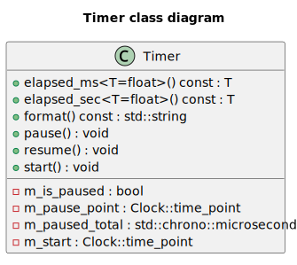

RTR Runtime使用std::chrono作为计时器库，std::chrono提供了高精度的计时器功能，可以用于测量程序的执行时间。计时器库使得性能分析和优化成为可能。

### 枚举和宏

RTR Runtime使用枚举和宏来定义一些常用的常量和类型，如错误码、日志级别、渲染API等。枚举和宏使得代码更加清晰和易于维护。由于篇幅限制，这里不再详细列举具体的枚举和宏定义。

## 资源层

### 概述
资源层主要用于提供一些通用的资源管理类和接口。
资源层的设计主要是为了实现跨平台的资源管理，使得RTR Runtime可以在不同的平台上运行。
以下是资源层的主要模块


### 文件服务


`File_service`类作为跨平台资源管理的核心组件，封装了底层文件系统操作，提供统一的资源存取接口。主要功能包括路径管理（设置/获取根目录）、文本文件读写支持、目录创建与递归遍历、跨平台文件操作（复制/移动/删除），以及通过构建树形文件结构实现可视化资源管理。该抽象层有效隔离了不同操作系统的文件系统差异，为上层资源加载器提供标准化的访问接口。
另外，在GUI层中，File面板将使用File_service提供的接口，实现资源的可视化管理。

### 资源管理器

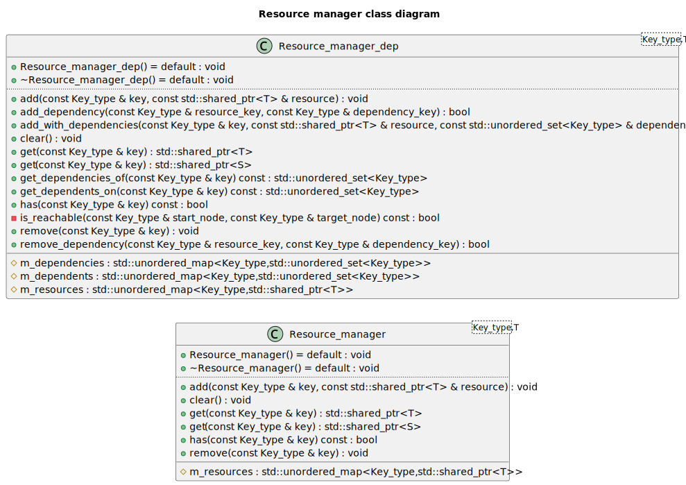

`Resource_manager_dep` 类是一个模板化的资源管理工具，用于存储和管理由 `Key_type` 标识的、类型为 `T` 的共享资源（通过 `std::shared_ptr`）。它的核心特点是引入了资源依赖图功能：它不仅能添加、获取、移除和清空资源，还能记录和管理资源之间的依赖关系。您可以显式声明一个资源依赖于另一个（例如，材质依赖于纹理），或者在添加资源时就指定其依赖项。该类具备循环依赖检测机制，能防止创建导致问题的依赖闭环。在移除资源时，它会检查是否有其他资源依赖于待移除项，默认情况下会阻止此类移除以保证依赖完整性，从而提供更健壮的资源生命周期管理。同时，它也支持查询特定资源的直接依赖项和被依赖项。


### 文本加载器


首先，`Text` 类被设计为文本内容的基础表示与封装单元。此类支持通过两种主要途径进行实例化：其一，通过指定文件系统路径，此时类内部将执行文件读取操作以加载文本；其二，通过直接传递C风格字符串常量进行初始化。在内部实现上，`Text` 类采用 `std::string` 对象来存储文本数据，并提供了一组公共接口方法，允许外部代码访问文本内容（例如，获取 `std::string` 引用、C风格字符串指针）以及查询文本属性（如长度、是否为空）。其文件加载逻辑集成了一套基础的异常处理机制，在发生I/O错误时，会将相关的诊断信息输出至标准错误流。

其次，`Text_loader` 类作为一个辅助性的加载器（Loader）组件，其特定职责是创建并管理 `Text` 类的共享指针（`std::shared_ptr`）实例。该加载器提供了一个静态成员函数 `load_from_path`，此函数接受一个文件路径作为参数，负责根据该路径实例化 `Text` 对象，并将生成的对象包装在 `std::shared_ptr` 中返回。此种设计模式有效地将文本对象的具体创建逻辑，尤其是涉及文件系统交互的部分，从客户端代码中分离出来，并统一封装在 `Text_loader` 内部，从而提高了代码的模块化程度和可维护性。

### 图像加载器
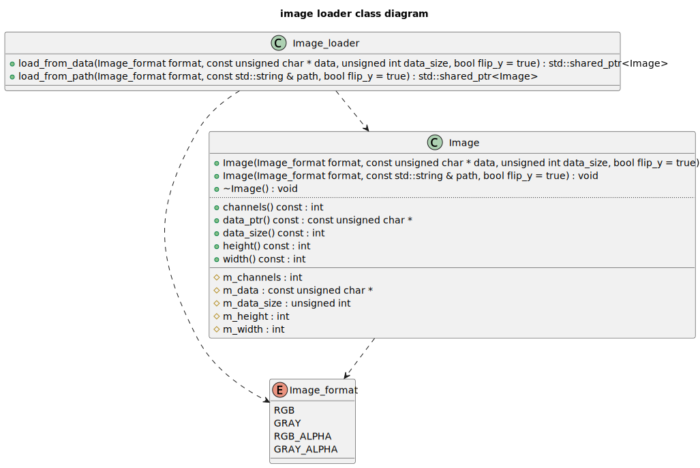

图像加载器首先定义了 `Image_format` 枚举类型，用以抽象不同的像素表示格式（例如RGB、灰度图），并通过 `stbi_image_format` 辅助函数将这些抽象格式映射为 `stb_image` 库所特有的常量，从而确保库接口的正确调用。核心的 `Image` 类作为图像数据的抽象表示，封装了图像的维度（宽度、高度）、通道数量以及一个指向由 `stb_image` 获取的原始像素缓冲区的指针。该类支持从内存字节流或文件系统路径进行实例化，并允许在加载过程中对期望的像素格式及垂直方向进行精细控制。值得注意的是，`Image` 类的析构函数负责调用 `stbi_image_free `函数，从而确保了由 `stb_image `库所管理内存的确定性释放。为简化资源获取过程，Image_loader 类实现了工厂设计模式，提供了静态方法（`load_from_path` 和 `load_from_data`）用于创建并返回包裹在 `std::shared_ptr`智能指针中的 `Image` 实例。此设计不仅简化了客户端与加载机制的交互，亦通过共享所有权语义整合了稳健的内存管理策略。

### 哈希


`Hash` 结构体被设计为一个统一的哈希值表示和处理单元，它封装了一个 `unsigned long long` 类型的核心哈希值，并提供了标准的构造、赋值及比较操作。该结构体的关键功能在于其哈希生成能力：通过静态方法 `from_string`，它能够利用FNV-1a算法从字符串高效地计算出哈希值；而另一个静态方法 `from_raw_data` 则采用一种自定义的分块处理和位混合算法，从原始字节序列生成哈希。此外，`Hash` 结构体重载了 `+=` 和 `+` 运算符，允许通过特定的位操作（结合了异或、加法、位移及素数乘法）安全地将多个哈希对象合并为一个新的哈希值，这对于组合对象或序列的哈希非常有用。用户可以通过 `value()` 方法获取其内部的原始 `unsigned long long` 哈希值，使得该结构体不仅是哈希值的容器，也是一套功能完备的哈希生成与组合工具。

### GUID
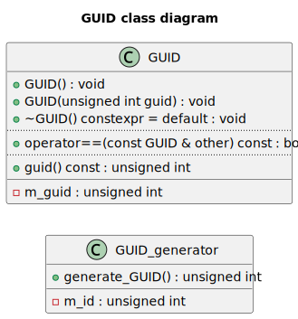

GUID 系统的设计目的是为了提供一种简单且高效的方式来生成和管理全局唯一的标识符，适用于需要唯一标识对象或资源的场景。
它包含两个主要组件：`GUID_generator` 和 `GUID`。这两个类协同工作以提供一种简单的顺序唯一标识符（GUID）生成与封装机制。`GUID_generator` 类扮演着ID生产者的角色，它内部维护一个静态自增的无符号整型计数器，并通过其静态方法 `generate_GUID()` 来分配并返回一个在此程序运行期间内唯一的递增ID。而 `GUID` 类则作为这些ID的容器和表示；当其实例通过默认构造函数创建时，会自动调用 `GUID_generator` 来获取一个新的唯一ID进行初始化，同时也支持使用一个已有的 `unsigned int` 值来构造。

## 平台层

### 平台层概述

RTR Runtime的平台层设计旨在提供跨平台的支持，使得开发者可以基于不同的图形API(OpenGL/DirectX12/Vulkan)使用RTR Runtime。并且向上提供统一的接口，使得上层模块可以在不同的平台上运行。


平台层的设计主要包括以下两个方面：

- 平台抽象：通过平台接口层提供统一的平台抽象，使得上层模块可以在不同的平台上运行。也就是下文提到的RHI（Render Hardware Interface）。

- 平台适配：通过平台适配层提供不同平台的适配实现，使得平台层可以在不同的平台上运行。也就是对RHI的具体实现。

平台接口层和平台适配层的设计主要是为了实现跨平台的支持，使得上层模块可以在不同的平台上运行。
在本项目中，RHI接口仅实现了OpenGL的版本，对于其他的平台，需要自行实现RHI接口。


### RHI核心模块

本质上来说，RHI接口是对GPU设备的面向对象的抽象，它提供了一组API，使得开发者可以方便地管理GPU设备。在经典的图形开发的流程中，图形API通常会提供两种类型的能力：
- 资源管理能力：用于管理GPU设备上的资源，如纹理、缓冲区、渲染目标等。
- 渲染能力：用于管理GPU设备上的渲染状态，如渲染管道、着色器、渲染目标等。

因此，在RTR Runtime中，RHI接口主要提供了以下两个模块：

- RHI_functions 
- RHI_resources 

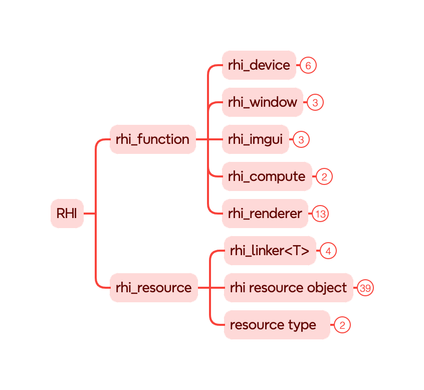

### RHI设计上的优势

相比于传统的图形API（OpenGL），RTR Runtime的RHI接口更加面向对象，更加符合现代的C++编程风格，并且简单易用，功能全面。 这也是RTR Runtime的RHI设计的优点之一。


接下来将会对这两个模块进行详细的介绍。

### RHI_functions 模块

HI_functions模块提供了一组API，用于管理GPU设备上的渲染能力。也包括渲染上下文的创建与销毁，资源的创建与销毁，渲染状态的设置与获取。

#### RHI_device


`RHI_device` 是渲染硬件接口（Render Hardware Interface, RHI）系统的核心组件，负责统一抽象底层图形 API（例如 OpenGL、Vulkan、DirectX 等）的设备操作。该类通过纯虚函数接口规定了一系列图形资源与操作的创建方法，供具体的图形 API 实现类进行重载和实现。类中包含的所有成员函数都以面向对象方式封装了底层图形资源的创建逻辑，确保了平台无关性和模块化设计。

类的构造函数接收一个 `API_type` 参数，用于标识当前使用的图形 API 类型。通过 `api_type()` 方法可以访问该信息，用于在上层逻辑中根据 API 类型进行相应处理。此外，该类定义了一个纯虚函数 `check_error()`，用于在派生类中实现图形 API 特有的错误检查机制。

在资源创建方面，`RHI_device` 提供了多种缓冲区（Buffer）创建接口，包括顶点缓冲（Vertex Buffer）、索引缓冲（Element Buffer）、通用内存缓冲（Memory Buffer）等。所有这些缓冲资源都通过统一的参数接口进行创建，使得调用者无需关心底层的细节即可完成数据上传和管理。此外，该类还支持创建几何体对象 `RHI_geometry`，其本质是将多个顶点缓冲与索引缓冲组合起来，以描述完整的绘制图元结构。

在着色器方面，`RHI_device` 允许创建单个着色器代码对象（`RHI_shader_code`）以及由多个着色器组成的完整程序对象（`RHI_shader_program`）。通过参数传入的 `std::unordered_map`，用户可以灵活绑定不同类型的着色器（如顶点、片元等），并为其附加相应的 Uniform 变量。

纹理资源方面，`RHI_device` 支持创建 2D 纹理、2D 纹理数组和立方体纹理，均可通过设定 mipmap 层级、内部格式、包裹方式与过滤方式等参数来自定义。此外，类中还提供了多个便捷函数，用于快速创建常见的纹理类型，例如颜色附件、深度附件、深度立方体贴图等，从而简化了调用代码的复杂性，提高了开发效率。

除了资源创建外，`RHI_device` 还定义了帧缓冲对象（Frame Buffer）和屏幕缓冲对象（Screen Buffer）的创建接口，分别用于离屏渲染和最终画面显示。同时，为了支持计算着色器的使用，该类还包含 `create_compute_task` 方法，用于生成计算任务对象。此外，还提供了一些更高阶的资源管理与渲染流程对象，如 `RHI_memory_buffer_binder`、`RHI_texture_builder`、`RHI_renderer` 以及 `RHI_pipeline_state`，使得开发者可以灵活控制资源绑定、渲染流程状态以及多阶段渲染策略。

#### RHI_window
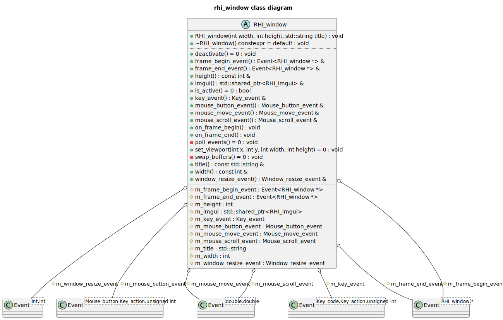

`RHI_window` 定义了图形渲染窗口在渲染硬件接口（RHI）中的基本行为和事件交互机制。它主要用于管理图形窗口的生命周期、事件响应与帧更新操作。构造函数接收窗口的宽度、高度和标题，用于初始化窗口的基本属性。窗口还可以绑定一个 `RHI_imgui` 对象，以支持图形用户界面功能的集成。在运行过程中，窗口可以检测并处理来自用户的输入事件，如按键、鼠标点击、鼠标移动和滚轮滚动，并通过相应的事件对象（如 `Key_event`、`Mouse_button_event` 等）向注册的回调函数派发事件。

类中预定义了两个重要的默认事件处理逻辑：窗口尺寸变化时会自动调整视口设置，并记录日志；当用户按下 ESC 键时，将触发窗口关闭的操作。为了支持每一帧的渲染流程，`RHI_window` 还定义了 `on_frame_begin` 和 `on_frame_end` 方法，它们在每帧开始和结束时分别执行事件回调，并调用虚函数 `poll_events` 和 `swap_buffers`，以轮询系统事件并交换前后缓冲区，保证窗口的实时响应和画面更新。

此外，该类还提供了多个访问接口，供外部模块读取窗口的宽度、高度、标题等信息，并访问各类事件对象以注册自定义事件处理逻辑。通过虚函数的设计，`RHI_window` 为不同平台的窗口实现提供了统一的抽象接口，使得后续在 OpenGL、Vulkan 等平台下可以灵活继承和实现具体功能，符合跨平台渲染系统的设计理念。

#### RHI_imgui


`RHI_imgui` 是一个用于抽象图形用户界面（GUI）渲染功能的纯虚类，旨在为不同后端实现 ImGui 提供统一的接口。该类通过一组虚函数定义了 GUI 渲染过程中常见的操作，包括帧的开始与结束、UI 面板的绘制流程，以及各种常用控件的渲染与交互逻辑。使用该类，开发者可以通过继承方式实现具体平台上的 GUI 渲染，例如 OpenGL、Vulkan 或 DirectX 下的 ImGui 接入，从而在渲染系统中无缝嵌入可视化调试工具或编辑器界面。

在渲染流程中，`begin_frame` 和 `end_frame` 分别用于标志一帧的 GUI 渲染开始和结束，而 `begin_render` 与 `end_render` 则用于具体 UI 面板的构建流程。例如，在一个以“Settings”为标题的面板中，可以添加颜色编辑器、按钮、滑动条、文本输入框等控件，这些功能分别由 `color_edit`、`button`、`slider_float`、`text_edit` 等方法提供。控件操作往往会绑定到外部变量地址上，实现交互式的数据修改。

此外，类中还提供了对 GUI 输入捕获状态的查询（`is_io_captured`），用于判断是否当前帧用户输入已被 GUI 接管，以避免与底层窗口系统产生冲突。`frame_rate` 方法可返回 GUI 当前帧率信息，便于性能监控。总体而言，`RHI_imgui` 为 GUI 模块提供了高度解耦的接口层，支持在跨平台渲染系统中灵活接入和扩展图形用户界面功能，是实时渲染系统中调试与交互不可或缺的组成部分。

#### RHI_compute


`RHI_compute_task` 是一个用于封装计算着色器任务的抽象基类，代表一类可在 GPU 上执行的通用计算操作。该类设计的核心目的是将与图形渲染无关的计算流程（如图像处理、粒子模拟、物理计算等）以统一接口的形式封装，方便在底层渲染后端中实现跨平台的计算任务调度。构造函数要求传入一个 `RHI_shader_program` 类型的共享指针，并在构造时检查该程序是否包含计算着色器类型（`Shader_type::COMPUTE`）。如果未包含，将输出错误信息，提示用户当前程序未提供有效的计算着色器代码。

该类内部通过一个受保护的成员变量 `m_shader_program` 来持有计算任务所绑定的着色器程序，使得派生类可以直接访问其资源并进行调度。类中定义了两个纯虚函数，`dispatch` 和 `wait`，分别用于发起计算任务的执行请求与同步等待其执行完成。`dispatch` 接收三个无符号整数作为线程组分布的维度，用于定义计算任务的执行规模，而 `wait` 则用于阻塞主线程，直到 GPU 上的计算任务完成，确保任务顺序一致性和数据的完整性。

#### RHI_renderer
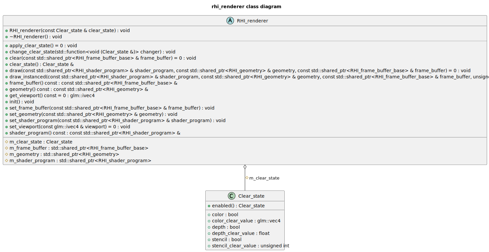

`RHI_renderer` 是图形渲染引擎中的一个抽象基类，负责定义统一的渲染接口和状态管理机制，为具体平台的渲染实现（如 OpenGL、Vulkan、DirectX 等）提供可扩展的框架。该类围绕图形渲染的核心组件设计，包括着色器程序（`RHI_shader_program`）、几何数据（`RHI_geometry`）、帧缓冲对象（`RHI_frame_buffer_base`）以及清屏状态（`Clear_state`）。清屏状态用于控制是否清除颜色、深度和模板缓冲区，以及这些缓冲区的默认清除值。默认清屏颜色为柔和的粉色调，既具辨识度，又适合作为调试背景。

该类提供了 `draw` 和 `draw_instanced` 两个纯虚函数，分别用于常规绘制与实例化绘制，从而支持多种绘制方式。绘制时需要绑定着色器、几何体和帧缓冲，它们通过类成员变量持有，并可以在运行时修改。通过 `set_shader_program`、`set_geometry` 和 `set_frame_buffer` 三个 setter 接口，用户可以灵活配置渲染资源，而 `init` 方法提供了一种便捷方式将这些资源初始化为空指针，便于状态重置或重新绑定。

此外，类中还定义了 `clear` 和 `apply_clear_state` 两个虚函数，用于控制帧缓冲的清除操作。其中 `change_clear_state` 方法支持通过传入 lambda 或函数对象的方式动态修改清除状态，并立即应用，从而允许更高层的模块对渲染管线的清除行为进行灵活配置。同时，视口设置函数 `get_viewport` 和 `set_viewport` 也是纯虚接口，确保渲染器可以根据窗口大小或其他需求更新视口，支持多视图或多窗口渲染。

### RHI_resources 模块

#### RHI资源的分类
RHI_resources分为两种类型：
- 原子类型 ：用于表示GPU设备上的不可细分的资源。如显存缓冲区，纹理、Shader代码，渲染管线配置文件等。
- 组合类型 ：由原子类型组合而成的资源。如帧缓冲，几何体，Shader程序等。

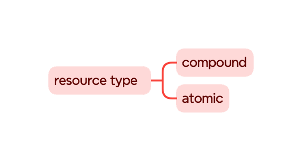

#### RHI资源和渲染器前端的交互方式

RHI虽然是对GPU设备的面向对象的抽象，但是在实际的使用中，我们通常会使用渲染器前端来管理RHI资源。因为RHI还是一个较为底层的概念，我们通常不会直接使用RHI来管理资源。而是使用渲染器前端来管理RHI资源，封装RHI层的细节，提供更易用的API。


在此，我们提出了RHI_linker概念，用于将RHI资源和渲染器前端进行链接。RHI_linker是一个模板类，它的模板参数是RHI资源的类型。RHI_linker的作用是将RHI资源和渲染器前端进行链接，使得渲染器前端可以使用RHI资源。并且RHI_linker向前端提供了一组API，用于灵活地管理RHI资源。可以实现渲染资源的惰性创建或者预生成等功能。

### RHI资源对象

在这里我们开始介绍RHI具体的资源有哪些，包括其实现方式和设计理念


#### RHI_buffer


`RHI_buffer` 是对 GPU 设备上一种通用缓冲资源的抽象表示，在图形渲染中扮演着基础而重要的角色。它封装了缓冲区的基本属性，如缓冲类型（`Buffer_type`）、使用方式（`Buffer_usage`）以及数据大小等，旨在为渲染器提供统一的内存操作接口。类中定义了几个纯虚函数，如 `reallocate_data`、`subsitute_data` 和 `map_buffer`，它们分别用于重新分配数据、在指定偏移位置替换数据以及映射缓冲区到主存进行读写操作。这些接口的抽象设计允许不同平台或图形 API（如 Vulkan、OpenGL、DirectX）对底层缓冲区管理进行定制化实现。

与 `RHI_buffer` 配套的还有 `RHI_buffer_access_flags` 结构体，用于指示在映射缓冲区时的访问权限。它提供了三个静态函数：`read_only`、`write_only` 和 `read_write`，分别用于快速配置读取、写入或读写权限。这一设计增强了 API 的表达力，使用户可以明确指定访问目的，避免出现不必要的数据同步或资源状态切换。

此外，RHI 还针对不同类型的缓冲需求提供了接口类，如 `IRHI_vertex_buffer`、`IRHI_element_buffer` 和 `IRHI_memory_buffer`。其中，`IRHI_vertex_buffer` 表示一个顶点缓冲区，记录了每个顶点的数据类型、迭代方式和每个单元的数据数量等关键信息。它可用于描述顶点数据的组织方式，为渲染管线中的顶点输入阶段提供支持。而 `IRHI_element_buffer` 则用于存储索引数据，主要作用是在绘制时通过索引引用顶点，从而减少冗余数据，提高内存利用率。其内部假设索引类型为 `UINT`，简化了接口使用。`IRHI_memory_buffer` 提供了与绑定显存位置相关的接口，例如绑定整个缓冲区或部分区域，常见于 Uniform Buffer、Storage Buffer 等资源类型的绑定操作，其对齐方式也可通过成员变量进行指定。

为了支持统一的资源绑定操作，RHI 还引入了 `RHI_memory_buffer_binder` 抽象类。该类为内存缓冲绑定操作提供了统一接口，支持整体绑定与部分绑定，便于在渲染管线不同阶段灵活控制资源访问。这种解耦的设计使得上层渲染器能够更方便地控制底层资源，而无需关心底层 API 的差异和复杂性。

#### RHI_geometry


RHI_geometry 是对图形渲染中“几何体”这一资源的抽象封装。在图形渲染的过程中，几何体是由顶点和索引（元素）数据共同描述的，这正是 RHI_geometry 所管理的内容。该类的设计意图是为前端渲染逻辑提供一个统一的接口，用于管理和绑定 GPU 缓冲资源，并最终驱动绘制命令的执行。

在类内部， `m_vertex_buffers` 是一个映射表，用于保存多个顶点缓冲（RHI_buffer），它们通过整数 location 作为键进行索引。这种设计与现代图形 API（如 OpenGL、Vulkan）对顶点属性绑定的方式保持一致，即每个顶点属性（位置、法线、纹理坐标等）都对应一个独立的缓冲对象。 `m_element_buffer` 则是可选的索引缓冲（element/index buffer），用于在绘制时通过索引来复用顶点数据，从而提高内存效率。

构造函数支持从外部传入顶点缓冲和索引缓冲的智能指针，使得 RHI_geometry 对底层资源保持引用计数式的管理模式，避免了资源的重复拷贝和泄漏风险。

作为一个抽象类，RHI_geometry 定义了若干纯虚函数，用于由派生类提供具体实现。`bind_buffers()` 是一个用于绑定所有相关缓冲区的函数，通常在绘制之前调用。`bind_vertex_buffer()` 提供了动态绑定某个顶点缓冲区的能力，这使得几何体的数据结构可以在运行时灵活变更。`draw()` 和 `draw_instanced()` 分别用于执行标准绘制和实例化绘制操作，后者在图形编程中常用于大量相同对象的重复渲染（例如草地、树木等），大幅提升渲染效率。

#### RHI_shader

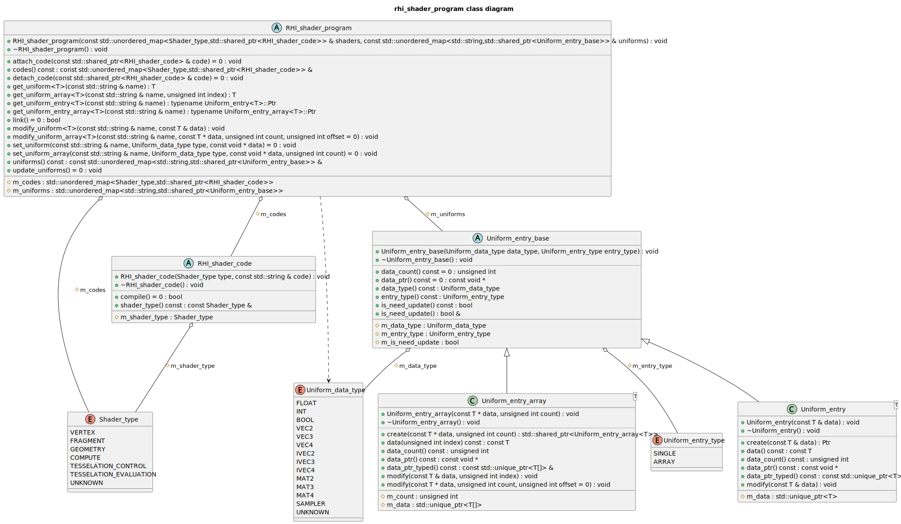

RHI_shader 是对图形渲染中“着色器”这一资源的抽象封装。在图形渲染的过程中，着色器是用于处理顶点和像素数据的程序，它定义了顶点和像素的输入输出格式、计算逻辑等。在GPU渲染管线的不同阶段，都会有不同的Shader来对渲染管线中的数据进行灵活地处理。
我们在此介绍两个和Shader密切相关的概念：

- RHI_Shader_code，它是对着色器代码的抽象封装。
- RHI_Shader_program ，它由多个RHI_Shader_code构成，是对着色器程序的抽象封装。

#### RHI_shader_code

RHI_shader_code 类，它是对着色器代码资源的抽象表示，是 RHI（渲染硬件接口）层中的一个关键组件。着色器是运行在 GPU 上的程序，负责控制渲染管线中各个阶段的行为，例如顶点变换、片元着色等。该类设计的主要目的是提供统一的接口来管理不同类型的着色器代码，并在运行时执行编译过程。

类中包含一个受保护成员变量 m_shader_type，用于标识该着色器的类型，比如是顶点着色器（Vertex Shader）、片元着色器（Fragment Shader）、几何着色器（Geometry Shader）等。这种分类对于着色器资源的管理和编译流程是必要的，因为不同的类型有不同的输入输出要求，并在 GPU 渲染流水线中的位置也不同。

虚函数 compile() 是类的核心接口，它表示将着色器源码编译成 GPU 可识别的中间表示或机器码。由于是纯虚函数，这个类是抽象的，不能被直接实例化，而需要由具体图形 API（如 OpenGL、Vulkan、DirectX）的后端类继承并实现具体的编译逻辑。

#### RHI_shader_program

`RHI_shader_program` 是抽象的着色器程序类，内部通过 `m_codes` 管理各个类型（如顶点、片元等）的着色器代码，通过 `m_uniforms` 维护所有 Uniform 变量的映射关系。它定义了一系列虚函数，如 `attach_code` 、 `detach_code` 、 `link` 和 `set_uniform` 等，用于派生类实现平台相关的操作。此外，类还提供了模板函数接口，例如 modify_uniform 和 get_uniform，可以类型安全地修改或读取 Uniform 变量的值。这些模板函数通过 `std::dynamic_pointer_cast` 实现对不同类型的 Uniform 条目的安全访问，并在找不到对应 Uniform 名称时输出提示信息。

对于 Shader的 uniform变量管理，RHI也提供了全面支持：
`Uniform_entry_base` 是所有 Uniform 数据项的抽象基类，定义了统一变量的类型（Uniform_data_type）以及是否需要更新的状态标志。这个类提供了接口函数 `data_ptr` 和 `data_count` ，由派生类具体实现，以获取底层数据指针和元素数量。

对于具体的 `Uniform` 数据，代码分别实现了 `Uniform_entry<T>` 和 `Uniform_entry_array<T>` 两个模板类，分别对应单个值和数组类型的 Uniform。两者都继承自 `Uniform_entry_base` ，分别使用 `std::unique_ptr<T>` 和 `std::unique_ptr<T[]> ``来管理数据的生命周期。Uniform_entry` 提供了对单一数据的访问与修改，而 `Uniform_entry_array` 支持修改整个数组或指定位置的元素。两者均提供了静态 `create` 方法，便于构造共享指针实例以供管理。

#### RHI_texture

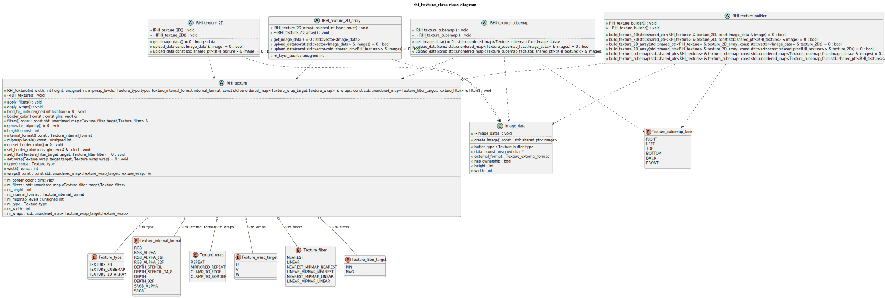

`RHI_texture` 是对纹理资源的抽象封装，它是图形渲染中最常见的资源之一。纹理通常用于存储图像数据，例如纹理贴图、法线贴图等，在图形渲染中起到重要的作用。

`RHI_texture` 是一个抽象基类，封装了纹理资源的通用属性和操作接口，例如纹理的类型、内部格式、尺寸、多级渐远纹理（mipmap）级数、环绕方式和过滤方式等。该类还定义了若干纯虚函数，如 `set_filter`,`set_wrap` ,`generate_mipmap` 和 `bind_to_unit` ，用于由具体平台的子类实现。同时，它提供了封装好的方法用于批量设置过滤器和环绕参数，以及设置边框颜色的方法 `set_border_color，并通过` `on_set_border_color` 纯虚函数将具体行为交由子类实现，从而保证接口的一致性与灵活性。

对于纹理元数据的管理，我们提供了 `Image_data` 结构体。该结构体用于表示原始图像数据，包含图像的宽高、指向数据的指针、数据格式和外部格式信息，并通过 `has_ownership` 成员变量指示是否需要在析构时释放数据内存。此外，该结构体还封装了一个 `create_image` 方法，可以根据图像的缓冲类型创建对应格式的 `Image` 对象。

RHI_texture 分为三大类：
- 2D 纹理：用于存储二维图像数据，如纹理贴图。
- 2D 数组纹理：用于存储二维图像数据的数组，如纹理数组。
- Cubmap 纹理：用于存储立方体贴图图像数据。

`对于这三种类型，IRHI_texture_2D` `、IRHI_texture_cubemap` 和 `IRHI_texture_2D_array` 分别定义了针对二维纹理、立方体纹理和二维纹理数组的接口，这些接口统一约定了图像数据上传和获取的操作，并支持通过原始图像数据或已有纹理资源进行纹理的构建。这种设计有助于实现纹理资源的灵活转换与共享，同时也便于引擎内部的功能复用。

`RHI_texture_builder` 是一个面向构建的接口类，定义了一组用于创建不同类型纹理的方法。通过 `build_texture_2D`,`build_texture_cubemap` 和 `build_texture_2D_array` 等方法，用户可以使用原始图像数据或已有纹理资源构建目标纹理对象。这一设计模式遵循了“构建者模式”的思想，使纹理的构建流程更加灵活且易于维护，有利于与外部资源加载系统集成，提升引擎的模块化程度。

#### RHI_frame_buffer


`RHI_frame_buffer` 定义了一套用于渲染帧缓冲区（Frame Buffer）的抽象与实现类，主要包括普通离屏帧缓冲与屏幕缓冲的封装。通过统一的基类接口 `RHI_frame_buffer_base`，系统可以在不关心具体帧缓冲类型的前提下操作渲染目标，从而提升渲染系统的通用性与可扩展性。

`RHI_frame_buffer_base` 是所有帧缓冲类型的抽象基类，定义了判断帧缓冲有效性的纯虚函数 `is_valid`，以及获取缓冲区宽度和高度的接口 `width` 和 `height`。这一接口的存在为不同类型的帧缓冲提供了统一的访问方式，使得在后续的渲染流程中可以透明地切换目标缓冲对象，无需依赖具体的帧缓冲实现细节。

`RHI_frame_buffer` 是具体的离屏帧缓冲实现，它维护了一个宽高尺寸，并使用 `std::vector` 存储了多个颜色附件（Color Attachments），以及一个深度附件（Depth Attachment）。这些附件均为纹理对象，说明该类旨在将渲染输出重定向到纹理中，用于后续的后处理、纹理采样或图像保存等操作。该类提供了获取颜色附件和深度附件的接口，从而方便图形管线在不同阶段读取或替换对应资源。

`RHI_screen_buffer` 代表的是屏幕帧缓冲，即最终渲染结果输出到用户可见窗口的那部分帧缓冲。它内部保存了一个指向窗口对象的智能指针 `m_window`，并通过该对象提供的接口获取当前窗口的宽度和高度。由于屏幕缓冲通常不拥有独立的纹理资源，其行为主要受窗口系统的驱动，因此它没有显式的颜色或深度附件。

#### RHI_pipeline_state

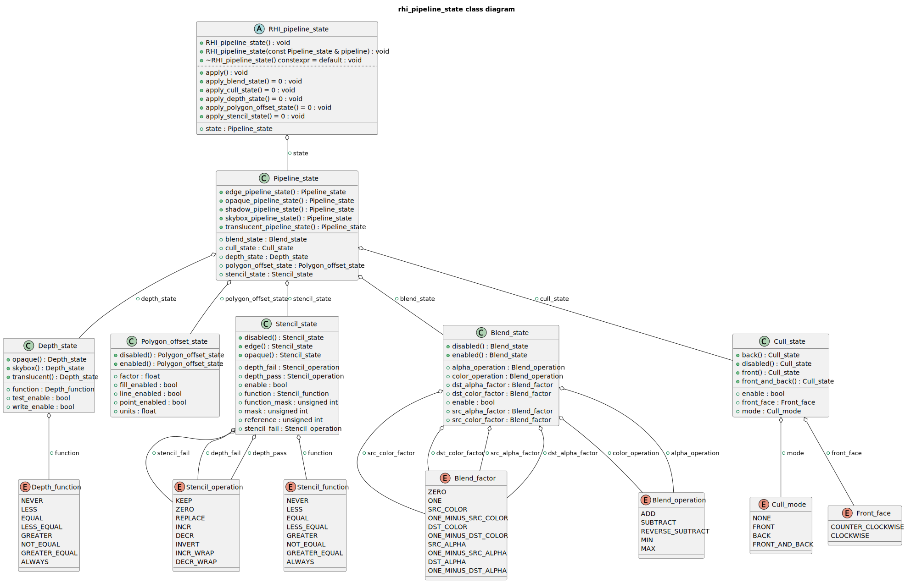

`RHI_pipeline_state` 定义了一个图形渲染管线状态的抽象系统，用于描述和控制图形渲染过程中的关键固定功能阶段。它以结构体的方式封装了深度测试、混合、偏移、模板测试以及背面剔除等常见渲染状态配置，并提供了多个静态工厂方法来快速构造常见渲染情形下的状态组合，如不透明物体、透明物体、天空盒、边缘检测和阴影渲染等。

`Depth_state` 表示深度测试状态，其成员控制是否启用深度测试与深度写入，并指定使用哪种深度比较函数。针对不透明物体、半透明物体以及天空盒，该结构提供了三种静态方法，便于在构建渲染管线时快速设定合适的深度状态。例如，半透明对象通常关闭深度写入以避免遮挡错误，而天空盒允许与最远处深度相等的片元通过测试。

`Polygon_offset_state` 用于控制多边形偏移，用以避免面片重合导致的Z-fighting问题。它支持对点、线和填充的偏移开关控制，并可指定偏移因子与单位值。该状态默认禁用，同时也提供了统一启用的工厂方法供特殊场景（如阴影偏移）使用。

`Stencil_state` 结构体封装了模板测试的配置，包括是否启用模板测试、比较函数、以及当模板测试或深度测试失败或成功时应采取的操作。同时，它还提供模板参考值和掩码控制模板操作的范围。该结构定义了三种典型模板状态：禁用模板、不透明绘制时替换模板值、边缘检测时测试不相等值以突出轮廓。

`Blend_state` 控制颜色混合阶段，主要用于实现半透明物体的正确叠加效果。它提供了源与目标颜色因子、混合操作等配置项。在默认禁用状态下，不进行任何颜色混合，而启用时则通常采用常见的 alpha 混合方式，即源颜色乘以其 alpha 值，加上目标颜色乘以（1 - alpha）。

`Cull_state` 表示背面剔除设置，包括是否启用剔除、剔除哪一面（前面、背面、或全部），以及定义哪一面为正面（顺时针或逆时针）。它的多种静态方法可以帮助快速构造面向不同渲染任务的剔除设置，如完全关闭剔除或启用背面剔除等。

所有这些状态被整合进一个统一的 `Pipeline_state` 结构体，用于代表某一具体渲染流程所需的完整状态集。该结构提供了多个静态方法，返回常见的渲染状态组合，例如用于阴影贴图渲染的 shadow\_pipeline\_state，或用于不透明几何绘制的 opaque\_pipeline\_state。通过这种方式，可以简化渲染流程中对状态的管理，提高可读性与复用性。

`RHI_pipeline_state` 是一个抽象类，封装了一个具体的 `Pipeline_state` 成员，并定义了一个 `apply()` 方法用于将当前状态应用到底层图形 API 管线中。它通过纯虚函数分别调用各个子状态的应用接口，如 `apply_blend_state`、`apply_cull_state` 等，这些函数需在子类中结合具体的图形 API（如 OpenGL、Vulkan 或 DirectX）进行实现。该抽象设计有效地将高层渲染逻辑与底层平台无关地解耦，方便跨平台图形后端的开发与维护。

# 框架层

## 框架层概述

框架层定义了用户直接使用渲染器的接口，作为渲染器最顶层，框架层对用户所需要渲染的虚拟世界进行了抽象，包括场景定义，对象的定义以及对象行为的描述。


## 框架层的核心概念
框架层有如下核心概念，由下自上组成了一个层次结构：

- Component
  代表了虚拟世界中实体的一个组件，每个Component对象表示着虚拟世界中实体的一种属性，以及可以与其他Component进行交互的行为。
- Component_list
  一个Component的列表，用于存储虚拟世界中的一个实体的所有Component。每个实体都可以有多个Component，这些Component可以通过Component_list进行管理。
- Game_object
  代表了虚拟世界中的一个实体，如玩家、敌人、道具等。每个Game_object都可以挂载一个或多个Component。
- Scene
  一个场景容器，用于管理虚拟世界中的所有Game_object。每个Scene都可以包含多个Game_object，并且可以通过Scene对象进行统一的管理和控制。除此之外，Scene还提供一些全局的信息，如主相机、主光源，天空盒等。
- World
  一个虚拟世界，用于管理所有的Scene。每个World都可以包含多个Scene，并且可以通过World对象进行统一的管理和控制。


有了如上静态的层次结构，我们是如何驱动一个动态场景呢？其实，上述概念均包含了tick方法，这些方法会在每一帧的逻辑更新阶段被调用。

World对象会执行Scene的tick方法，Scene对象会执行Game_object的tick方法，Game_object对象会执行所挂载的Component的tick方法。此外，用户可以在tick方法中获取当前的逻辑上下文，当前的时间增量，以及当前的输入状态。用户可以根据这些信息在tick方法中更新Game_object的状态，同时也可以更新逻辑上下文


## 框架层的具体实现
在这里我们开始介绍框架层的具体实现

### Component

![Component_base] (./docs/diagrams/framework/component_base_class.svg)

`Component_base` 是所有组件的基类，封装了组件的基本行为和属性，并提供了与其它组件协作的核心接口。每一个组件通过枚举类型 `Component_type` 进行分类，例如节点（NODE）、网格渲染器（MESH\_RENDERER）、相机（CAMERA）、相机控制器（CAMERA\_CONTROL）、光源（LIGHT）、阴影投射器（SHADOW\_CASTER）以及用户自定义的组件（CUSTOM）等。在运行时，每一个组件实例都可以通过类型标识进行识别，以便框架进行特定的逻辑分发。

`Component_base` 定义了一个纯虚的 `tick` 方法，该方法由派生类实现，代表组件在每帧逻辑更新时执行的行为。此外，它还提供了优先级控制机制，通过 `priority` 字段来调节不同组件在更新过程中的调用顺序，允许更细粒度的执行时调度。组件还可以启用或禁用，这一能力对实现某些状态切换或优化渲染路径非常重要。

每个组件内部保存了一个弱引用指向其所附加的 `Component_list` 对象。这一设计让组件能够通过 `get_component` 方法查找和访问同一个实体上的其他组件，从而支持组件之间的解耦协作。此外，组件还可以通过 `add_component` 方法动态地向实体添加新的组件，或者通过 `remove_component` 方法移除不再需要的组件。


`Component_list` 类是组件系统的容器，负责管理一个实体上的所有组件。它内部使用一个 `std::vector` 来维护所有挂载的组件实例。用户可以通过 `add_component` 将新的组件加入到列表中，也可以使用模板方法 `get_component<T>` 来获取某一类型的组件引用。这些方法支持类型安全的动态查询，内部通过 `dynamic_pointer_cast` 来完成类型识别。`remove_component<T>` 允许按类型移除组件，而 `has_component<T>` 则提供快速检测某个组件是否已存在。

为了增强系统的灵活性和调度能力，`Component_list` 还提供了组件排序功能。用户可以传入自定义的排序函数，通过 `sort_components` 方法对组件列表进行重新排序，从而影响组件在每帧更新中的执行顺序。这一机制在处理需要优先或延后更新的逻辑时非常有用，比如先更新相机控制器，再更新相机本身，以确保状态的正确传递。

### Game_object


在组件系统之上，`Game_object` 是表示虚拟世界中一个具体实体的核心类。它是场景中可以被操作和驱动的基本单位，代表了一个完整的逻辑或图形对象，比如玩家、敌人、道具或环境中的任意元素。每个 `Game_object` 拥有一个名字，用于标识自身，同时也拥有一个内部的 `Component_list`，用于管理所有挂载在其上的组件。

`Game_object` 提供了多种模板方法来访问或管理组件。开发者可以通过 `get_component<T>` 查询某一类型的组件，通过 `add_component<T>` 添加新的组件，或者通过传入已构造的组件实例调用另一版本的 `add_component` 方法。这些接口不仅简化了用户的使用体验，还允许组件在运行时动态构建和挂载，使得实体在生命周期中可以灵活地改变其行为和属性。为了保证组件的可访问性，每当组件被添加进 `Game_object` 时，系统都会自动设置组件的 `Component_list` 指针，并调用其生命周期方法 `on_add_to_game_object`，确保组件在加入实体时可以执行初始化逻辑。

在每一帧的逻辑更新阶段，`Game_object` 的 `tick` 方法会被调用。该方法首先根据组件的优先级对所有组件进行排序，然后依次调用每个启用状态下组件的 `tick` 方法。这一机制确保了组件的执行顺序具备可预测性，尤其适用于组件间存在依赖关系的场景，例如相机控制器需要在相机更新之前执行。通过这种设计，`Game_object` 在封装组件行为的同时，也为整个逻辑调度提供了清晰的控制入口。

此外，`Game_object` 支持使用静态工厂方法 `create` 来构造实体对象，从而提高了创建接口的一致性。无论是运行时动态创建的游戏对象，还是场景加载过程中的反序列化逻辑，均可以使用该工厂方法进行统一处理。

### Scene


在游戏世界的层级结构中，`Scene` 扮演着容器与组织者的双重角色。它代表了一个独立的游戏或渲染场景，聚合了多个 `Game_object` 实例，并统一管理其生命周期、逻辑更新与资源状态，是构建关卡、编辑地图或驱动渲染输出的核心单元。

`Scene` 中的每一个 `Game_object` 都代表了虚拟世界中的一个具体元素，而 `Scene` 本身则通过一个 `std::vector<std::shared_ptr<Game_object>>` 管理着它们的集合。开发者可以通过 `add_game_object` 方法添加新的对象，无论是传入已有对象的共享指针，还是通过对象名称构建新的实例，`Scene` 都会将其统一纳入管理范畴。同时，它也提供了基于名称查找游戏对象的能力，以及按引用或名称移除对象的方法，使得场景对象的管理具备较高的灵活性和便利性。此外，`clear` 方法允许开发者快速清空整个场景，适用于场景切换或资源重置等操作。

为了适配渲染需求，`Scene` 也支持对天空盒（`Skybox`）资源的引用管理。通过 `set_skybox` 和 `skybox` 方法，用户可以为场景指定当前所使用的天空盒资源，进而影响渲染时的环境背景。在逻辑更新过程中，`Scene::tick` 方法会在执行场景中所有 `Game_object` 的更新逻辑之前，将当前的天空盒信息写入 `Logic_tick_context` 中，确保逻辑数据与渲染数据之间的一致性。

`Scene` 的生命周期中最核心的操作是逻辑更新，即 `tick` 方法的调用。在每一帧中，它会遍历并驱动所有子 `Game_object` 的更新逻辑，执行顺序按照对象插入顺序进行。这种设计使得 `Scene` 成为游戏引擎逻辑调度的入口，它通过对所有实体的调度，实现了从场景到对象、再到组件的逐层解耦与更新。

### World


`World` 是对游戏空间的更高层次封装，它管理着一个或多个 `Scene` 实例，并提供场景切换、统一逻辑驱动以及场景索引控制的功能。可以将 `World` 理解为一个“舞台管理者”，在其之下，不同的 `Scene` 像是一幕幕剧目，而 `Game_object` 则是舞台上的具体演员。

每个 `World` 拥有一个独立的名称，并维护着一组 `Scene` 的集合。通过 `add_scene` 方法，开发者可以动态添加新的场景资源，无论是通过已有 `Scene` 实例注入，还是通过名称创建新的场景对象，都能快速集成到当前世界中。`get_scene` 方法允许开发者按名称查找场景，而 `remove_scene` 则提供了清除不再使用场景的手段，确保资源管理的清晰有序。

`World` 的核心功能之一是场景切换管理。其内部维护一个 `m_current_scene_index`，用于标识当前激活的场景索引。开发者可以通过 `set_current_scene`（支持通过名称或指针）指定当前活跃场景，或通过 `set_current_scene_index` 直接设置索引。此外，`next_scene` 和 `previous_scene` 提供了自动循环切换场景的机制，非常适合用于演示场景轮播、剧情过场等功能模块。

逻辑驱动方面，`World::tick` 方法会将逻辑上下文 `Logic_tick_context` 传递给当前场景，由场景进一步递交给各个 `Game_object` 进行更新。通过这种逐层递进的方式，`World` 实现了对整个逻辑更新流程的统一调度。无论是物理运算、组件行为，还是渲染状态更新，都可以在这一过程中自然衔接，形成清晰的执行链条。

## 框架层所提供的预制组件

### Node_component


`Node` 类和 `Node_component` 是实现场景图系统（Scene Graph System）与游戏对象体系（GameObject System）之间桥梁的关键模块，它们共同支持游戏对象的空间层级变换、节点组织与世界坐标转换等核心功能。

`Node` 类本身是一个支持层级结构的空间变换节点，提供了位置（position）、旋转（rotation）、缩放（scale）等基本变换属性，并支持通过父子关系构建出树状结构的场景图。每个节点可以拥有多个子节点，并可设置其父节点，从而形成具有继承性的空间结构。通过 `model_matrix()` 方法，节点可以在发生变换时按需（基于脏标记机制）计算其完整的变换矩阵，并自动组合父节点的变换，以获得正确的世界变换。`Node` 同时也提供了 `world_position`、`world_rotation`、`world_scale` 等接口，用于获取世界空间中的状态，以及常用的空间方向向量（如前、上、右等）。此外，它支持 `look_at_point` 和 `look_at_direction` 等方法，可将节点朝向某个方向或点，在游戏角色面向控制、摄像机朝向调整等功能中尤为重要。

与之配套的 `Node_component` 是框架层的一个预制组件，继承自 `Component_base`。它的职责是为游戏对象绑定一个 `Node` 实例，从而使得该对象可以在场景图中进行空间定位和组织。该组件在被添加到游戏对象时会自动创建一个 `Node` 对象并与之关联，开发者可以通过 `node()` 方法访问或操作这个节点。虽然 `Node_component` 本身不直接处理更新逻辑，其存在确保了游戏对象具备场景图中的层级变换能力，为后续的渲染、物理、动画等系统提供统一的空间基础。

`Node` 提供了功能完备的变换和层级管理机制，而 `Node_component` 则将这一能力以组件化的形式集成到游戏对象中。两者相辅相成，共同构建起了该游戏引擎中支持复杂空间结构和父子变换继承的基础设施。

### Camera_component


`Camera` 类作为抽象基类，定义了所有相机通用的接口与核心属性。它依赖于一个 `Node` 实例来提供空间位置信息，使得相机能够通过节点系统进行定位与朝向控制。`Camera` 支持设置近平面和远平面，并提供了获取视图矩阵 `view_matrix()` 的方法，该方法基于绑定的节点计算视图变换，用于将世界空间转换为观察空间。由于 `Camera` 是抽象类，因此具体的投影矩阵生成逻辑交由子类实现，并通过 `projection_matrix()` 虚函数暴露。此外，相机还支持调整缩放（`adjust_zoom`）与设置纵横比（`set_aspect_ratio`），为动态视图控制提供便利。

该体系下提供了两种具体的相机实现：`Perspective_camera` 和 `Orthographic_camera`。前者实现了透视投影，适用于三维场景中的真实视觉模拟，通过设定视野角（FOV）和纵横比生成投影矩阵。它的缩放操作通过在前方向上平移实现，模拟相机前后移动的效果。后者则采用正交投影，常用于2D界面、编辑器或需要无透视畸变的场景。`Orthographic_camera` 支持设置投影边界，并可通过缩放调整其可视区域大小。此外它还能根据窗口纵横比动态调整边界高度，实现自动适配。

`Camera_component` 则是组件系统中的桥接器，将 `Camera` 类与游戏对象体系结合起来，使得游戏对象可以拥有并驱动一个摄像机实例。在逻辑更新的 `tick()` 函数中，组件会从相机中提取视图矩阵、投影矩阵、位置与方向等数据，并存入逻辑交换数据结构中供渲染使用。该组件还提供了 `add_resize_callback()` 方法，可注册窗口尺寸变化时的回调，从而自动更新相机的纵横比，确保视图正确适配窗口大小。

为了方便不同类型相机的使用，系统还提供了 `Perspective_camera_component` 和 `Orthographic_camera_component` 两个具体子类。在添加到游戏对象时，这些组件会查找已有的 `Node_component`，获取其 `Node` 节点作为相机的空间基础，然后构建相应类型的相机实例。这种设计不仅实现了组件化管理，也保证了相机与场景图系统的无缝集成，为场景中多相机切换、UI摄像机与主视角分离等功能提供了基础支持。

### Camera_control_component


`Camera_control` 是一个抽象基类，负责统一摄像机控制的接口与基本行为封装，支持不同风格的摄像机控制类型，如轨迹球控制（Trackball）和第一人称游戏控制（Game）。该类持有一个摄像机的共享指针，并记录当前控制方式的类型以及控制的敏感度参数（包括移动速度、旋转速度和缩放速度）。它定义了必须实现的核心接口如 `pitch`（俯仰）、`yaw`（偏航）和 `tick`（根据输入状态更新摄像机状态），用于派生类根据用户输入更新摄像机姿态。

在 `Camera_control` 的派生类中，`Trackball_Camera_control` 实现了一种轨迹球式的控制方式，通过鼠标左键旋转摄像机观察角度，中键平移摄像机位置，滚轮实现缩放，适合查看模型或场景。它在 `pitch` 和 `yaw` 方法中通过矩阵旋转计算新的摄像机位置，保持摄像机环绕目标旋转的交互感。而 `Game_Camera_control` 则模拟第一人称或自由视角的游戏摄像机控制逻辑，通过 W/A/S/D/Q/E 键控制方向移动，左键控制旋转视角，滚轮缩放视野。这种方式更适合在 3D 场景中自由漫游。

`Camera_control_component` 则是一个基于组件化设计的摄像机控制容器，用于在游戏对象系统中集成和驱动 `Camera_control` 的行为。它继承自 `Component_base`，并在每帧调用 `tick` 方法来更新摄像机状态，实质上将输入系统与摄像机控制器进行连接。其子类如 `Trackball_camera_control_component` 和 `Game_camera_control_component`，会在被添加到游戏对象时自动获取相应的 `Camera_component`，并根据绑定的摄像机实例化对应的控制器，使得组件系统具备动态装配和切换摄像机控制方式的能力。这种设计模式有效提升了系统的可扩展性和灵活性，便于在不同交互场景下切换控制风格。

### Light_component


`Light` 类及其派生类代表了 3D 图形系统中的不同类型的光源。`Light` 类作为基类，提供了基础的属性，如颜色、强度和与之相关的节点，这些节点定义了光源在 3D 世界中的位置和朝向。该类还包括了这些属性的 getter 和 setter 方法，便于访问和修改光源的属性。构造函数用于初始化这些属性，并且类确保其析构函数是虚拟的，从而能够正确清理派生类对象。

派生类——`Directional_light`、`Point_light` 和 `Spot_light`——是对 `Light` 类的具体化，表示 3D 场景中的不同类型的光源。`Directional_light` 代表一个特定方向的光源，通常用于模拟阳光；`Point_light` 代表从一个点发出的全向光源，常用于模拟灯泡；`Spot_light` 则代表一个在锥形区域内发光的光源，通常用于模拟聚光灯等。每个子类都有一些特定于光源类型的属性，如 `Point_light` 的衰减因子或 `Spot_light` 的角度。

`Light_component` 类作为 `Light` 类的容器，封装了光源的功能，并将其纳入引擎的组件系统中。每种光源类型的组件，如 `Directional_light_component`、`Spot_light_component` 和 `Point_light_component`，都继承自 `Light_component`，并专门处理不同的光源类型。这些组件负责在游戏对象中添加适当的光源、每帧更新光源的数据以及执行必要的更新操作。

例如，`Directional_light_component` 类包含了处理方向光的逻辑，包括存储光源的颜色、强度和方向。它使用 `tick` 函数将光源数据推送到交换数据中进行处理，如根据节点的世界前向向量更新光源的方向。同样，`Point_light_component` 和 `Spot_light_component` 处理各自的光源类型，将相关的数据如位置、衰减因子和角度推送到交换数据中。

### Mesh_renderer_component

`Mesh_renderer` 类和 `Mesh_renderer_component` 类用于表示 3D 图形渲染系统中的网格渲染器。`Mesh_renderer` 类负责管理与渲染相关的基本组件，包括节点、几何体和材质。它的构造函数接受一个节点对象指针，用于将网格渲染器与特定的 3D 对象绑定。`Mesh_renderer` 类提供了对这些属性的访问方法，包括节点、几何体和材质的 getter 和 setter 方法，允许开发者动态地修改网格的属性。

`Mesh_renderer_component` 类继承自 `Component_base`，是一个组件系统的一部分，专门用于管理 `Mesh_renderer` 类的生命周期和行为。该组件类包含了一个 `Mesh_renderer` 的共享指针，并且提供了 `on_add_to_game_object` 方法，在将该组件添加到游戏对象时，会自动创建并初始化一个 `Mesh_renderer` 对象。`Mesh_renderer_component` 还包括一个标志位 `m_is_cast_shadow`，用于控制该渲染器是否参与阴影投射。

`Mesh_renderer_component` 还定义了 `tick` 方法，该方法在每帧被调用时，负责将网格渲染器的相关数据（如材质、几何体、模型矩阵和阴影投射标志）推送到渲染数据中，供后续的渲染管线处理。`Mesh_renderer_component` 提供了一个静态方法 `create`，用于创建一个新的组件实例，使得组件系统更加灵活和易于管理。

### Shadow_caster_component

`Shadow_caster_component` 定义了一个与阴影映射（Shadow Mapping）相关的类结构，主要是为不同类型的光源（如定向光和点光源）提供阴影映射的功能。`Shadow_caster`类作为基类，包含了一个共享指针`m_shadow_map`，用于存储阴影贴图，以及`m_shadow_camera`，用于控制生成阴影的相机视角。该类有一个构造函数，接受一个相机对象，构造时进行初始化，并提供了多个方法来访问和修改阴影贴图和相机。

`Directional_light_shadow_caster`类继承自`Shadow_caster`，它特别为定向光源（如太阳光）设计。在构造函数中，它要求传入一个正交相机（Orthographic Camera），这是因为定向光源的阴影通常使用正交投影。该类提供了一个方法，将`m_shadow_camera`动态转换为`Orthographic_camera`，确保正确访问其特定功能。

`Point_light_shadow_caster`类则是专门为点光源设计的，同样继承自`Shadow_caster`，并使用透视相机（Perspective Camera）生成阴影。这些类通过继承和多态，能够根据不同光源的类型动态选择合适的阴影映射策略。

接下来的`Directional_light_shadow_caster_component`类是一个组件类，主要功能是为游戏对象添加定向光源的阴影投射功能。它内部包含一个`Directional_light`对象和一个`Directional_light_shadow_caster`对象。在`update`方法中，基于光源的位置和方向更新相机的变换矩阵，并调整阴影相机的参数。`tick`方法用于更新阴影贴图数据，并将其传递到后续渲染流程中。

`CSM_shadow_caster_component`类则实现了级联阴影映射（CSM，Cascaded Shadow Mapping）的功能。该类支持多个定向光阴影投射器（`Directional_light_shadow_caster`），并且可以根据相机的远近裁剪层次，动态调整阴影投射器的数量和视锥体。`generate_csm_layers`方法根据主相机的近远裁剪面生成层次化的阴影层，`generate_csm_frustum_vertices`方法则计算出每个阴影层的视锥体顶点。该类在`update`方法中根据光源和视锥体的变化调整每个阴影相机的参数。

# 上下文交换层

## 上下文交换层概述
上下文交换层定义了框架层和功能层之间是如何传输数据的，使得逻辑与数据解耦。


在这里，我们介绍上下文交换层的两个个核心概念：
-  `Swap_data` 
   功能层和框架层之间交换的数据结构
-  `Tick_context`
    框架层和功能层调用tick函数的上下文

### Swap_data


`Swap_data` 结构体是渲染系统中框架层与功能层之间进行数据交换的核心载体，它封装了渲染场景所需的全部信息，旨在实现逻辑与数据的解耦。通过这个结构体，渲染器可以获取到当前帧需要渲染的所有对象、光源以及摄像机视图等关键数据。

该结构体包含一个 `Swap_camera` 对象，用于定义当前场景的观察视角，包括其视图矩阵、投影矩阵、摄像机位置和方向，以及近裁剪面和远裁剪面距离。场景中所有可渲染的几何体都通过 `render_objects` 向量进行管理，每个 `Swap_object` 都包含几何体数据、材质信息、模型变换矩阵以及是否投射阴影的标志。

光源信息则被细分为三种类型：`directional_lights` 存储方向光（如太阳光）的信息，包括强度、颜色和方向；`point_lights` 存储点光源（如灯泡）的信息，包含强度、颜色、位置和衰减参数；而 `spot_lights` 则存储聚光灯的信息，除了强度、颜色、位置和方向外，还定义了内外圆锥角的余弦值来控制光照范围。此外，`Swap_data` 还包含一个 `Skybox` 的共享指针，用于渲染天空盒，为场景提供环境背景。

`Swap_data` 也处理了复杂的阴影数据，特别是针对方向光。`dl_shadow_casters` 存储单一方向光的阴影投射信息，包括阴影贴图和用于生成阴影的平行光正交摄像机数据。为了支持更精细的方向光阴影，特别是针对大范围场景，`enable_csm_shadow` 布尔变量用于控制是否启用级联阴影贴图（CSM）。当启用时，`csm_shadow_casters` 向量将包含多个 `Swap_CSM_shadow_caster` 结构体，每个结构体代表一个CSM级联，记录其对应的阴影投射器以及该级联的近裁剪面和远裁剪面距离。

为了方便数据管理，`Swap_data` 提供了两个成员函数。`clear()` 函数用于重置 `Swap_data` 中的所有向量和共享指针，将其恢复到初始状态，确保每帧数据交换的独立性。而 `get_shadow_casters()` 函数则遍历 `render_objects` 向量，从中筛选出所有标记为 `is_cast_shadow` 的对象，并以 `Swap_shadow_caster_object` 的形式返回，这些对象仅包含几何体和模型矩阵信息，专用于阴影贴图的生成过程，从而优化了阴影计算的数据传输。

### Tick_context


`Tick_context` 是框架层与功能层之间进行通信和数据传递的上下文结构，它为每帧的逻辑更新（Tick）和渲染更新（Tick）提供了必要的输入数据。通过将数据封装到这些上下文结构中，系统能够清晰地分离不同功能层（如逻辑层和渲染层）的职责，并确保它们在各自的更新周期中拥有所需的所有信息，从而实现高度解耦的设计。

其中，`Logic_tick_context` 专为逻辑更新（或称模拟更新）提供上下文。它包含三个关键成员：`input_state`，该成员承载了当前帧的用户输入状态，如键盘按键、鼠标移动等，供逻辑层处理用户交互；`logic_swap_data` 是对 `Swap_data` 结构体的一个引用，它充当逻辑层向渲染层传递渲染指令和场景数据的输出通道，逻辑层会在这里填充本帧需要渲染的所有对象、光源、摄像机视图等信息；`delta_time` 则表示自上一帧逻辑更新以来所经过的时间，这个时间步长对于实现帧率无关的物理模拟、动画更新和计时器等功能至关重要。

`Render_tick_context` 则为渲染系统的每帧更新提供了上下文。它主要包含两个成员：`render_swap_data`，这是对 `Swap_data` 结构体的另一个引用，但在此上下文中，它扮演着渲染层的输入数据源角色，渲染器会从这里读取逻辑层准备好的所有场景数据，并据此进行渲染绘制操作；与 `Logic_tick_context` 类似，`delta_time` 也存在于 `Render_tick_context` 中，它同样表示自上一帧渲染更新以来经过的时间，这对于实现时间相关的渲染效果、动画播放和着色器更新等方面非常有用。通过这种方式，逻辑层和渲染层可以独立地进行更新，并通过 `Swap_data` 在两者之间进行数据交换，共同驱动整个应用的运行。

# 功能层

## 功能层概述

功能层定义了渲染器的核心功能，这些功能由若干个系统提供，如渲染系统，输入系统等。每个系统的具体实现由渲染器后端提供的平台无关的API实现


## 功能层的输入系统


输入系统是功能层中的一个关键组件，它负责捕获、处理并维护所有用户输入设备（如键盘和鼠标）的当前状态。这个系统旨在提供一个统一且易于查询的接口，供上层逻辑（如游戏逻辑或UI系统）获取最新的输入信息，从而实现对用户交互的响应。

该系统的核心数据结构是 `Input_state`。这个结构体详细记录了当前输入设备的各种状态：`key_mods`、`keys` 和 `mouse_buttons` 分别通过无序映射（`std::unordered_map`）存储了修饰键（如Ctrl、Shift）、普通按键和鼠标按键的按下/释放状态（`Key_action`）。此外，`Input_state` 还追踪鼠标的绝对位置 (`mouse_x`, `mouse_y`)，以及自上一帧以来的鼠标移动量 (`mouse_dx`, `mouse_dy`) 和鼠标滚轮的滚动量 (`mouse_scroll_dx`, `mouse_scroll_dy`)。为了方便外部模块查询，`Input_state` 提供了 `key_mod`、`key` 和 `mouse_button` 等常量成员函数，它们以安全的方式返回指定按键或按钮的状态，如果查询的键不存在，则默认返回 `Key_action::RELEASE`。

`Input_system` 类是输入系统的主要管理者。它在构造时需要一个 `RHI_window` 的共享指针，并利用该窗口对象注册一系列事件回调。这包括鼠标移动事件、鼠标滚轮事件、键盘按键事件和鼠标按钮事件。当这些事件发生时，`Input_system` 内部的相应 `update_` 方法（例如 `update_mouse_position`、`update_key` 等）会被调用，负责处理原始输入数据并更新 `m_state`（即内部维护的 `Input_state` 对象）。值得注意的是，`update_mouse_position` 方法在更新鼠标绝对位置的同时，还会计算并存储鼠标的相对移动量。此外，`Input_system` 还注册了一个 `frame_end_event` 回调，在每一帧结束时调用 `reset_deltas()` 方法，将鼠标的位移和滚轮的增量归零，确保这些瞬时变化量在每帧开始时都是干净的。外部模块可以通过 `state()` 方法获取当前 `Input_state` 的常量引用，从而查询最新的输入数据。`create` 静态成员函数提供了一种便捷的方式来创建 `Input_system` 的共享实例。

## 功能层的渲染系统

### 渲染系统概述

渲染系统是功能层中至关重要的组成部分，它负责将抽象的场景数据转化为最终呈现在屏幕上的图像。整个渲染过程通过一系列精心设计的组件和流程来管理，旨在实现高效、灵活且可扩展的图形渲染。其核心在于对底层渲染硬件接口（RHI）的抽象和封装，使得渲染逻辑与具体的图形API实现解耦，从而提升系统的可移植性和维护性。

### 渲染系统核心概念

- Render_system
  整个渲染系统的入口，负责初始化全局RHI资源并管理 `Render_pipeline` 的生命周期。
- Render_pipeline
  渲染管线的抽象基类，定义了渲染的高级流程和接口。每个 `Render_pipeline`中包含多个 `Render_pass`，为每个render_pass提供了资源管理能力，并定义了其执行顺序。
- Render_pass
  `Render_pass` 是渲染管线中的基本构建单元，代表着一个独立的渲染阶段。如Shadow_map的绘制，场景着色，天空盒渲染，以及后处理等。 
- Render_object
  渲染系统中所有可渲染资产的抽象基类，例如几何体，材质，纹理和内存缓冲区。每个 `Render_object` 都可以与RHI设备进行链接和管理，确保渲染资源在需要时能够正确地加载和绑定到GPU。
- RHI的渲染前端
  RHI的渲染前端均继承上文提到的`RHI_linker<T>`类，同时对于某些可以作为渲染资源的类也将继承 `Render_object` 便于在 `Render_pipeline` 中获取。

对于上文的渲染系统的核心概念，本渲染系统都提供了抽象的基类与之对应，这些基类是整个渲染系统的基石，下文将对于这些类进行介绍。

### Render_object


`Render_object` 代表了所有可渲染资产的类型。这包括通过 `Render_object_type` 枚举分类的各种元素，例如 `MATERIAL`（材质）、`GEOMETRY`（几何体）、`TEXTURE`（纹理）和 `MEMORY_BUFFER`（内存缓冲区）。`Render_object` 的每个实例都包含一个 `m_resource_type` 成员，在构造时进行初始化，精确地标识其特定类别。

`Render_object` 的设计通过其虚析构函数强调了可扩展性和正确的资源管理，确保派生类可以实现自己的清理机制，同时保持多态行为。一个公共的 `resource_type()` 方法提供了一个只读接口来查询对象的类型，使得渲染系统能够根据资产的性质动态地处理和管理各种资产。这个抽象基类对于将渲染资源与RHI设备链接和管理至关重要，确保在整个渲染管线中，资产能够在需要时被GPU正确地加载、绑定和使用。

### Render_pass


`Render_pass` 代表了渲染过程中的一个独立阶段或步骤。作为管线的基本构建单元，例如阴影贴图的绘制、场景着色、天空盒渲染以及后处理等，每个具体的渲染阶段都将继承自这个基类并实现其特有的渲染逻辑。

该类内部持有一个对 `RHI_global_render_resource` 的引用 `m_rhi_global_render_resource`。这意味着每个 `Render_pass` 实例都能够访问全局的渲染硬件接口（RHI）资源，从而在执行其渲染任务时，可以利用底层的图形API功能来管理和绑定GPU资源。构造函数负责初始化这个全局资源引用，使得子类在执行渲染操作时能够无缝地与RHI层交互。

`Render_pass` 包含一个纯虚函数 `excute()`，这使得 `Render_pass` 成为一个抽象类，强制其所有派生类必须提供自己的 `excute()` 方法实现。这个方法是每个渲染阶段的核心逻辑所在，定义了在该特定渲染阶段中需要执行的所有渲染指令和操作。

此外，在 `Render_pass` 的具体实现中的最佳实践是在类中定义 `Execution_context` 和 `Render_resource_flow` 结构体。
前者是在执行 `excute()` 函数时对渲染上下文的引用，通常存储可渲染对象的元信息(如材质，几何等)。而后者通常存放渲染资源 `Render_object`, 作为 `Render_pass` 的输入和输出。

### Render_pipeline


`Render_pipeline` 旨在定义和管理整个渲染过程的高级流程和接口。作为渲染管线的抽象层，`Render_pipeline` 不仅负责初始化和管理全局的渲染硬件接口（RHI）资源，还通过其内部的 `Resource_manager` 来对各种 `Render_object`（如纹理、内存缓冲区等可渲染资产）进行生命周期和访问的管理。这意味着一个具体的渲染管线实现将负责其所涉及的所有渲染资源的加载、绑定和释放。

该基类中定义了一系列纯虚函数，强制其所有派生类必须实现这些方法，从而构建一个完整的渲染流程。其中包括 `execute(const Render_tick_context& tick_context)`，这是整个渲染管线每一帧的主执行入口，它将根据提供的渲染上下文（`Render_tick_context`）来驱动整个渲染过程。此外，还有 `init_ubo()` 和 `update_ubo(const Render_tick_context& tick_context)`，它们分别负责统一缓冲区对象（UBO）的初始化和每一帧的数据更新，UBO通常用于向着色器传递全局性的渲染数据，如视图矩阵、投影矩阵和光源信息等。

`Render_pipeline` 还通过 `init_render_passes()` 和 `update_render_pass(const Render_tick_context& tick_context)` 来管理其包含的各个 `Render_pass`。`init_render_passes()` 用于初始化组成该管线的各个渲染阶段（`Render_pass`），而 `update_render_pass()` 则负责在每一帧更新这些渲染阶段的内部状态或上下文，为它们的执行做准备。最后，`update_render_resource(const Render_tick_context& tick_context)` 方法提供了一个通用的接口，用于在每一帧根据上下文更新管线所管理的任何渲染资源，确保渲染数据的实时性和正确性。通过这种抽象，`Render_pipeline` 实现了渲染逻辑与具体图形API的解耦，并为不同渲染策略的实现提供了灵活且可扩展的框架。

### Render_system


`Render_system` 类是整个渲染系统的最高层入口和管理器，它扮演着将抽象的渲染概念与底层渲染硬件接口（RHI）具体实现联系起来的关键角色。在功能层面，它负责初始化所有全局共享的 RHI 资源，并管理整个 `Render_pipeline` 的生命周期和执行。

在 `Render_system` 的构造函数中，它接收 `RHI_device` 和 `RHI_window` 的共享指针，并利用这些核心接口来初始化 `m_global_render_resource` 成员。这个 `m_global_render_resource` 结构体集中封装了渲染系统所需的各种全局 RHI 对象，包括 RHI 设备本身、渲染窗口、渲染器、屏幕缓冲区、内存绑定器、管线状态以及纹理构建器。通过这种方式，`Render_system` 在其生命周期的开始阶段就完成了底层图形环境的搭建和基础资源的配置，为后续的渲染操作奠定了基础。

`Render_system` 的核心职责之一是管理一个 `Render_pipeline` 实例，并通过 `set_render_pipeline` 方法允许外部设置或替换不同的渲染管线实现，这赋予了系统极大的灵活性，可以根据需求切换不同的渲染策略或流程。一旦渲染管线被设置，`Render_system` 就通过其 `tick` 方法来驱动每一帧的渲染更新和执行。

在每个 `tick` 周期中，`Render_system` 会按照预定的顺序调用当前 `Render_pipeline` 实例的一系列更新和执行方法。这包括 `update_render_resource`、`update_ubo` 和 `update_render_pass`，这些方法负责在渲染前更新必要的资源、统一缓冲区对象以及各个渲染阶段的状态。最后，它会调用 `m_render_pipeline->execute(tick_context)` 来启动整个渲染管线的实际执行过程，将场景数据最终转化为屏幕上的图像。通过这种结构，`Render_system` 实现了对整个渲染流程的高效协调和管理，确保了渲染过程的顺畅和可控。


### Attribute_buffer

`Attribute_buffer` 定义了一个用于管理图形渲染中顶点和元素属性的层次结构。其核心目标是提供一个类型安全且灵活的机制，将CPU端的数据结构映射到GPU所需的缓冲区格式，并处理与底层渲染硬件接口（RHI）的连接。

首先，`get_buffer_atrribute_type` 函数模板提供了一个编译时机制，用于将C++的基本数据类型（如 `float`、`int`、`unsigned int` 和 `bool`）映射到自定义的 `Buffer_data_type` 枚举类型。这通过C++17的 `if constexpr` 特性实现，允许在编译时根据模板参数的类型选择不同的分支，确保了类型检查的严格性，并在遇到不支持的类型时通过 `static_assert` 引发编译错误。

`Attribute_base` 类是所有缓冲区属性的抽象基类，它继承自 `RHI_linker<RHI_buffer>`，表明所有属性都与一个 RHI 缓冲区资源相关联，并能够通过 `link` 方法与 RHI 设备进行连接。它存储了缓冲区的用途（`Buffer_usage`，例如静态或动态）和数据类型（`Buffer_data_type`）。该类定义了一系列纯虚函数，如 `data_ptr()`、`data_count()` 和 `data_size()`，强制其派生类提供具体的数据访问方式和大小信息。

在此基础上，`Vertex_attribute_base` 进一步抽象了顶点属性的共性。它继承自 `Attribute_base`，并引入了 `Buffer_iterate_type`，用于指定顶点数据是如何迭代的（例如，每顶点或每实例）。这个类同样定义了纯虚函数，如 `unit_data_count()`（单个单元的数据项数量）、`unit_count()`（单元的总数）和 `unit_data_size()`（单个单元的数据大小），这些都是顶点数据特有的概念。最重要的是，`Vertex_attribute_base` 实现了 `link` 方法，它调用 RHI 设备的 `create_vertex_buffer` 方法来创建与该顶点属性关联的底层 RHI 缓冲区，完成了CPU数据到GPU缓冲区的实际映射。

与顶点属性不同，`Element_atrribute` 是一个具体的类，专门用于表示元素（索引）属性。它内部使用 `std::vector<unsigned int>` 来存储索引数据，并实现了 `Attribute_base` 中的纯虚函数以提供对索引数据的访问。其 `link` 方法则调用 RHI 设备的 `create_element_buffer` 来创建元素缓冲区。为了方便使用，它还提供了一个静态的 `create` 方法。

最后，`Vertex_attribute` 是一个模板类，它继承自 `Vertex_attribute_base`，并使用模板参数 `T` 来指定数据类型（如 `float`）和 `UNIT_DATA_COUNT` 来指定每个顶点单元的数据项数量（例如，位置属性的 `UNIT_DATA_COUNT` 为 3）。它内部使用 `std::vector<T>` 来存储实际的顶点数据，并利用 `get_buffer_atrribute_type<T>()` 在构造时确定 RHI 数据类型。`Vertex_attribute` 实现了所有抽象基类中的纯虚函数，提供了对数据大小、单元数量和单元数据大小的计算。此外，它还提供了一系列便捷的方法，如 `unit_data()`、`get_unit()`、`set_unit()` 和 `apply()`，用于更灵活地访问和修改其内部的顶点数据。通过这些模板实例，可以方便地定义常见的顶点属性，例如 `Position_attribute`（三维浮点位置）、`Normal_attribute`（三维浮点法线）、`UV_attribute`（二维浮点纹理坐标）和 `Color_attribute`（四维浮点颜色）等，大大简化了不同顶点属性的创建和管理。

### Memory_buffer

`Memory_buffer` 定义了一个通用的内存缓冲区系统，旨在抽象和管理GPU上的不同类型的数据存储，使其能够被着色器访问。它通过一个抽象基类 `Memory_buffer` 和多个特化的模板派生类来实现这一目标，涵盖了统一缓冲区（Uniform Buffer）和存储缓冲区（Storage Buffer）等常见类型。

`Memory_buffer` 作为基类，代表了所有通用目的的GPU内存缓冲区。它继承自 `RHI_linker<RHI_buffer>`，这表明 `Memory_buffer` 能够与底层的渲染硬件接口（RHI）设备链接，从而管理实际的GPU缓冲区资源。该基类存储了缓冲区的类型（`Buffer_type`，例如统一缓冲区或存储缓冲区）和使用模式（`Buffer_usage`，例如静态或动态），这些属性在创建底层 RHI 缓冲区时至关重要。`Memory_buffer` 引入了两个纯虚函数 `pull_from_rhi()` 和 `push_to_rhi()`，强制所有派生类必须实现从GPU读取数据到CPU内存以及从CPU内存写入数据到GPU内存的逻辑，从而实现了CPU与GPU之间的数据同步。

`Uniform_buffer<T>` 是 `Memory_buffer` 的一个模板派生类，专门用于管理单个实例的统一缓冲区。统一缓冲区通常用于存储着色器在绘制过程中不变的常量数据，例如变换矩阵、光照参数或相机属性。该类内部持有一个类型为 `T` 的数据成员 `m_data`。在构造时，它将缓冲区类型设置为 `UNIFORM`，使用模式默认为 `STATIC`。其 `link` 方法负责调用 `device->create_memory_buffer` 在 GPU 上创建实际的统一缓冲区，并提供数据大小和初始数据指针。`push_to_rhi()` 方法通过映射 RHI 缓冲区并使用 `memcpy` 将 `m_data` 从CPU写入到GPU内存，而 `pull_from_rhi()` 则执行相反的操作，从GPU读取数据到 `m_data`。它还提供了便捷的 `create` 静态方法。

与 `Uniform_buffer<T>` 类似，`Uniform_buffer_array<T>` 也是 `Memory_buffer` 的一个模板派生类，但它专门用于管理一个包含多个 `T` 类型元素的数组的统一缓冲区。它内部使用 `std::vector<T>` 来存储数据。其构造函数同样将缓冲区类型设置为 `UNIFORM`，使用模式默认为 `STATIC`。在 `link` 方法中，它根据 `std::vector` 的大小计算总数据量，并将其传递给 `device->create_memory_buffer`。`push_to_rhi()` 和 `pull_from_rhi()` 方法的实现与 `Uniform_buffer<T>` 类似，但它们操作的是整个 `std::vector` 的数据。该类同样提供了 `create` 静态方法。

`Storage_buffer<T>` 和 `Storage_buffer_array<T>` 也是 `Memory_buffer` 的模板派生类，它们分别用于管理单个实例和数组的存储缓冲区。存储缓冲区通常比统一缓冲区更大，且支持在着色器中进行随机读写访问，这使得它们非常适合于存储大量数据或实现计算着色器中的数据交互。它们的构造函数将缓冲区类型设置为 `STORAGE`，使用模式默认为 `DYNAMIC`，这意味着数据可能在运行时频繁更新。这些类的 `link`、`push_to_rhi()` 和 `pull_from_rhi()` 方法的实现逻辑与统一缓冲区类相似，但它们在创建 RHI 缓冲区时会指定 `STORAGE` 类型。这些类也提供了方便的 `create` 静态方法，用于创建对应的存储缓冲区实例。通过这些类，系统能够高效地管理不同类型和用途的GPU内存，支持图形渲染中复杂的数据流和计算需求。

### Geometry

`Geometry`是渲染系统中用于封装和管理三维模型几何数据的重要组成部分。作为 `Render_object` 的一种具体类型，`Geometry` 承载了模型的所有顶点属性（如位置、纹理坐标、法线、切线）以及索引数据，这些数据共同定义了三维物体的形状。该类继承自 `RHI_linker<RHI_geometry>`，表明它能够与底层的渲染硬件接口（RHI）设备链接，从而在 GPU 上创建和管理几何缓冲区资源。

`Geometry` 实例主要通过一个 `unordered_map` 来存储其顶点属性，其中键通常表示顶点属性在着色器中的位置或槽位（例如，0代表位置，1代表纹理坐标，2代表法线等），值是 `Vertex_attribute_base` 类型的共享指针。这种设计提供了极大的灵活性，允许一个几何体包含任意数量和类型的顶点属性。此外，它还包含一个 `shared_ptr<Element_atrribute>` 来管理索引数据，这些索引用于高效地定义三角形或其他图元。其构造函数负责接收这些顶点属性和索引数据并进行初始化，而提供的访问器方法则允许外部模块查询和修改这些属性。

`Geometry` 类的核心功能体现在其 `link` 方法中，这个方法负责将CPU内存中的几何数据传输到GPU。在 `link` 方法内部，它首先定义了一个 lambda 表达式，用于遍历所有顶点属性。对于每一个顶点属性，如果它尚未与 RHI 设备链接，`link` 方法会调用该属性自身的 `link` 方法（例如，`Position_attribute::link`），从而在 GPU 上创建对应的顶点缓冲区。随后，这些已链接的 RHI 顶点缓冲区资源被收集起来。类似地，`link` 方法还会检查并链接索引属性（`m_element_attribute`），确保索引缓冲区在 GPU 上也已准备就绪。最后，`link` 方法调用 `device->create_geometry()`，将所有已链接的 RHI 顶点缓冲区和 RHI 元素缓冲区传递给 RHI 层，从而在 GPU 上构建完整的几何体对象，使其能够被渲染管线使用。

为了方便地创建常用的基本几何体，`Geometry` 类提供了一系列静态工厂方法。例如，`create_box()` 和 `create_plane()` 方法分别用于生成标准大小的立方体和平面，它们内部会计算并填充好位置、纹理坐标、法线和切线等顶点数据，并创建相应的 `Vertex_attribute` 和 `Element_atrribute` 实例。`create_screen_plane()` 则专门用于创建用于全屏渲染的平面，通常用于后处理效果，它的顶点坐标是屏幕空间坐标。`create_sphere()` 方法则用于生成球体，它不仅生成了位置、纹理坐标和法线，还包含了复杂的切线计算逻辑，以支持高级光照模型。这些静态方法极大地简化了在应用中集成常见几何体的过程。

此外，`Geometry` 类还提供了静态的辅助方法用于计算模型的边界体积，这对于渲染优化（如视锥体剔除）、碰撞检测或其他空间查询非常有用。`compute_bounding_box()` 方法接收一个 `Position_attribute` 作为输入，计算出该几何体在空间中的轴对齐包围盒的最小和最大顶点。基于此，`compute_bounding_sphere()` 方法则进一步计算出包围该几何体的最小包围球。这些边界体积信息在许多图形应用中都扮演着重要的辅助角色。

### Shader

着色器在现代图形渲染管线中扮演着核心角色，它们是运行在GPU上的小型程序，负责处理顶点数据、计算光照、应用纹理以及执行其他复杂的视觉效果。为了应对渲染场景中不断变化的需求，例如是否启用阴影、法线贴图或不同的光照模型，一个灵活的着色器系统是必不可少的。本系统通过引入“着色器特性”（Shader Feature）的概念，实现了着色器的模块化和变体生成，使得一个着色器可以根据所需功能动态地组合出不同的版本，从而优化性能并简化管理。

#### Shader_code

`Shader_code` 类是构成着色器程序的基本单元，它代表了一段未经编译的原始着色器源码。每个 `Shader_code` 实例都包含其源代码字符串 (`m_code`) 和其对应的着色器类型 (`m_shader_code_type`)，例如顶点着色器或片段着色器。该类继承自 `RHI_linker<RHI_shader_code>`，这意味着它能够与底层的渲染硬件接口（RHI）设备进行连接。当调用 `link` 方法时，`Shader_code` 会利用RHI设备创建对应的 `RHI_shader_code` 对象，这个对象是RHI层对特定着色器源码的抽象表示，为后续的编译和链接奠定基础。`create` 静态方法提供了一种便捷的创建 `Shader_code` 共享指针实例的方式。

#### Shader_program

`Shader_program` 类代表了一个已经编译并链接完成的、可直接在GPU上执行的着色器程序。它内部维护了一个映射表，存储着构成该程序的所有 `Shader_code` 对象（例如，一个顶点着色器和一个片段着色器）。此外，`Shader_program` 还管理着一个统一变量（Uniform）的映射表 (`m_uniforms`)，这些统一变量是CPU端向GPU着色器传递数据的通道，例如模型矩阵、光照参数或纹理采样器等。与 `Shader_code` 类似，`Shader_program` 也继承自 `RHI_linker<RHI_shader_program>`，其 `link` 方法负责协调其包含的所有 `Shader_code` 首先完成链接，然后调用 RHI 设备来创建最终的 `RHI_shader_program` 对象。这个链接过程会将各个着色器阶段（如顶点和片段着色器）编译并组合成一个完整的程序，使其能够在渲染管线中被激活使用。同样，它也提供了一个 `create` 静态方法用于创建实例。

#### Shader变体系统

着色器变体系统是本框架中实现着色器灵活性的核心。它围绕 `Shader_feature` 枚举、`Shader_feature_dependency_graph` 和 `Shader` 类构建，旨在根据不同的渲染需求动态生成和管理着色器的多种功能组合。

`Shader_feature` 枚举定义了一系列可以在着色器中启用或禁用的渲染特性，例如 `SHADOWS`（阴影）、`ALBEDO_MAP`（反照率贴图）、`NORMAL_MAP`（法线贴图），以及用于特定光照模型的贴图类型（如Phong模型的 `SPECULAR_MAP` 和PBR模型的 `METALLIC_MAP` 等）。`shader_feature_to_defines` 内联 constexpr 函数将这些枚举值转换为对应的预处理宏字符串（例如 `ENABLE_SHADOWS`），这些宏会在编译着色器源码时被插入，通过条件编译（`#ifdef`）来启用或禁用特定的着色器代码路径，从而实现不同的功能组合。

`Shader_feature_dependency_graph` 类用于管理着色器特性之间的依赖关系。例如，高度贴图可能依赖于法线贴图的计算，而级联阴影贴图（CSM_SHADOWS）则依赖于基础阴影（SHADOWS）。这个依赖图允许定义特性之间的复杂关系，并提供了 `add_dependency`、`is_dependent`、`get_dependencies` 和 `get_all_dependencies` 等方法来查询和遍历这些依赖。全局静态成员 `g_shader_feature_dependency_graph` 实例预定义了常见的特性依赖，确保了着色器变体生成的正确性。

`Shader` 类是整个变体管理系统的核心。它使用 `Shader_feature_set`（一个 `std::bitset`）来高效地表示一个已启用的特性组合。`Shader` 类还包含一个静态缓存 `g_shader_cache` 及其辅助方法（如 `is_cached`、`get_cached_shader`、`add_shader_to_cache` 等），用于存储和检索已生成或编译过的 `Shader` 实例，避免重复加载和处理。每个 `Shader` 实例在构造时，会接收其基础的着色器代码、主统一变量、针对特定特性的统一变量集，以及一个特性白名单 (`shader_feature_whitelist`)，用于限制哪些特性组合是允许的。

`Shader` 类的关键功能在于 `get_shader_variant` 方法。当请求一个特定特性组合的着色器变体时，该方法首先检查缓存中是否存在。如果不存在，它会验证所请求的特性组合是否符合白名单，然后调用 `get_shader_codes` 和 `get_shader_uniforms` 方法来动态生成该变体所需的完整着色器代码和统一变量集合，并创建一个新的 `Shader_program` 实例。`get_shader_codes` 方法通过将活跃特性的宏定义前置到原始着色器源码中，实现了不同变体之间的代码差异化。`get_shader_uniforms` 则根据启用的特性集合，将基础统一变量与特性专属的统一变量合并，形成最终的统一变量列表。

为了提高性能，`Shader` 类提供了 `get_all_shader_variants_permutation` 方法，该方法通过一个深度优先搜索（DFS）算法，结合特性依赖图和白名单，计算出所有可能的合法着色器变体组合。随后，`generate_all_shader_variants` 和 `link_all_shader_variants` 方法可以利用这些组合，在加载阶段预先生成并链接所有的着色器变体，从而避免在运行时首次使用某个变体时才进行编译链接，减少渲染的卡顿。此外，`Shader` 类还包含 `get_shader_code_from_url` 和 `load_shader_code_with_includes` 等静态工具方法，用于从文件加载着色器源码，并支持在着色器代码中进行 `include` 引用，处理文件路径和循环包含。

最后，像 `Phong_shader`、`Skybox_cubemap_shader`、`Shadow_caster_shader` 和 `Gamma_shader` 这样的具体着色器类，都继承自 `Shader` 基类。它们在构造函数中指定了自身的名称、主着色器代码文件路径（通过 `get_shader_code_from_url` 加载）、默认统一变量、以及特定特性下的额外统一变量和其支持的特性白名单。它们的 `create` 静态方法通常会首先检查全局缓存中是否存在对应的着色器实例，如果存在则直接返回缓存中的实例，否则创建新实例并加入缓存，从而实现了着色器实例的单例管理和重用，优化了资源加载和性能。

### Material

`Material` 类是渲染系统中用于定义物体表面属性的抽象基类。作为 `Render_object` 的一种具体类型，它承载了渲染过程中决定物体外观和行为的关键信息，例如颜色、纹理、光泽度以及对光照的响应方式。每个 `Material` 实例都与一个 `Shader` 对象相关联，这个着色器决定了该材质如何进行光照计算和渲染。

在 `Material` 的构造函数中，它接收一个 `Material_type` 来指定材质的种类（例如，可能是 Phong 材质或基于物理渲染 PBR 材质），以及一个 `Shader` 对象的共享指针。这种设计使得材质与具体的着色器程序紧密耦合，因为材质的外观特性最终通过着色器来实现。`Material` 基类提供了一个虚析构函数，确保在通过基类指针删除派生类对象时能够正确地清理资源。

`Material` 类定义了一系列虚函数，这些函数构成了其核心接口，允许派生类根据特定材质的需求提供不同的实现。其中，`get_shader_program() const` 方法是该类中的一个关键功能，它负责从关联的 `Shader` 对象中获取一个特定的 `Shader_program` 变体。这个变体的选择是基于 `get_shader_feature_set()` 方法返回的着色器特性集合。这意味着一个材质可以根据自身启用的特性（例如是否使用法线贴图、是否启用阴影）动态地选择最适合的着色器程序，以确保渲染的正确性和效率。

`virtual Shader::Shader_feature_set get_shader_feature_set() const` 是一个虚函数，其默认实现返回一个空的特性集合。派生类必须重写此方法，以明确指定该材质需要激活哪些着色器特性。通过这种机制，材质能够声明其所依赖的着色器功能，从而在运行时选择正确的着色器变体进行渲染。另外，`virtual Pipeline_state get_pipeline_state() const` 方法允许材质定义其渲染管线状态，例如是否进行深度测试、是否启用混合（用于透明材质）。默认实现返回一个不透明的管线状态，但透明或需要特殊渲染状态的材质派生类会重写此方法。

此外，`virtual std::unordered_map<unsigned int, std::shared_ptr<Texture>> get_texture_map()` 方法是一个虚函数，用于返回该材质所使用的所有纹理集合，其键通常代表纹理绑定槽位。例如，一个材质可能包含反照率贴图、法线贴图、粗糙度贴图等。最后，`virtual void modify_shader_uniform(const std::shared_ptr<RHI_shader_program>& shader_program)` 方法是一个虚函数，允许派生类在渲染前修改着色器程序中的特定统一变量（uniform）。这使得材质能够将其独有的属性（如漫反射颜色、高光系数、纹理采样器等）传递给当前正在使用的着色器程序，从而影响物体的最终渲染效果。

### Texture

`Texture` 类是所有纹理类型的抽象基类。它继承自 `GUID`（提供唯一标识符）、`RHI_linker<RHI_texture>`（使其能够与 RHI 设备链接并管理底层的 RHI 纹理资源）以及 `Render_object`（将其归类为可渲染资产）。`Texture` 类封装了所有纹理共同的属性，包括纹理类型（`Texture_type`，如 2D、2D 数组、立方体贴图）、MIP 级别数量（`m_mipmap_levels`）、内部存储格式（`Texture_internal_format`，如 `RGB_ALPHA`、`DEPTH_32F`），以及纹理的环绕模式（`m_wraps`，定义纹理坐标超出 [0,1] 范围时的行为）和过滤模式（`m_filters`，定义纹理采样时的插值方式）。其虚析构函数确保了派生类资源的正确清理，同时提供了访问这些通用属性的公共接口。

`Texture_2D` 类是 `Texture` 基类的具体实现，专门用于表示二维纹理。它维护了纹理的宽度 `m_width` 和高度 `m_height`，并可以包含一个 `std::shared_ptr<Image>` 来存储从文件加载的原始像素数据。`Texture_2D` 提供了两个构造函数：一个接受 `Image` 对象作为输入，用于加载现有图像数据；另一个则只接受宽度和高度，用于创建空的纹理，这在作为帧缓冲区附件（如颜色或深度附件）时非常有用。其核心 `link` 方法负责与 RHI 设备交互，首先调用 `device->create_texture_2D` 来在 GPU 上创建纹理对象。如果存在图像数据 (`m_image` 不为空)，它会进一步使用 `device->create_texture_builder()` 来获取一个纹理构建器，并将 `Image` 中的像素数据上传到新创建的 RHI 纹理中。此外，`Texture_2D` 提供了一系列静态的 `create` 工厂方法，这些方法封装了常见的纹理创建模式，例如从图像创建常规纹理 (`create_image`)，以及创建用于帧缓冲区的颜色附件 (`create_color_attachemnt`)、深度附件 (`create_depth_attachemnt`) 和深度模板附件 (`create_depth_stencil_attachemnt`)，这些工厂方法预设了合适的内部格式、环绕模式和过滤模式，极大地简化了纹理的创建流程。

`Texture_2D_array` 类同样是 `Texture` 基类的派生类，用于管理二维纹理数组。这种纹理类型包含多个层（`m_layer_count`），每个层都是一个独立的二维纹理，但它们共享相同的宽度和高度。`Texture_2D_array` 内部存储一个 `std::vector<std::shared_ptr<Image>>` 来容纳所有层的图像数据。与 `Texture_2D` 类似，它也提供了接受图像向量或仅尺寸和层数的构造函数。在 `link` 方法中，它调用 `device->create_texture_2D_array` 来创建 RHI 纹理数组对象。随后，它会遍历存储的所有图像数据，并利用纹理构建器将每个图像层的像素数据上传到 RHI 纹理数组中。`Texture_2D_array` 也提供了类似的静态 `create` 工厂方法，用于从图像集合创建纹理数组，或创建作为颜色、深度、深度模板附件的纹理数组，这些方法同样预设了针对纹理数组的常见配置。

`Texture_cubemap` 类是 `Texture` 基类的另一个具体实现，专为立方体贴图设计。立方体贴图由六个相互垂直的二维纹理组成，用于表示环境或天空盒。`Texture_cubemap` 维护一个 `std::unordered_map<Texture_cubemap_face, std::shared_ptr<Image>>` 来存储每个面的图像数据，以及纹理的宽度和高度。它的构造函数可以接受一个包含六个面的图像映射，或只接受宽度和高度来创建空的立方体贴图。在 `link` 方法中，它调用 `device->create_texture_cubemap` 来创建 RHI 立方体贴图对象。然后，它遍历每个面的图像数据，并使用纹理构建器将相应的像素数据上传到 RHI 立方体贴图的每个面上。与前两种纹理类型一样，`Texture_cubemap` 也提供了方便的静态 `create` 工厂方法，用于从六个图像创建立方体贴图，或创建作为颜色、深度、深度模板附件的立方体贴图，这些方法为立方体贴图的常见用途提供了预配置的默认值。

### Frame_buffer

`Frame_buffer` 类在渲染系统中扮演着至关重要的角色，它抽象了 GPU 上的离屏渲染目标。这意味着图形内容可以被渲染到这个帧缓冲区中，而不是直接渲染到屏幕上。这种机制广泛应用于高级渲染技术，例如阴影贴图的生成、延迟着色中的 G-Buffer 构建，以及各种后处理效果，因为它允许渲染结果作为纹理被后续的渲染通道或着色器再次使用。

该类继承自 `RHI_linker<RHI_frame_buffer>`，这表明 `Frame_buffer` 能够管理一个底层的 `RHI_frame_buffer` 资源，并能够通过其 `link` 方法与渲染硬件接口（RHI）设备建立连接。在内部，`Frame_buffer` 维护着其自身的尺寸（`m_width` 和 `m_height`），以及一系列纹理附件：一个 `std::vector<std::shared_ptr<Texture>>` 用于存储颜色附件，和一个 `std::shared_ptr<Texture>` 用于存储深度附件（可能包含模板信息）。在构造时，`Frame_buffer` 会初始化这些尺寸和附件列表。

此外，当`link`方法被调用时，它首先会遍历所有颜色附件。对于每一个颜色纹理，它会检查该纹理是否已经与 RHI 设备链接；如果没有，则会先调用 `color_attachment->link(device)` 来确保底层的 RHI 纹理资源已经被创建并绑定到 GPU。同样，它也会对深度附件执行相同的检查和链接操作。在所有必要的纹理附件都已链接到 RHI 设备之后，`link` 方法最终会调用 `device->create_frame_buffer()`，将收集到的 RHI 颜色纹理资源和深度纹理资源传递给 RHI 层，从而在 GPU 上实际创建并配置这个离屏渲染的帧缓冲区。这种机制确保了在渲染到帧缓冲区之前，所有相关的纹理资源都已准备就绪并可供 GPU 使用。此外，`Frame_buffer` 也提供了一个静态的 `create` 方法，方便地创建其共享指针实例。

### Skybox

`Skybox` 类在三维渲染场景中用于表示背景或远处的环境，它通常提供场景的整体环境光照和空间感。该类封装了天空盒的几何形状及其表面材质，使其能够被渲染系统统一管理。

在 `Skybox` 的构造函数中，其核心逻辑是根据传入的纹理类型来灵活配置天空盒的几何体和材质。它首先通过调用 `Geometry::create_box()` 来初始化天空盒的几何体，通常天空盒都使用一个包围整个场景的立方体几何体。接着，它会检查传入的 `Texture` 对象是二维纹理 (`Texture_2D`) 还是立方体贴图 (`Texture_cubemap`)。如果传入的是一个二维纹理（通常是球形全景图），`Skybox` 会创建一个 `Skybox_spherical_material` 实例，并为其指定 `Skybox_spherical_shader`，然后将二维纹理赋值给该材质的 `spherical_map` 属性。相反，如果传入的是一个立方体贴图，`Skybox` 则会创建一个 `Skybox_cubemap_material` 实例，并指定 `Skybox_cubemap_shader`，随后将立方体贴图赋值给该材质的 `cube_map` 属性。这种设计模式体现了多态性，使得 `Skybox` 能够根据环境贴图的不同类型，自适应地选择并配置相应的材质和着色器，以正确渲染环境效果。

`Skybox` 类还提供了 `geometry()` 和 `material()` 方法，这些方法允许外部模块访问其内部维护的几何体和材质共享指针，从而可以在渲染管线中获取并使用这些组件。此外，`create` 静态方法提供了一个便捷的工厂函数，使得外部代码能够以简单的方式创建 `Skybox` 的共享指针实例，进一步简化了天空盒的初始化和管理。通过这种方式，`Skybox` 类提供了一个简洁而强大的抽象，用于在三维应用中集成和渲染复杂的环境背景。

### 渲染系统的优越之处

这样设计的渲染系统相比直接操作裸露的图形API来执行渲染逻辑有许多好处：

- **灵活性和可扩展性**。开发者可以轻松地通过实现新的 `Render_pipeline` 类来尝试不同的渲染技术（例如，从前向渲染切换到延迟渲染），而无需修改核心渲染逻辑。同样，通过添加新的 `Render_pass` 类，可以方便地集成新的渲染效果或阶段（如环境光遮蔽、景深等），这使得系统能够快速适应不断变化的渲染需求。

- **可维护性和可测试性**。清晰的模块边界和职责分离使得每个组件的代码量相对较小，易于理解和维护。由于 `Render_pass` 具有明确的输入（`Resource_flow` 和 `Execution_context`），这使得它们可以更容易地进行单元测试，从而提高代码质量和稳定性。

- **强大的平台无关性**。RHI抽象层是其核心优势之一，它使得渲染器能够轻松地部署到支持不同图形API（如OpenGL、Vulkan、DirectX）的平台上，而无需重写大部分渲染代码，这对于开发跨平台应用至关重要。

- **数据流的清晰性与效率**。`Swap_data` 和 UBOs 的广泛使用不仅使逻辑层和渲染层之间的数据交换变得结构化和易于理解，而且通过批处理数据更新，有效减少了CPU与GPU之间的通信次数，从而潜在地提升了渲染性能。这种设计确保了渲染系统在复杂场景下也能保持高效运行，并为未来的性能优化奠定了坚实基础。

以上是对渲染系统的概述，其中我们只介绍了其设计思路和一些关键的基类，下一章则展开介绍这些基类的具体实现，以具体案例的形式来介绍本渲染系统的框架是如何使用的。

# 渲染系统具体实现

## 概述

本章将以构建一个简单的前向渲染管线案例的形式来介绍本渲染系统的框架是如何使用的。

## 前向渲染管线简介

前向渲染管线是一种直接且广泛使用的渲染技术，它以一种相对简单的方式处理场景中的几何体和光照。其核心思想是遍历场景中的每一个物体，然后针对该物体独立地完成所有的渲染步骤，包括顶点处理、光栅化、片段着色以及深度测试等，最终将其绘制到帧缓冲区中。

在这种管线中，每个物体在被绘制时都会将所有相关的光照计算一并完成。这意味着，对于场景中的每一个像素，光照信息会在它被渲染时直接计算并应用，而不是像延迟渲染那样将几何信息存储起来，然后再进行光照计算。这种直接计算的特性使得前向渲染对于处理透明物体和多重纹理混合等情况更为直观和方便。

尽管前向渲染在处理大量光源时可能会因为每个物体都要对所有光源进行计算而导致性能下降，但其简单的实现逻辑和对硬件的友好性使其在许多应用场景中依然是首选，特别是在光源数量有限或对渲染效果有较高灵活度要求的项目中。

## 需求分析

现在的目标是构建一个具备基础功能的前向渲染管线，以支持3D场景的渲染需求。具体而言，系统需要能够渲染场景中的各种几何体，并对其应用基于Phong光照模型的光照计算，包括环境光、漫反射和镜面反射分量。为了提升视觉细节，系统还需要支持多种纹理贴图，例如反照率贴图、高光贴图、法线贴图、透明度贴图以及高度贴图（并能实现视差效果）。同时，实时阴影的实现是必不可少的，需要支持定向光源的阴影投射，并通过PC（Percent-Closer Filtering）等技术实现柔和阴影效果。为了丰富场景背景，系统应能渲染天空盒，无论是基于立方体贴图还是球形贴图。此外，渲染结果还需要进行基础的后期处理，如伽马校正，以确保最终图像在显示设备上的色彩准确性。在系统设计层面，需要实现高度模块化的设计，将着色器、材质和渲染通道进行清晰分离，并通过统一缓冲区对象（UBO）高效地管理和传递场景级数据，例如摄像机参数和光源信息。

## 实现思路

基于上述需求，本渲染系统采取分层和模块化的设计思路。首先，在着色器层面，通过抽象的 `Shader` 基类和具体的 `Phong_shader`、`Skybox_cubemap_shader`、`Skybox_spherical_shader`、`Shadow_caster_shader` 和 `Gamma_shader` 等实现类，封装了不同渲染效果所需的着色器程序及相应的Uniform变量和特性支持，并引入了着色器缓存机制以优化资源加载。其次，材质系统通过 `Material` 基类及其子类（如 `Phong_material`、`Skybox_spherical_material`、`Shadow_caster_material` 和 `Gamma_material`）来定义物体的视觉属性。每个材质类都聚合了多个设置结构体（如 `Shadow_settings`、`Phong_material_settings`、`Parallax_settings` 和 `Phong_texture_settings`），这些结构体封装了材质的各种参数和纹理贴图，并通过 `modify_shader_uniform` 方法将数据传递给对应的着色器，同时材质还能动态地根据自身属性（如是否拥有特定纹理）生成着色器特性集合，并决定渲染管线状态（如不透明或半透明）。

在数据管理方面，系统广泛使用统一缓冲区对象（UBO）来存储全局的场景数据，例如 `Camera_ubo`、`Directional_light_ubo_array`、`Point_light_ubo_array`、`Spot_light_ubo_array` 和 `Orthographic_camera_ubo`。这些UBO在管线初始化时被创建、链接并绑定到特定的内存槽位，每一帧都会从 `Render_tick_context` 中更新其数据并上传到GPU，从而实现多个着色器之间高效的数据共享。渲染流程被划分为独立的渲染通道（Render Pass），由抽象的 `Render_pass` 基类定义接口。具体的实现包括 `Shadow_pass`（负责生成深度贴图，作为阴影的输入）、`Main_pass`（负责主场景的渲染，包括几何体、材质、天空盒和阴影集成）和 `Postprocess_pass`（负责后期处理，如伽马校正）。每个渲染通道都通过 `Execution_context` 接收输入数据，并通过 `Resource_flow` 定义其输入输出资源，并管理自身的帧缓冲区。

最后，整个渲染管线的协调由 `Render_pipeline` 抽象类及其具体实现 `Forward_render_pipeline` 完成。`Forward_render_pipeline` 在构造时会初始化所有的UBO和渲染通道。在每一帧的渲染循环中，它会首先调用 `update_render_resource` 方法来更新动态渲染资源（如渲染目标纹理），然后调用 `update_ubo` 更新全局UBO数据，接着调用 `update_render_pass` 配置每个渲染通道的上下文和资源流，建立通道间的数据依赖。最终，通过按顺序调用 `m_shadow_pass->execute()`、`m_main_pass->execute()` 和 `m_postprocess_pass->execute()`，实现了从阴影图生成、主场景渲染到后期处理的完整前向渲染流程，将最终图像呈现在屏幕上。这种结构化的实现方式确保了系统的模块性、可扩展性和高效性。

## Shader类实现

### Phong_shader

`Phong_shader` 实现了基于Phong光照模型的渲染效果。在其构造函数中，它指定了 `phong.vert` 和 `phong.frag` 这两个着色器文件作为其顶点和片段程序。此外，`Phong_shader` 还初始化了一系列默认的Uniforms，包括用于模型变换的 `model` 矩阵、表示透明度的 `transparency` 值，以及Phong光照模型所需的环境光（`ka`）、漫反射（`kd`）、镜面反射（`ks`）颜色分量和高光指数（`shininess`）。值得注意的是，`Phong_shader` 通过一个 `Shader_feature` 的 `unordered_map` 灵活地支持多种渲染特性，例如高度图（`HEIGHT_MAP`）和阴影（`SHADOWS`），每种特性都对应着一组独特的Uniforms，比如高度图的视差缩放（`parallax_scale`）和层数（`parallax_layer_count`），以及阴影的偏差（`shadow_bias`）和PCF（Percent-Closer Filtering）参数。这使得 `Phong_shader` 能够根据场景需求动态地启用或禁用不同的视觉效果。

### Skybox_shader

对于天空盒的渲染，系统实现了 `Skybox_cubemap_shader` 和 `Skybox_spherical_shader` 两种实现。这些着色器的主要职责是绘制一个代表远景环境的盒子或球体，并通过立方体贴图或球形贴图来呈现天空或环境图像。它们的构造函数分别加载了 `skybox_cubemap.vert`/`skybox_cubemap.frag` 和 `skybox_spherical.vert`/`skybox_spherical.frag` 着色器代码。与 `Phong_shader` 不同的是，这两种天空盒着色器在构造时没有定义任何默认的Uniform变量，因为它们主要依赖于纹理绑定来获取环境数据，且不涉及复杂的灯光或材质计算。

### Shadow_caster_shader

`Shadow_caster_shader` 专门用于生成深度图，这是实现实时阴影的关键一步。该着色器加载 `shadow_caster.vert` 和 `shadow_caster.frag`，并且仅包含一个 `model` 统一变量，用于将场景中的物体从世界坐标系转换到光源的视图空间。它的主要任务是从光源的视角渲染场景，并将深度信息存储到一张纹理中，供其他着色器在计算光照时查询，以判断像素是否处于阴影之中。

### Gamma_shader

`Gamma_shader` 作为一个后处理着色器，负责执行伽马校正。它使用 `gamma.vert` 和 `gamma.frag` 着色器，并且在构造时同样没有定义默认的Uniforms。`Gamma_shader` 的作用是将渲染管线输出的线性颜色空间数据转换为适合显示设备输出的非线性颜色空间，确保图像在屏幕上呈现出正确的亮度和色彩感知。

## Material类实现

### Phong_material

在渲染系统中，为了更好地组织和管理材质的各种属性，我们会设计系列结构体来封装不同的设置，这些设置最终都会被传递到着色器中以影响渲染结果。这些结构体包括 `Shadow_settings`、`Phong_material_settings`、`Parallax_settings` 以及 `Phong_texture_settings`，它们共同构成了 `Phong_material` 类的重要组成部分。

`Shadow_settings` 结构体专注于阴影相关的配置，如 `shadow_bias` 用于避免阴影痤疮，`light_size` 影响软阴影效果，`pcf_radius`、`pcf_tightness` 和 `pcf_sample_count` 则用于配置百分比靠近过滤（PCF）以平滑阴影边缘，同时它还包含一个 `enable_csm` 标志来启用级联阴影贴图。该结构体提供了一个 `modify_shader_uniform` 方法，用于将这些阴影参数有效地传递给当前的渲染着色器。`Phong_material_settings` 则定义了Phong光照模型的基础材质属性，包括 `transparency`（透明度）、`ka`（环境光系数）、`kd`（漫反射系数）、`ks`（镜面反射系数）以及 `shininess`（光泽度）。同样地，它也实现了 `modify_shader_uniform` 方法，确保这些材质颜色和光泽度属性能够更新到着色器中。对于实现视差贴图（parallax mapping）效果，`Parallax_settings` 结构体提供了 `parallax_scale` 和 `parallax_layer_count` 等参数，控制视差效果的强度和采样层数，并通过其 `modify_shader_uniform` 方法将这些值同步给着色器。最后，`Phong_texture_settings` 结构体充当了各种纹理贴图的容器，它包含了 `albedo_map`（反照率贴图）、`specular_map`（镜面光贴图）、`normal_map`（法线贴图）、`alpha_map`（透明度贴图）和 `height_map`（高度贴图），这些纹理共同丰富了材质的视觉表现。

`Phong_material` 类继承自 `Material` 基类，它聚合了上述所有设置结构体的实例，从而能够全面地定义一个遵循Phong光照模型的材质。在构造函数中，它接受一个 `Phong_shader` 的共享指针，明确了该材质将由哪个着色器进行渲染。该材质的一个关键功能体现在其 `get_shader_feature_set()` 方法中。此方法会根据当前材质所拥有的纹理贴图（如反照率贴图、法线贴图等）以及阴影设置（如是否启用阴影、是否启用CSM），动态地构建并返回一个着色器特性集合。这个集合告诉渲染管线当前材质需要哪些特定的着色器功能，使得着色器能够根据材质属性进行条件编译或分支，以实现最高效的渲染路径。

此外，`Phong_material` 还通过 `get_texture_map()` 方法提供了一个映射，将纹理贴图按照预定义的索引组织起来，方便渲染器在绘制时将这些纹理绑定到着色器的对应纹理单元上。`get_pipeline_state()` 方法则根据材质的 `transparency` 值或是否存在 `alpha_map` 来判断材质是应该以不透明（opaque）还是半透明（translucent）的管道状态进行渲染，这对于正确的渲染顺序和混合至关重要。最后，重写的 `modify_shader_uniform()` 方法是材质与着色器通信的桥梁。它会依次调用其内部各个设置结构体的 `modify_shader_uniform` 方法，确保在每次渲染该材质时，所有相关的阴影、材质颜色、视差等参数都能够及时地更新到当前的 `RHI_shader_program` 中，从而保证渲染效果的正确性和实时性。这种模块化的设计使得材质属性的管理更加清晰，易于扩展和维护。

### Skybox_material

`Skybox_spherical_material` 专为渲染天空盒而设计，特别是当天空盒使用球形环境贴图时。其构造函数接收一个 `Skybox_spherical_shader` 的共享指针，将其与用于绘制球形天空盒的着色器程序关联起来。该材质包含一个 `spherical_map` 成员，用于存储实际的球形纹理数据。在渲染过程中，`get_texture_map()` 方法会负责将这个球形贴图提供给着色器，通常绑定到第一个纹理单元。此外，`get_pipeline_state()` 方法会返回一个预定义的 `skybox_pipeline_state`，这可能包含了针对天空盒渲染所需的特殊管线设置，例如禁用深度写入或特定的背面剔除规则，以确保天空盒正确地呈现在场景的最远端。

### Shadow_caster_material

`Shadow_caster_material` 是为了支持阴影贴图的生成。它与 `Shadow_caster_shader` 配对使用，这个着色器仅负责从光源视角渲染场景中的物体，并将它们的深度信息写入到一张阴影贴图中。因此，`Shadow_caster_material` 的构造函数只接收 `Shadow_caster_shader` 作为参数，它不包含任何材质颜色或纹理贴图的设置，因为其唯一的目的是为了生成深度数据。`get_pipeline_state()` 方法返回 `shadow_pipeline_state`，这通常会配置渲染管线以进行深度预通道渲染，例如禁用颜色写入但启用深度写入，并且可能应用特殊的深度偏差来解决阴影痤疮问题，从而高效地生成准确的阴影贴图。

### Gamma_material

`Gamma_material` 则是一个用于后期处理的材质，其主要职责是执行伽马校正。它与 `Gamma_shader` 协同工作，该着色器负责应用伽马曲线以调整图像的亮度和对比度，使其在显示器上呈现出更自然的视觉效果。此材质类包含一个 `screen_map` 成员，它通常是一个纹理，存储着渲染管线中前一阶段生成的未经伽马校正的场景图像。`get_texture_map()` 方法将这个 `screen_map` 传递给伽马校正着色器。由于伽马校正通常是一个全屏后处理效果，`Gamma_material` 本身不涉及复杂的几何或光照属性，其重点在于处理输入纹理并输出校正后的图像。

## Render_pass实现

### Shadow_pass

`Shadow_pass` 类在渲染管线中扮演着至关重要的角色，它专门负责生成用于计算实时阴影的深度贴图（通常称为阴影图）。作为一个继承自 `Render_pass` 的类，它封装了渲染阴影投射物体的所有必要逻辑和资源管理。

该渲染通道的输入输出通过两个内部结构体定义：`Execution_context` 包含了此次阴影渲染所需的所有数据，主要是 `shadow_caster_swap_objects` 列表，这些对象是场景中需要投射阴影的几何体；而 `Resource_flow` 则定义了通道的输出，即最终生成的深度纹理 `shadow_map_out`。

`set_resource_flow` 方法是通道配置其输出的重要环节。它接收一个 `Resource_flow` 结构体，并从其中获取作为阴影图输出的深度纹理。此方法负责确保该纹理在渲染设备上被正确链接和准备。随后，它创建一个 `Frame_buffer`（帧缓冲区），并将接收到的 `shadow_map_out` 纹理指定为该帧缓冲区的深度附件。这意味着后续的绘制操作会将深度信息直接渲染到这张纹理中，从而构建出完整的阴影图。这个帧缓冲区也需要在渲染设备上进行链接，以便后续的渲染操作能够使用它。`set_context` 方法则用于为渲染通道提供运行时所需的输入数据，即将需要投射阴影的物体列表加载到 `m_context` 成员中，供 `execute` 方法使用。

在 `Shadow_pass` 的构造函数中，它初始化了一个 `Shadow_caster_material` 实例。这个材质使用了前面介绍过的 `Shadow_caster_shader`，这意味着所有参与阴影投射的对象都将通过这个专门设计用于深度渲染的着色器进行处理，确保只将它们的深度信息写入到阴影图中，而不会进行复杂的颜色或光照计算。

`execute` 方法是 `Shadow_pass` 的核心执行逻辑。每次调用时，它首先清空之前帧生成的帧缓冲区（即深度贴图），为当前帧的阴影渲染做好准备。接着，它会应用 `m_shadow_caster_material` 所定义的渲染管线状态（`shadow_pipeline_state`），这个状态通常配置为只进行深度测试和写入，而忽略颜色输出，以优化阴影图的生成。然后，它获取并链接 `Shadow_caster_material` 关联的着色器程序。随后，`execute` 方法会遍历 `Execution_context` 中提供的每一个 `shadow_caster_swap_object`。对于每个物体，它会确保其几何体在渲染设备上被链接，并将该物体的模型矩阵作为Uniform变量传递到着色器中。最后，通过调用渲染器的 `draw` 方法，将每个物体的深度信息绘制到之前配置好的帧缓冲区（即阴影图）中。通过这一系列操作，`Shadow_pass` 成功地生成了一张包含场景中所有阴影投射物体深度信息的纹理，这张纹影图将在后续的主渲染通道中被用于计算像素是否处于阴影区域。

### Main_pass

`Main_pass` 类是渲染管线中的核心环节，它承担着将场景中的主要几何体、天空盒以及各种光照和材质效果绘制到最终图像的任务。作为一个继承自 `Render_pass` 的类，它协调着多个渲染元素，并将上一个通道（如阴影通道）的输出作为输入，以实现更复杂的视觉效果。

该渲染通道通过两个内部结构体来管理其数据流：`Execution_context` 结构体定义了该通道在执行时所需的场景相关输入，其中包括一个指向 `Skybox` 对象的共享指针（用于渲染背景天空）和 `render_swap_objects` 列表（包含了场景中所有需要被主渲染通道处理的几何体及它们的材质信息）。`Resource_flow` 结构体则描述了通道的输入和输出资源。它的输出是 `color_attachment_out`（最终的颜色缓冲区）和 `depth_attachment_out`（深度缓冲区），而其关键输入则是 `shadow_map_in`，这是一张由 `Shadow_pass` 生成的阴影贴图，用于在主渲染过程中计算阴影。

在 `Main_pass` 的构造函数中，它简单地初始化了基类 `Render_pass`，并将全局渲染资源传递给它。具体的帧缓冲区和渲染上下文的设置则在专门的 `set_resource_flow` 和 `set_context` 方法中完成。

`set_resource_flow` 方法负责配置 `Main_pass` 的输出帧缓冲区。它根据窗口的尺寸，从 `Resource_flow` 中获取输出的颜色附件和深度附件纹理。随后，它创建一个新的 `Frame_buffer`，将这些纹理作为其颜色和深度附件，并将其链接到渲染设备，从而为后续的绘制操作准备好渲染目标。`set_context` 方法则用于将包含天空盒和待渲染对象列表的执行上下文传递给 `Main_pass`，使其能够访问当前帧所需的所有场景数据。

`execute` 方法是 `Main_pass` 的核心执行函数，它定义了场景的渲染流程。在每次执行时，它首先会清空目标帧缓冲区，为新的渲染帧做好准备。如果 `Execution_context` 中包含天空盒对象，`Main_pass` 会优先渲染天空盒。这包括获取天空盒材质的着色器程序和几何体，确保它们都已链接到渲染设备，然后遍历天空盒材质的纹理贴图（例如立方体贴图或球形贴图），将它们绑定到对应的纹理单元上。接着，它应用天空盒材质定义的渲染管线状态（例如，可能禁用深度写入以确保天空盒始终位于场景背景），并最终通过渲染器绘制天空盒。

在渲染完天空盒之后，`Main_pass` 会将来自 `Resource_flow` 的 `shadow_map_in` 纹理绑定到一个特定的纹理单元（在代码中是单元5）。这一步至关重要，因为它使得后续渲染的场景物体着色器能够访问到预先计算好的阴影贴图，从而进行阴影查询并正确地计算光照。接着，`Main_pass` 会遍历 `Execution_context` 中提供的所有 `render_swap_objects`。对于每一个物体，它会获取其材质对应的着色器程序和几何体，确保它们都已链接。然后，它会绑定该物体材质所使用的所有纹理贴图。在应用物体材质的渲染管线状态（例如，根据材质透明度选择不透明或半透明渲染状态）之后，它会调用材质的 `modify_shader_uniform` 方法来更新着色器中与材质相关的各种 Uniform 变量，包括模型矩阵。最后，通过渲染器的 `draw` 方法，将物体绘制到主帧缓冲区中。整个 `Main_pass` 过程精心编排，确保了场景中的所有可见元素能够正确地被渲染，并整合了阴影等复杂效果，最终生成了完整的彩色图像。

### Postprocess_pass

`Postprocess_pass` 类是渲染管线的最后阶段，它负责对前面渲染通道生成的结果图像应用各种后期处理效果，最终将处理后的图像呈现在屏幕上。在这个具体的实现中，它主要用于执行伽马校正。

该渲染通道的输入数据通过 `Resource_flow` 结构体定义，其中只包含一个 `texture_in`，这通常是前一个渲染通道（如 `Main_pass`）输出的颜色附件纹理，即未经后期处理的场景图像。与此相对，其 `Execution_context` 结构体目前为空，因为这个特定的后处理通道在执行时不需要额外的场景相关上下文信息。

在 `Postprocess_pass` 的构造函数中，它初始化了一个 `Gamma_material` 实例，这个材质内部关联着 `Gamma_shader`，从而执行伽马校正操作。此外，它还创建了一个 `m_screen_geometry`，这是一个覆盖整个屏幕的平面几何体（通常称为全屏四边形或全屏三角面片）。后处理效果通常通过将输入纹理作为着色器的采样源，然后将结果渲染到一个全屏四边形上来实现，因此这个 `screen_geometry` 是必不可少的，它在构造时也会被链接到渲染设备。

`set_resource_flow` 方法用于配置该通道的输入。它接收一个 `Resource_flow` 对象，并将其包含的 `texture_in`（即待处理的场景图像）赋值给 `m_gamma_material` 的 `screen_map` 成员。这样，在执行伽马校正时，`Gamma_shader` 就可以通过 `screen_map` 访问到前一阶段的渲染结果。`set_context` 方法在此实现中则作为占位符，目前没有额外的上下文需要设置。

`execute` 方法是 `Postprocess_pass` 的核心执行逻辑。它首先会清除 `m_rhi_global_render_resource.screen_buffer`，这是最终呈现在用户屏幕上的默认帧缓冲区。接着，它会获取 `m_gamma_material` 关联的着色器程序，并确保其已链接到渲染设备。然后，该方法会从 `m_gamma_material` 获取其纹理贴图（在这里就是作为输入的 `screen_map`），确保该纹理也已链接，并将其绑定到对应的纹理单元上，以便在着色器中进行采样。在应用了 `m_gamma_material` 所定义的渲染管线状态后（对于后处理通常是简单的2D绘制状态，可能禁用深度测试），它会调用渲染器的 `draw` 方法。此时，渲染器将使用 `m_gamma_material` 的着色器程序，以 `m_screen_geometry` 作为绘制目标，并将渲染结果直接输出到 `m_rhi_global_render_resource.screen_buffer` 中。通过这个过程，`Postprocess_pass` 成功地将前一阶段渲染的场景图像进行伽马校正处理，并将最终的、视觉上正确的图像输出到显示设备上。

## Forward_render_pipeline实现

在实现了多个渲染通道（如 `Shadow_pass`、`Main_pass` 和 `Postprocess_pass`）后，我们将它们组合成一个完整的前向渲染管线。这个管线的实现通过 `Forward_render_pipeline` 类来完成，它负责协调各个渲染通道的执行顺序和数据流动。

`Forward_render_pipeline` 内部维护着多个关键的统一缓冲区对象，包括 `m_camera_ubo`（存储摄像机的视图和投影矩阵、位置等信息）、`m_directional_light_ubo_array`、`m_point_light_ubo_array` 和 `m_spot_light_ubo_array`（分别存储场景中各种类型光源的数组数据），以及 `m_dl_shadow_camera_ubo`（用于存储定向光源生成阴影贴图时的摄像机视图和投影信息）。这些UBO在管道初始化时会被创建并链接到渲染设备，然后绑定到特定的内存绑定点，使得场景中的所有着色器都可以通过这些绑定点高效地访问到共享的场景数据。

在 `Forward_render_pipeline` 的构造函数中，它会立即调用 `init_ubo()` 和 `init_render_passes()` 来完成管线的初步设置。`update_render_resource()` 方法则负责在每一帧开始时准备必要的渲染资源，例如创建主渲染通道的颜色附件和深度模板附件纹理，并确保用于阴影贴图的 `dl_shadow_map` 纹理被正确链接和设置边框颜色，这些动态创建或更新的纹理资源会被添加到 `m_render_resource_manager` 中，以便其他渲染通道可以方便地获取和使用。

`update_ubo()` 方法是管线中每个帧更新数据的核心。它从 `Render_tick_context` 中提取当前帧的摄像机数据、各种光源数据以及用于阴影计算的定向光源摄像机数据，并将这些最新的数据填充到对应的UBO中，随后通过 `push_to_rhi()` 方法将数据高效地上传到GPU。

`init_render_passes()` 方法负责实例化管线中的各个渲染通道，包括 `m_shadow_pass`（用于生成阴影贴图）、`m_main_pass`（主场景渲染通道）和 `m_postprocess_pass`（后处理通道，如伽马校正）。这些通道都使用全局渲染资源进行创建。而在每一帧的渲染循环中，`update_render_pass()` 方法则会根据最新的 `Render_tick_context` 来更新每个渲染通道的执行上下文和资源流。例如，它会告知 `m_shadow_pass` 需要输出的阴影贴图和哪些物体是阴影投射者；告知 `m_main_pass` 需要输入哪些纹理（如阴影贴图）、输出到哪个帧缓冲区，以及需要渲染哪些场景对象和天空盒；最后，它还会为 `m_postprocess_pass` 指定输入纹理（通常是 `m_main_pass` 的颜色输出）。

最终，`execute()` 方法定义了前向渲染管线的执行顺序：它首先调用 `m_shadow_pass->excute()` 来生成阴影贴图，然后调用 `m_main_pass->excute()` 进行主场景渲染，并将阴影贴图作为输入进行光照计算，最后调用 `m_postprocess_pass->excute()` 对主渲染结果进行后期处理（如伽马校正），并将最终图像呈现到屏幕上。这种分阶段的执行流程清晰地展现了前向渲染管线的逻辑结构，通过各个渲染通道的协同工作，实现了场景的完整渲染。

# 编辑器架构

至此，我们完成了渲染器运行时的讲解，接下来我们开始讲解渲染器的编辑器架构。

## 编辑器的设计理念

此编辑器代码所揭示的设计理念核心在于为游戏引擎提供一个可扩展、模块化且在运行时可配置的调试与参数调整环境。其主要思想是将编辑器用户界面组件与底层的引擎逻辑分离，从而允许在引擎运行时动态地检查和修改各项参数。这一目标通过构建一个高度模块化的基于面板（Panel）的系统来实现。每组特定的引擎设置，如阴影属性、材质参数或视差效果，都被封装在各自独立的面板中，极大地促进了职责分离的清晰性。

## 编辑器的核心架构

编辑器的核心架构围绕一个中央的 `Editor` 类构建，该类负责协调管理各种用户界面 `Panel` 实例。`Panel` 类作为所有可定制编辑器窗口的抽象基类，定义了一个通用的接口。具体的面板将会继承自这个基类，每个面板都负责呈现和操作一组独特的引擎参数。这种设计采用了模板方法模式，其中 `Panel::render()` 方法定义了渲染循环（开始、绘制、结束），而 `draw_panel()` 虚方法则由派生类实现，以提供特定的UI元素。

`Editor` 类内部维护着一个 `Panel` 对象的无序映射 (`std::unordered_map`)，通过面板名称进行索引，从而方便地实现面板的添加、移除和检索。至关重要的是，编辑器充当 `Engine_runtime` 实例的包装器，将引擎的帧更新（tick）转发给运行时，同时利用 `RHI_imgui` 管理自己的编辑器特定渲染循环。这种清晰的分离使得编辑器能够作为正在运行的引擎的一个叠加层或伴侣来运行。依赖注入是架构中显着的模式，`RHI_imgui` 接口被提供给面板以满足其渲染需求，并且特定的设置对象（如 `Shadow_settings`）被注入到各自的面板中以供操作。

## 编辑器的具体实现

在具体实现层面，编辑器利用 `RHI_imgui` 接口来渲染其图形用户界面。`Panel` 类的 `render()` 方法封装了每个面板的 ImGui 渲染过程，确保在面板的自定义 `draw_panel()` 逻辑前后正确调用 `begin_render()` 和 `end_render()`。`draw_panel()` 方法由派生面板类实现，直接使用 `m_imgui` 的方法（例如 `slider_float`、`color_edit`、`slider_int`）来创建交互式UI小部件，这些小部件对应着特定的引擎设置。例如，`Shadow_settings_panel` 提供滑动条以调整 `shadow_bias`、`light_size`、`pcf_radius`、`pcf_tightness` 和 `pcf_sample_count`，直接修改其持有的 `Shadow_settings` 对象。类似地，`Phong_material_settings_panel` 允许修改 `Phong_material_settings` 的 `ambient`、`diffuse`、`specular` 颜色和 `shininess`。`Parallax_settings_panel` 则提供了对 `parallax_scale` 和 `parallax_layer_count` 的控制。

编辑器的主要操作循环由 `Editor` 类中的 `run()` 方法处理。此方法会持续调用 `tick()`，`tick()` 又会分派调用到 `runtime_tick()`（用于更新底层引擎状态）和 `editor_tick()`（用于绘制编辑器的UI）。`editor_tick()` 方法启动一个 ImGui 帧，遍历 `m_panel_map` 中所有已注册的面板，并调用每个面板的 `render()` 方法，从而确保所有活动的面板都显示在屏幕上。最后，它结束 ImGui 帧。`Editor` 和各个 `Panel` 类型的静态 `create` 方法简化了对象的创建和管理，提供了一种实例化这些由共享指针管理的对象的统一方式。

# 实时渲染算法的实现

在这一章我们将会介绍实时渲染算法的具体实现，也就是上文所提到的 `Shader_code` 对象所加载出来的 `glsl` 代码。
我们将会从阴影，光照模型，材质，后处理这四个方面进行展开，详细讲解该渲染器是如何实现具有真实感的渲染效果。

## 阴影算法

阴影是提升场景真实感和空间感的重要手段。本渲染器实现了两种常见的阴影算法：百分比渐近滤波（Percentage Closer Filtering, PCF）用于生成柔和的阴影边缘，以及百分比渐近柔和阴影（Percentage Closer Soft Shadows, PCSS）用于模拟更真实的、随距离变化的半影效果。这些算法可以与层叠阴影贴图（Cascaded Shadow Maps, CSM）结合使用，以在广阔的场景中提供高质量的动态阴影。

百分比渐近柔和阴影（PCSS）是对PCF的进一步改进，它能够模拟出更加真实的半影效果，即阴影的柔和程度会随着遮挡物与阴影接收面之间距离的增加而增加。PCSS主要包含三个步骤：遮挡物搜索（Blocker Search）、半影区域估算（Penumbra Estimation）和最终的PCF滤波。

首先是遮挡物搜索。为了确定半影的大小，需要先找到潜在的遮挡物。函数 `get_search_radius` 根据当前片元在光源空间下的深度 `light_space_depth`、光源的近裁剪面 `near_plane`、光源的尺寸 `light_size` 以及光源视锥体的尺寸 `frustum_size`（例如正交投影的宽度），来计算一个初始的搜索半径。这个半径用于在阴影图上确定一个区域进行采样，以寻找平均遮挡物深度。通过 `get_sampled_uv` 和 `get_sampled_depth` (或 `get_sampled_depth_tex_array`) 获取该区域内的深度样本后，`find_blocker_depth` 函数会遍历这些样本。它将片元自身深度 `light_projected_depth`（已应用偏置 `bias`）与样本深度进行比较，筛选出那些比片元更靠近光源的样本（即遮挡物），并计算这些遮挡物样本的平均深度 `blocker_depth_sum / float(blocker_count)`。如果未找到遮挡物，则返回-1.0，表示片元可能完全受光。

接下来是半影区域估算。一旦获得了平均遮挡物深度 `blocker_depth`，就可以使用 `get_penumbra_radius` 函数来估算半影的半径。该函数利用相似三角形原理，根据接收面深度 `receiver_depth`（即 `light_projected_depth`）、平均遮挡物深度 `blocker_depth`、光源尺寸 `light_size` 和光源视锥体尺寸 `frustum_size`，计算出半影的相对大小。公式 `(receiver_depth - blocker_depth) / receiver_depth * light_size / frustum_size` 体现了距离越远（`receiver_depth - blocker_depth` 越大），半影越宽的物理现象。

最后一步是使用上一步计算得到的 `penumbra_radius` 作为PCF的采样半径进行滤波。再次调用 `get_sampled_uv` 生成新的、范围适应半影大小的采样UV坐标，然后通过 `get_sampled_depth` (或 `get_sampled_depth_tex_array`) 获取深度，并最终由 `pcf` 函数计算出最终的阴影强度。整个PCSS流程通过动态调整PCF的滤波范围，实现了更加逼真且具有物理依据的柔和阴影效果。同样，泊松盘采样 (`generate_poisson_disk_samples` 与 `pcf_tightness` 参数) 在PCSS的遮挡物搜索和最终滤波阶段都扮演着重要角色，确保了采样质量。用户可以通过 `pcf_sample_count` 控制采样密度，以在性能和质量之间取得平衡。

好的，我们来将这些算法原理以段落形式，并融入具体的公式和流程细节，进行更详尽的阐述。

### PCF (Percentage Closer Filtering)

百分比渐近滤波（PCF）是一种旨在缓和阴影边缘锯齿，创造出柔和过渡效果的技术。其核心思想并非简单地判断一个点是否在阴影中，而是通过对该点在阴影图对应位置周围的一片区域进行多次采样，计算这些样本中实际被遮挡的比例，以此作为该点的阴影强度。

#### 具体实现


在具体实现时，对于场景中的每一个待着色的片元，首先会将其位置转换到光源的观察空间，从而得到其在对应阴影图上的UV坐标 `main_uv` 以及深度值 `light_projected_depth`。为了在阴影图上进行有效的多点采样，系统采用了泊松盘采样策略，通过 `generate_poisson_disk_samples` 函数生成一组分布均匀且能避免摩尔纹的二维偏移样本。该函数内部，初始采样角度 `angle` 基于 `rand_2to1(uv_seed) * PI2` （其中 $PI2 = 2\pi$）的伪随机结果生成，后续样本点则通过迭代更新角度 `angle += (1.0 - 0.6180339887) * PI2` （此为黄金分割角，有助于良好分布）和半径 `radius += radius_increment`，并结合 `tightness` 参数调整样本聚集度，计算出形如 
$$(\cos(\text{angle}) \cdot \text{radius}^{\text{tightness}}, \sin(\text{angle}) \cdot \text{radius}^{\text{tightness}})$$
的偏移量 `samples[i]`。这些生成的泊松盘样本随后被 `get_sampled_uv` 函数使用，结合片元的主UV `main_uv` 和一个由uniform变量 `pcf_radius` 控制的采样半径 `sample_radius`，通过公式 
$$\text{sampled\_uv}[i] = \text{main\_uv} + \text{poisson\_disk\_samples}[i] \cdot \text{sample\_radius}$$
计算出最终用于查询阴影图的多个UV坐标。

获取到采样UV坐标后，系统会调用 `get_sampled_depth` 函数（或在CSM模式下，调用 `get_sampled_depth_tex_array` 并传入相应的 `layer` 索引）从阴影图中读取这些位置的深度值 `sampled_depth[i]`，即 `texture(shadow_map, sampled_uv[i]).r`。这些深度值构成了进行比较的基础。核心的PCF逻辑在 `pcf` 函数中完成：它遍历所有采样深度，将每个 `sampled_depth[i]` 与当前片元的光源空间深度 `light_projected_depth`（减去一个小的偏移 `shadow_bias` 以防止自阴影瑕疵）进行比较。如果满足条件 `light_projected_depth - shadow_bias > sampled_depth[i]`，则意味着在该采样方向上存在遮挡物，累加器 `sum` 会增加1.0。遍历所有样本后，最终的阴影强度（即被遮挡的比例）由 
$$\text{shadow\_factor} = \text{sum} / \text{float}(\text{sample\_count})$$
计算得出。这个比例值介于0和1之间，直接反映了片元的受光程度。

### PCSS (Percentage Closer Soft Shadows)

#### 原理介绍

百分比渐近柔和阴影（PCSS）则是一种更为高级的阴影渲染技术，它致力于模拟真实世界中光源具有物理尺寸所产生的半影（penumbra）效果，使得阴影的柔和程度能够根据遮挡物与接收面之间的距离动态变化。PCSS的实现流程相对复杂，主要可概括为对潜在遮挡物的搜索、基于搜索结果的半影区域估算，以及最终使用估算出的半影大小进行PCF滤波。

#### 具体实现

```mermaid
graph TD
    AA[开始PCSS处理每个片元] --> AB{获取片元在光源空间下的UV和深度 D_frag (receiver_depth)};
    AB --> AC{Step 1: 遮挡物搜索};
    AC --> AD{计算初始搜索半径 R_search};
    AD --> AE{在R_search区域内采样N_blocker个点，获取其深度};
    AE --> AF{计算平均遮挡物深度 D_blocker};
    AF --> AG{Step 2: 半影估算};
    AG -- D_blocker有效 --> AH{根据D_frag, D_blocker, 光源尺寸等计算半影半径 R_penumbra};
    AF -- 未找到遮挡物 --> AI[阴影因子=0 (或小固定PCF)];
    AI --> AY[结束];
    AH --> AJ{Step 3: PCF滤波};
    AJ --> AK{使用R_penumbra作为PCF滤波半径，采样N_pcf个点};
    AK --> AL{执行PCF比较，计算最终阴影因子};
    AL --> AY;
```

PCSS处理流程的起始与PCF类似，首先获取片元在光源视角下的UV与深度 `light_projected_depth`（在PCSS语境下也称作接收面深度 `receiver_depth`）。接下来是遮挡物搜索阶段：为了确定半影的范围，算法需要估算平均遮挡物的深度。为此，`get_search_radius` 函数会计算一个初始的搜索半径，其计算公式为 
$$\text{search\_radius} = \frac{(\text{light\_space\_depth} - \text{near\_plane})}{\text{light\_space\_depth}} \cdot \frac{\text{light\_size}}{\text{frustum\_size}}$$
这里的 `light_space_depth` 是当前片元的光源空间深度，`near_plane` 是光源相机的近裁剪面距离（例如 `light_camera.near`），`light_size` 是光源的物理尺寸（一个uniform变量），而 `frustum_size` 代表光源视锥体在投影平面的大小（例如正交投影的宽度 `light_camera.right - light_camera.left`）。这个搜索半径随后用于生成采样点（通过 `get_sampled_uv`）并在该区域内通过 `get_sampled_depth`（或 `get_sampled_depth_tex_array`）采集一系列深度样本。`find_blocker_depth` 函数负责处理这些样本，它遍历样本，若发现某个采样深度 `sampled_depth[i]` 小于 `light_projected_depth - shadow_bias`，则视其为有效遮挡物，累加其深度值并计数。最终，如果找到了遮挡物（即 `blocker_count > 0`），则计算出平均遮挡物深度 
$$\text{avg\_blocker\_depth} = \text{blocker\_depth\_sum} / \text{float}(\text{blocker\_count})$$
若未找到，则返回-1.0，通常表示该点沐浴在光照下。

在估算出平均遮挡物深度 `avg_blocker_depth` 之后，便进入半影估算阶段。若 `avg_blocker_depth` 有效（不为-1.0），`get_penumbra_radius` 函数将依据此深度、接收面深度 `receiver_depth`、光源尺寸 `light_size` 及视锥体尺寸 `frustum_size` 来计算最终PCF滤波时应采用的半影半径。其核心公式为 
$$\text{penumbra\_radius} = \frac{(\text{receiver\_depth} - \text{avg\_blocker\_depth})}{\text{receiver\_depth}} \cdot \frac{\text{light\_size}}{\text{frustum\_size}}$$
此公式基于相似三角形原理，反映了当接收面与遮挡物之间距离 (`receiver_depth - avg_blocker_depth`) 增大或光源尺寸增大时，半影区域随之扩大的物理现象。

最后一步是执行PCF滤波。此时，不再使用固定的 `pcf_radius`，而是将上一步计算得到的动态 `penumbra_radius` 作为 `get_sampled_uv` 函数的 `sample_radius` 参数，生成适应当前半影大小的采样点分布。随后的深度采样（`get_sampled_depth`）和核心比较逻辑（在 `pcf` 函数中）与标准PCF流程一致，但由于滤波半径是动态变化的，最终得到的阴影将呈现出更加真实的、随距离变化的柔和边缘。例如，当物体紧贴阴影投射表面时，`receiver_depth - avg_blocker_depth` 很小，导致 `penumbra_radius` 也小，阴影边缘锐利；反之，则阴影边缘会更加模糊和柔和。

## Phong光照模型

#### 原理介绍

Phong光照模型是一种经验模型，广泛应用于实时渲染中，用于模拟光线与物体表面相互作用的基本效果。它将光照分解为三个主要分量：环境光（Ambient）、漫反射光（Diffuse）和镜面反射光（Specular）。环境光分量模拟了场景中无处不在的间接光照，使得物体即使没有被直接光源照射也不会完全黑暗。漫反射分量则模拟了光线在粗糙表面上向各个方向均匀散射的效果，其强度取决于光线入射角。镜面反射分量用于模拟光滑表面上的高光，即光线在特定方向上的集中反射，其强度和范围取决于表面的光滑程度（光泽度）以及观察者视角。此着色器中镜面反射部分采用了Blinn-Phong优化，通过计算半程向量（Halfway Vector）来简化计算并能更好地处理掠射角的情况。这些分量的组合，使得该模型能够以相对较低的计算成本，生成具有可信视觉效果的图像。

$$C_{final} = C_{ambient} + (1.0 - \text{shadow}) \cdot (C_{diffuse\_total} + C_{specular\_total})$$

#### 具体实现

在着色器的 `main` 函数中，每个片元的光照计算细致地实现了上述Phong（实际上是Blinn-Phong）模型的各个方面。首先，它会根据是否启用法线贴图 (`ENABLE_NORMAL_MAP`) 来确定表面法线 `normalized_normal`。如果启用了法线贴图，则会从 `normal_map` 中采样法线，并通过TBN矩阵 `v_tbn` 将其转换到世界空间或观察空间（取决于 `v_tbn` 的构建方式，但通常是切线空间到世界/观察空间的转换）；否则，直接使用顶点着色器传入的插值法线 `v_normal`。类似地，片元的反照率（Albedo）颜色从 `albedo_map`（如果 `ENABLE_ALBEDO_MAP` 启用）或一个基于法线的默认颜色中获取，镜面反射遮罩 `specular_mask` 也可能从 `specular_map`（如果 `ENABLE_SPECULAR_MAP` 启用）中采样。如果启用了高度图 (`ENABLE_HEIGHT_MAP`)，纹理坐标 `uv` 会首先通过视差遮蔽贴图函数 `parallax_occlusion_uv` 进行调整，以模拟表面的凹凸细节对纹理采样的影响。

光照计算首先初始化环境光、漫反射光和镜面反射光的累加值。环境光分量 `ambient` 的计算非常直接，它等于材质的环境光反射系数 `ka` 乘以物体表面的基础颜色 `albedo.rgb`： 
$$C_{ambient} = \mathbf{ka} \cdot \text{albedo}_{rgb}$$

随后，着色器会遍历场景中所有激活的光源，包括方向光 (`dl_lights`)、点光源 (`pl_lights`) 和聚光灯 (`spl_lights`)。对于每一种光源，都会计算其对当前片元的漫反射和镜面反射贡献。

漫反射贡献由 `calculate_diffuse` 函数计算。其核心是兰伯特余弦定律，即漫反射强度与表面法线 `normal` 和光照方向 `light_dir` 之间夹角的余弦成正比。具体计算为
$$\text{diffuse\_factor} = \max(\text{dot}(\text{normal}, \text{light\_dir}), 0.0)$$
最终的漫反射颜色是材质的漫反射系数 `kd`、光源强度 `intensity`、光源颜色 `light_color`、上述 `diffuse_factor` 以及表面反照率 `albedo.rgb` 的乘积： 
$$C_{diffuse} = \mathbf{kd} \cdot \text{intensity} \cdot \text{light\_color} \cdot \text{diffuse\_factor} \cdot \text{albedo}_{rgb}$$

镜面反射贡献由 `calculate_specular` 函数计算，它采用的是Blinn-Phong模型。首先计算光照方向 `light_dir` 和观察方向 `view_dir` (即 `normalize(camera_position - v_frag_position)`) 之间的半程向量 `halfway_dir`： 
$$H = \text{normalize}(\text{light\_dir} + \text{view\_dir})$$
镜面反射因子取决于表面法线 `normal` 与此半程向量的点积，并由材质的光泽度 `shininess` 控制其集中程度： 
$$\text{specular\_factor} = \text{pow}(\max(\text{dot}(\text{normal}, \text{halfway\_dir}), 0.0), \text{shininess})$$ 
最终的镜面反射颜色是材质的镜面反射系数 `ks`、光源强度 `intensity`、光源颜色 `light_color`、上述 `specular_factor`、表面反照率 `albedo.rgb` （在此实现中，反照率也影响镜面反射，这是一种特定的设计选择）以及镜面反射遮罩 `spec_mask` 的乘积： 
$$C_{specular} = \mathbf{ks} \cdot \text{intensity} \cdot \text{light\_color} \cdot \text{specular\_factor} \cdot \text{albedo}_{rgb} \cdot \text{spec\_mask}$$

对于点光源，还会计算一个衰减因子 `attenuation`，该因子基于光源到片元的距离 `distance`以及在 `pl_lights[i].attenuation` (一个 `vec3`，其分量分别对应常数、一次和二次衰减系数) 中定义的衰减参数： 
$$\text{attenuation} = 1.0 / (att_x + att_y \cdot \text{distance} + att_z \cdot \text{distance}^2)$$
此衰减因子会同时作用于该点光源产生的漫反射和镜面反射分量。对于聚光灯，`calculate_spot_intensity` 函数会根据片元与聚光灯方向 `spl_lights[i].direction` 的夹角以及聚光灯内外锥角 `inner_angle_cos` 和 `outer_angle_cos` 来计算一个额外的光强因子 `intensity`，该因子同样会调制聚光灯的漫反射和镜面反射贡献。

最后，所有光源贡献的漫反射和镜面反射分量被累加起来。如果启用了阴影 (`ENABLE_SHADOWS`)，计算得到的阴影值 `shadow` (范围0到1，0表示完全受光，1表示完全在阴影中)会用于衰减漫反射和镜面反射的总和： 
$$C_{final} = C_{ambient} + (1.0 - \text{shadow}) \cdot (C_{diffuse\_total} + C_{specular\_total})$$
最终的片元颜色 `frag_color` 由这个光照结果和透明度 `alpha`（可能来自 `alpha_map` 或全局 `transparency`）共同确定。

## 材质表达

材质表达决定了物体表面如何与光线交互，从而呈现出不同的视觉外观。通过纹理贴图等技术，我们可以在不增加几何复杂度的前提下，极大地丰富物体表面的细节和质感。

#### 透明蒙板

透明蒙板（Alpha Mapping）是一种控制物体表面不同区域透明度的技术。它允许我们创建出例如玻璃、栅栏、毛发边缘等具有复杂轮廓或部分透明效果的物体，而无需构建精细的几何模型。其原理是使用一张灰度图（Alpha贴图），其中每个像素的亮度值代表了模型表面对应点的不透明度。纯黑通常表示完全透明，纯白表示完全不透明，中间的灰色值则代表不同程度的半透明。

透明蒙板的实现首先依赖于 `ENABLE_ALPHA_MAP` 预处理器宏。若此宏被定义，着色器会从绑定到纹理单元3的 `sampler2D alpha_map` 中采样透明度信息。原始的纹理坐标 `v_uv`（如果启用了视差贴图，则是经过 `parallax_occlusion_uv` 调整后的 `uv`）被用于采样Alpha贴图，得到一个基础的alpha值。这个从贴图中获取的alpha值还会与一个全局的 `uniform float transparency` 相乘，允许对整体透明度进行统一调整。该过程可以表示为：
$$\alpha_{base} = \text{texture}(\text{alpha\_map, uv}).r$$
$$\alpha_{final} = \alpha_{base} \cdot \text{transparency}$$
最终得到的 $\alpha_{final}$ 值随后被用于输出片元颜色 `frag_color` 的第四个分量，例如 
$$ \text{frag\_color} = \text{vec4}(\text{rgb\_lighting\_result, } \alpha_{final}) $$
这个alpha值将在后续的渲染管线阶段（如混合阶段）被GPU用于决定当前片元颜色如何与帧缓冲中已有的颜色进行混合，从而实现透明或半透明效果。如果 `ENABLE_ALPHA_MAP` 未定义，则 $\alpha_{final}$ 值直接取自全局的 `transparency` 变量。

#### 法线贴图

法线贴图（Normal Mapping）是一种在低多边形模型上模拟高精度表面细节的技术。它通过一张特殊的纹理（法线贴图）来存储表面法线方向的扰动信息，而不是直接存储几何高度。在光照计算时，使用从法线贴图中采样得到的法线方向，可以使得平坦的表面展现出凹凸不平的细节光影变化，如划痕、浮雕、砖缝等，从而在不显著增加顶点数据和计算负担的前提下，大幅提升模型的视觉真实感。

当 `ENABLE_NORMAL_MAP` 宏启用时，法线贴图功能被激活。顶点着色器需传入每个顶点的切线向量 `v_tangent` 以及一个预计算好的TBN矩阵 `v_tbn` ($M_{TBN}$，Tangent-Bitangent-Normal矩阵，用于将向量从切线空间转换到更高层级的坐标空间，如世界空间或观察空间)。片元着色器会从绑定到纹理单元2的 `sampler2D normal_map` 中采样法线数据。采样得到的RGB颜色值 $N_{map}$（通常存储在[0,1]范围）通过以下操作解码，将其从纹理存储格式转换回实际的法线向量（范围[-1,1]）：
$$N_{tangent} = N_{map} \cdot 2.0 - \vec3(1.0)$$
这个解码后的法线 $N_{tangent}$ 是在切线空间下定义的。接着，通过TBN矩阵 $M_{TBN}$ 将此切线空间法线转换到与光照计算所用坐标系一致的空间中，并进行归一化：
$$N_{world} = \text{normalize}(M_{TBN} \cdot N_{tangent})$$
这个经过法线贴图修正的 $N_{world}$（在代码中为 `normalized_normal`）将替代原始的顶点法线，参与后续所有的光照计算（如 `calculate_diffuse` 和 `calculate_specular` 函数中的点积运算），从而使得光照能够正确地响应由法线贴图定义的表面细节。若 `ENABLE_NORMAL_MAP` 未定义，则直接使用插值的顶点法线 `v_normal` 进行光照计算。

#### 视差贴图

视差贴图（Parallax Mapping）是一种增强表面凹凸感的技术，它通过在片元着色器中根据视角和高度图（Height Map）信息来动态调整纹理坐标，从而模拟出比法线贴图更强烈的深度和位移效果。当观察者视角变化时，纹理表面较高的部分会比较低的部分产生更明显的位移，从而产生视觉上的立体感和遮挡效果，例如砖墙中的砖块看起来像是真实突出的。

代码中，视差效果的实现由 `ENABLE_HEIGHT_MAP` 宏控制。若启用，着色器会使用绑定到纹理单元4的 `sampler2D height_map`（高度图）以及 `uniform float parallax_scale`（控制视差效果强度 $S_{parallax}$）和 `uniform float parallax_layer_count`（用于更高级的视差技术 $N_{layers}$，如陡峭视差或视差遮蔽贴图）。着色器内定义了三种不同的视差UV计算函数：基础的 `parallax_uv`，用于实现简单位移；`parallax_steep_uv`（陡峭视差映射），通过迭代步进的方式寻找更准确的射线与高度场表面的交点，能处理更陡峭的表面；以及在 `main` 函数中实际使用的 `parallax_occlusion_uv`（视差遮蔽映射，POM）。POM是更高级的视差技术，它不仅进行射线步进，还在最后一步通过线性插值来更精确地定位交点，从而能更好地模拟自遮挡效果，避免一些“悬浮”或拉伸的瑕疵。

在 `parallax_occlusion_uv` 函数内部，观察方向 $V_{view}$（从相机指向片元，代码中传入的是 `-view_direction`）首先被转换到当前片元的切线空间 $V_{tangent}$（通过 $M_{TBN}^T \cdot V_{view}$，其中 $M_{TBN}^T$ 是TBN矩阵的转置），并进行了透视校正，得到用于UV偏移计算的二维向量 $V_{offset\_dir}$：
$$V_{tangent\_xyz} = \text{normalize}(\text{transpose}(M_{TBN}) \cdot V_{view})$$
$$V_{offset\_dir}.xy = V_{tangent\_xyz}.xy / (-V_{tangent\_xyz}.z)$$
然后，算法沿着这个校正后的视线方向，在高度图中进行分层步进。每层的UV步进量 $\Delta_{uv}$ 和深度步进量 $D_{layer}$ 分别为：
$$\Delta_{uv} = V_{offset\_dir}.xy \cdot S_{parallax} / N_{layers}$$
$$D_{layer} = 1.0 / N_{layers}$$
在每一步迭代中，当前的纹理坐标 $uv_{curr}$ 和累积深度 $D_{curr}$ 会更新：
$$uv_{curr} = uv_{curr} + \Delta_{uv}$$
$$D_{curr} = D_{curr} + D_{layer}$$
同时，从高度图中采样当前高度 $H_{curr} = \text{texture}(\text{height\_map, } uv_{curr}).r$。迭代持续进行，直到 $H_{curr} \le D_{curr}$（即射线“穿透”了模拟的表面）。

当射线“穿过”表面时，为了得到更精确的交点，POM会使用最后两个步进点进行线性插值。设前一个步进点的UV为 $uv_{prev} = uv_{curr} - \Delta_{uv}$，前一个累积深度为 $D_{prev} = D_{curr} - D_{layer}$，前一个采样高度为 
$$H_{prev} = \text{texture}(\text{height\_map, } uv_{prev}).r$$
计算射线在上一层高于表面的距离 $d_{prev\_dist} = H_{prev} - D_{prev}$ 和射线在当前层低于表面的距离 $d_{curr\_dist} = D_{curr} - H_{curr}$。插值权重 $w$ 计算如下：
$$w = d_{curr\_dist} / (d_{curr\_dist} + d_{prev\_dist})$$
最终的视差校正后的UV坐标 $uv_{final}$ 通过混合得到：
$$uv_{final} = \text{mix}(uv_{curr}, uv_{prev}, w)$$
这个经过 `parallax_occlusion_uv` 计算得到的调整后UV坐标 $uv_{final}$，随后被用于对该片元所有其他表面纹理（如反照率贴图、法线贴图、高光贴图和透明蒙板）的采样，确保这些纹理能够正确地响应由视差模拟出的表面位移和凹凸。

## 后处理

后处理（Post-processing）是在场景的主要渲染阶段完成之后，对最终生成的图像进行一系列滤镜和效果处理的过程。这些效果通常在2D图像空间中操作，可以用于提升画面质量、增加艺术风格或模拟各种视觉现象。

### Gamma矫正

#### 原理介绍

Gamma矫正是一种重要的图像处理步骤，其目的是校正因显示设备（如显示器）的非线性响应特性而产生的颜色和亮度失真。大多数显示器的亮度输出与输入信号电压并非线性关系，而是遵循一个幂律函数，通常表示为 
$$L_{out} \propto V_{in}^{\gamma_{display}}$$
其中 $\gamma_{display}$$
 (gamma值) 通常约等于2.2。这意味着，如果我们将在线性颜色空间中计算得到的图像颜色（即光照计算在物理上是线性的）直接发送到显示器，图像在屏幕上看起来会比预期更暗，尤其是在中间色调区域。这是因为显示器的gamma曲线会压缩暗部区域的亮度范围，同时拉伸亮部区域。

为了抵消显示器的这种非线性特性，确保最终在屏幕上感知到的亮度和色彩能够准确反映渲染器在线性空间中计算的结果，我们需要在图像输出到显示器之前对其进行“Gamma校正”。这个校正过程实际上是应用一个与显示器gamma相反的转换。如果显示器的gamma是2.2，那么校正gamma就是 $1/2.2$。通过将线性颜色空间的颜色值 $C_{linear}$ 进行 
$$C_{corrected} = C_{linear}^{(1/\gamma_{display})}$$
的幂运算，预先调整图像的亮度响应曲线，使得经过显示器自身的gamma转换后，最终呈现给观察者的图像能够恢复线性的感知效果。这个过程对于保持色彩的准确性和场景的视觉保真度至关重要。

#### 具体实现

在`gamma.frag` 片元着色器代码中，Gamma矫正作为一种全屏后处理效果被实现。该着色器接收一个名为 `u_screen_texture` 的2D纹理作为输入，这通常是整个场景在主要渲染流程结束后被渲染到一个帧缓冲对象（FBO）上的图像结果，此时图像中的颜色值处于线性空间。

着色器的 `main` 函数首先使用传入的纹理坐标 `v_uv` 从 `u_screen_texture` 中采样得到当前片元的原始颜色：`vec4 color = texture(u_screen_texture, v_uv);`。接着，核心的Gamma矫正操作被应用于采样颜色的RGB分量上：`frag_color = vec4(pow(color.rgb, vec3(1.0 / 2.2)), 1.0);`。这里，`pow` 函数将 `color.rgb` 的每个分量都提升到 `vec3(1.0 / 2.2)` 次幂。值 `2.2` 是一个行业内广泛采用的标准显示器gamma近似值，尤其接近于sRGB色彩空间的特性。通过施加 $1/2.2$ 的幂指数，着色器有效地对线性颜色进行了预补偿。最终输出的 `frag_color` 的Alpha分量被设置为 `1.0`（完全不透明），这是因为Gamma矫正通常是显示图像前的最后几个步骤之一，处理的是最终要呈现的颜色。此Gamma校正后的颜色随后会被写入到目标帧缓冲（通常是屏幕默认帧缓冲），从而在显示器上展现出经过正确亮度校正的图像。

# 系统测试

## RHI测试


## 测试场景

- 分辨率 : 3024 * 1778
- 三角形面数 : 6300 * 16 = 99200
- 光照 : 1个平行光，4个点光源，1个探照灯
- 阴影 : PCF + PCSS 每次泊松盘采样20次
- 视差贴图采样层数 : 10层

## 测试结果

FPS: 30+


# 总结

## 研究成果

RTR渲染引擎是一款基于C++构建的3D渲染引擎，其核心设计目标是实现高度的模块化、可扩展性与跨平台能力。整个引擎分为两大主要部分：负责核心执行与显示的“Runtime（运行时）”和基于运行时构建、用于场景编辑与调试的“Editor（编辑器）”。

该引擎采用了严格的分层架构。后端包括提供基础工具与第三方库封装的“工具层”，管理资产加载与生命周期的“资源层”，以及通过关键的“RHI（渲染硬件接口）”实现跨图形API（如OpenGL、DirectX、Vulkan）的“平台层”。前端则由定义核心渲染、输入等功能的“功能层”，负责逻辑与渲染数据解耦传递的“上下文交换层”，以及提供用户友好的场景与对象管理API的“框架层”构成。

在前端设计中，引擎通过高效的帧循环机制驱动：从输入处理、逻辑更新（通过组件化的`Game_object`、`Component`体系在`World`和`Scene`中进行），到通过`Swap_data`结构进行数据交换，最后驱动渲染系统进行图形渲染。渲染系统本身也高度模块化，通过`Render_pipeline`（渲染管线）和`Render_pass`（渲染通道）的概念，将复杂渲染流程分解为独立可配置的阶段，并支持灵活的动态着色器变体生成系统以优化性能和功能组合。

RTR引擎实现了多种关键的实时渲染算法，包括基于物理的Phong（实际为Blinn-Phong）光照模型，支持法线贴图、Alpha贴图和视差遮蔽贴图（POM）以增强材质表现力，以及PCF和PCSS等高级阴影算法来生成柔和且真实的阴影效果。此外，它还集成了如Gamma校正等后处理步骤，以确保最终图像的视觉准确性。

其编辑器部分基于运行时提供的`RHI_ImGui`驱动，围绕一个中央`Editor`类构建。该编辑器通过管理一系列可定制的`Panel`（面板）实例，允许开发者在引擎运行时动态检查、编辑和调试场景对象、材质属性及各种渲染参数，极大地提升了开发和调试效率。

## 未来展望
未来的工作将集中在进一步优化渲染性能、扩展渲染功能以及增强编辑器的用户体验上。具体来说，我们计划：
- **性能优化**：通过更高效的GPU资源管理和GPU驱动的渲染管线设计，进一步提升渲染性能，尤其是在复杂场景下的帧率表现。
- **功能扩展**：引入更多高级的渲染技术，如Bloom效果、SSAO，IBL等，以增强渲染效果和视觉体验。
- **编辑器增强**：提升编辑器的用户界面和交互体验，增加更多可视化工具和调试功能，以便开发者更方便地使用引擎进行场景设计和调试。
- **跨平台支持**：进一步增强引擎的跨平台能力，比如根据RHI层添加Vulkan的实现，确保在不同平台下都能稳定运行。
- **社区支持**：在Github上建立一个活跃的开发者社区，鼓励用户提交反馈和贡献代码，以便不断改进和扩展引擎的功能。
- **文档和教程**：编写详细的文档和教程，帮助新用户快速上手引擎的使用和开发，降低学习曲线。

